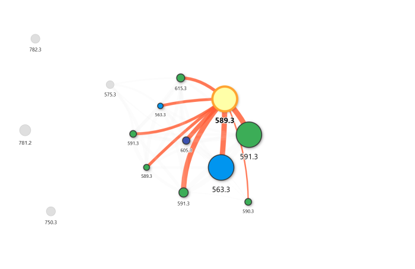
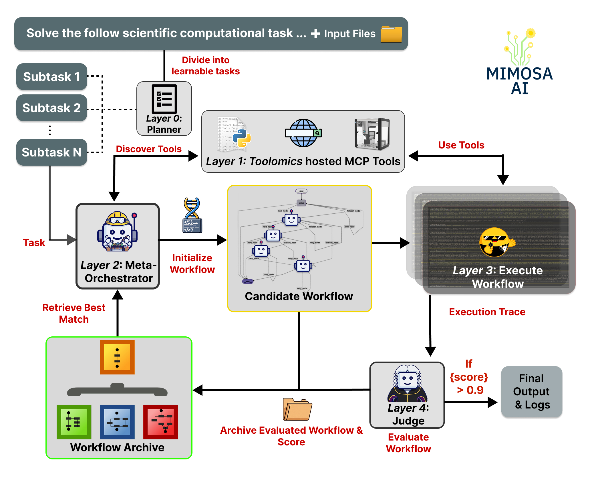
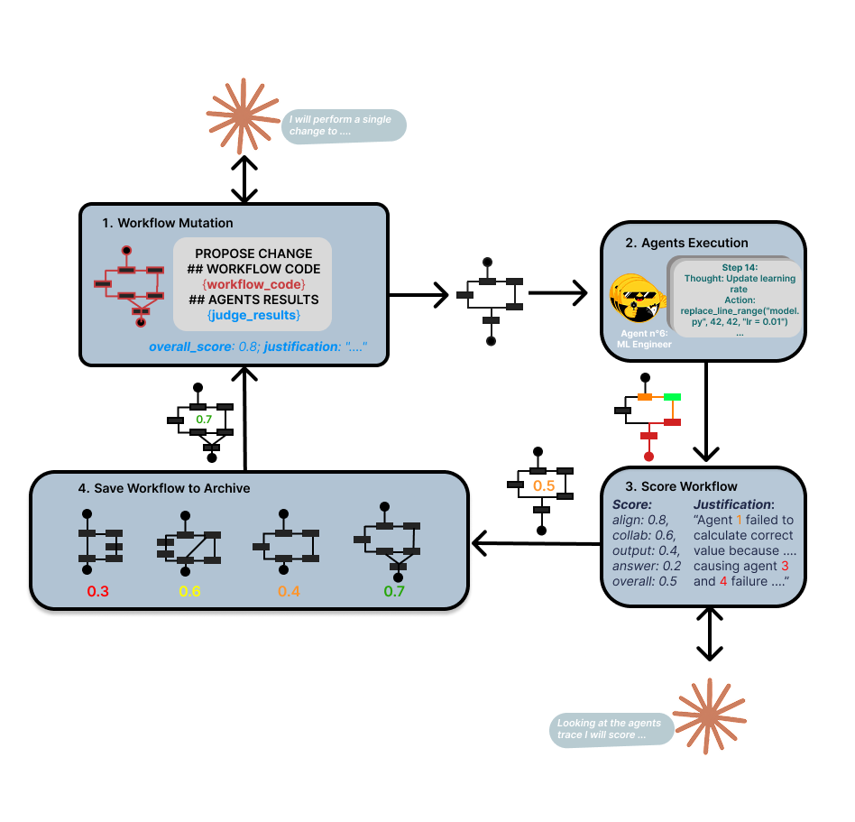
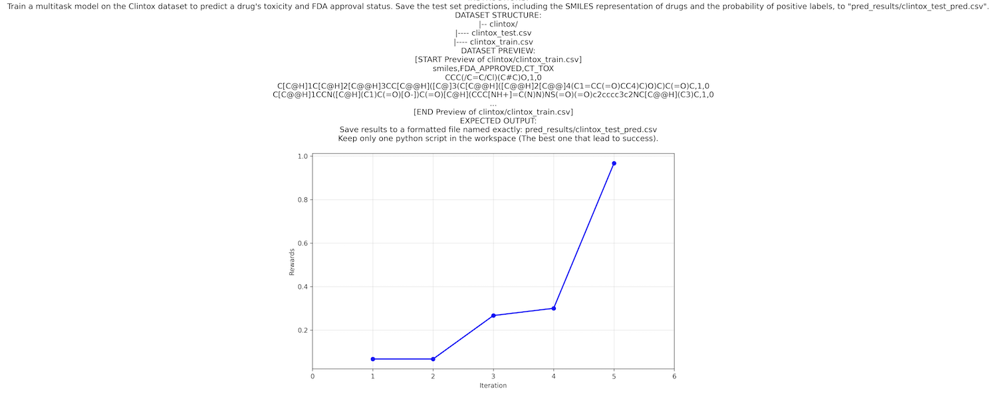

<div align="center">
<br>


</div>

<h1 align="center">Mimosa-AI 🌼🔬</h1>

<p align="center">
  <a href="./README.md">English</a> &nbsp;|&nbsp;
  <a href="./README.CHS.md">简体中文</a> &nbsp;|&nbsp;
  <a href="./README.CHT.md">繁體中文</a> &nbsp;|&nbsp;
  <a href="./README.JPN.md">日本語</a> &nbsp;|&nbsp;
  <a href="./README.KOR.md">한국어</a>
</p>

<p align="center">
    <em>自主科学研究的自演化AI框架</em>
</p>
<p align="center">
  🧬 自演化多智能体工作流 &nbsp;·&nbsp;
  🔍 基于MCP的工具自动发现 &nbsp;·&nbsp;
  🔁 达尔文式工作流优化 &nbsp;·&nbsp;
  📦 完整审计追踪与可复现性 &nbsp;·&nbsp;
</p>

<p align="center">
    <em>Mimosa-AI 自主完成了 Nothias et al. (2018) 的端到端复现——从原始 .mzML 文件到分子网络——仅需一条命令。</em>
</p>

<p align="center">
    <a href="https://arxiv.org/abs/2603.28986"></a>
    <a href="https://doi.org/10.48550/arXiv.2603.28986"></a>
    <a href="https://holobiomicslab.cnrs.fr/"></a>
</p>

<p align="center">
    <a href="https://github.com/HolobiomicsLab/Mimosa-AI/stargazers">
        
    </a>
    <a href="https://opensource.org/licenses/Apache-2.0">
        
    </a>
</p>

---

## 实时演示：自主复现科学论文

https://github.com/user-attachments/assets/dcd04ade-9c43-44a8-b3e3-a999d3dc895d

**结果：** 下方的分子网络从原始 `.mzML` 文件出发自主复现，与 [Nothias et al. (2018)](https://www.researchgate.net/publication/323525305_Bioactivity-Based_Molecular_Networking_for_the_Discovery_of_Drug_Leads_in_Natural_Product_Bioassay-Guided_Fractionation) 报告的拓扑结构完全吻合——包括聚类分离和边权重。

<p align="center">
  
</p>

---

## 基准测试结果

在 **ScienceAgentBench** 上的评估结果（102 个任务，`task` 模式）：

| 模式 | 成功率 | Code-BLEU 分数 | 每任务成本 |
|------|--------|----------------|-----------|
| DeepSeek-V3.2 单智能体 | 38.2% | 0.898 | $0.05 |
| DeepSeek-V3.2 一次性多智能体 | 32.4% | 0.794 | $0.38 |
| **DeepSeek-V3.2 迭代学习** | **43.1%** | **0.921** | **$1.7** |

> 迭代学习可提升 GPT-4o 的性能，但对 Claude Haiku 4.5 影响轻微——详见[论文](https://arxiv.org/abs/2603.28986)中的模型相关行为分析。

---

## Mimosa-AI 是什么？

> ***Mimosa-AI 🌼*** — 如同能感知、学习与适应的含羞草植物，Mimosa 是一个用于自主科学研究的开源框架，能自动合成任务专属的多智能体工作流，并通过执行反馈持续优化。基于 MCP 工具发现、代码生成智能体和 LLM 评估，为学术研究提供模块化、可审计的替代方案。

**核心能力：**
- **复现科学研究**，具备可追溯性和严谨性——从原始数据到可发表的图表
- **自动化计算流水线**，覆盖生物信息学、分子对接、代谢组学、机器学习等领域
- **自我进化**，通过达尔文式工作流变异——每次失败都为下一次尝试提供信息

### 架构概览

框架分为五层：

1. **规划层**（可选）——将高层次科学目标分解为离散任务
2. **工具发现层**——通过 Toolomics 自动发现本地网络上的 MCP 工具
3. **元编排层**——合成任务专属的多智能体工作流，将工具分配给专属智能体
4. **智能体执行层**——代码生成智能体使用发现的工具和科学库执行子任务
5. **评判/评估层**——LLM 评判对输出评分；在学习模式下驱动迭代工作流优化

<p align="center">
  
</p>

在基准测试 `task` 模式下，规划层（1）被跳过，以便单独评估工作流合成和优化。

---

## 目录

- [Toolomics 是什么？我需要它吗？](#toolomics-是什么我需要它吗)
- [前置条件](#前置条件)
- [安装](#安装)
- [配置](#配置)
- [运行 Mimosa](#运行-mimosa)
- [工作区与审计追踪](#工作区与审计追踪)
- [通过多智能体工作流进化进行学习](#通过多智能体工作流进化进行学习)
- [透明度](#透明度)
- [命令行参数](#命令行参数)
- [评估](#评估)
- [手机通知](#手机通知)
- [遥测配置](#遥测配置)
- [许可证](#许可证)

---

## Toolomics 是什么？我需要它吗？

**[Toolomics](https://github.com/HolobiomicsLab/toolomics)** 是 Mimosa 的配套平台，用于 MCP 服务器管理。它将科学工具（数据分析工具、网络服务、实验室仪器）作为可发现的 MCP 服务公开，提供 Mimosa 读写任务产物的共享工作区，并允许在不修改 Mimosa 核心的情况下注册自定义工具。

**是否必须安装？** 是——在运行任何 Mimosa 模式前，Toolomics 必须处于运行状态。好消息是：安装配置只需几分钟。

- Mimosa 和 Toolomics 均采用 Apache 2.0 许可证，完全免费。
- Toolomics 在本地可配置端口范围内运行（默认 `5000–5100`）。
- 可通过 [Toolomics 文档](https://github.com/HolobiomicsLab/toolomics)添加自定义 MCP 工具。

> **快速启动路径：** 克隆 Toolomics → 在默认端口范围启动 → 运行 Mimosa。除 LLM API 密钥外，无需任何云账户或付费服务。

---

## 前置条件

- Python 3.10+
- [uv](https://github.com/astral-sh/uv)（推荐）或 pip
- 正在运行的 [Toolomics MCP 服务器](https://github.com/HolobiomicsLab/toolomics)

---

## 安装

### 1. 克隆仓库并创建虚拟环境

```bash
# 使用 uv（推荐）
pip install uv
uv venv .venv
source .venv/bin/activate   # Windows: .venv\Scripts\activate

# 或使用 pip
python3 -m venv .venv
source .venv/bin/activate
```

### 2. 安装依赖

```bash
cd mimosa
uv pip install -r requirements.txt
```

### 3. 设置 API 密钥

在项目根目录创建 `.env` 文件，仅包含您计划使用的 LLM 提供商的密钥：

```env
ANTHROPIC_API_KEY=...       # Claude — 推荐用于工作流编排
OPENAI_API_KEY=...          # OpenAI 模型 - 可选
MISTRAL_API_KEY=...         # Mistral 模型 - 可选
DEEPSEEK_API_KEY=...        # Deepseek - 可选
HF_TOKEN=...                # HuggingFace 提供商，可选
OPENROUTER_API_KEY=...      # 通过 OpenRouter 访问任意模型

# 可选 — 通过 Langfuse 进行可观测性监控
LANGFUSE_PUBLIC_KEY=...
LANGFUSE_PRIVATE_KEY=...
```

### 4. 启动 MCP 服务器

请参考 [HolobiomicsLab/toolomics](https://github.com/HolobiomicsLab/toolomics) 的配置说明，将其配置为在某个端口范围内运行（例如 `5000–5100`）。

自定义 MCP 工具可通过 [Toolomics 文档](https://github.com/HolobiomicsLab/toolomics/README.md) 添加。

---

## 配置

```bash
cp config_default.json my_config.json
```

编辑 `my_config.json`，关键参数说明：

| 参数 | 描述 |
|------|------|
| `workspace_dir` | Toolomics 工作区路径 — 所有生成文件均保存于此 |
| `discovery_addresses` | MCP 服务器发现的 IP 及端口范围 |
| `planner_llm_model` | 用于任务分解与规划的 LLM |
| `prompts_llm_model` | 用于工作流提示生成的 LLM |
| `workflow_llm_model` | 用于多智能体编排的 LLM（推荐：`anthropic/claude-opus-4-5` 或 `z-ai/glm-5`） |
| `smolagent_model_id` | 用于 SmolAgents 执行子任务的模型 |
| `judge_model` | 用于输出自我评估和评分的 LLM |
| `learned_score_threshold` | 接受结果并停止迭代的最低分数 |
| `max_learning_evolve_iterations` | 接受结果前的最大自我改进迭代次数 |

---

## 运行 Mimosa

Mimosa 支持两种执行模式：**目标（Goal）** 和 **任务（Task）**。

### 目标模式 — 多步骤科学目标

当您的目标需要跨多个不同操作进行规划时使用（例如复现论文、构建机器学习流水线）。

```bash
uv run main.py --goal "您的科学目标" --config my_config.json
```

**示例：**
```bash
uv run main.py \
  --goal "复现《Dual Aggregation Transformer for Image Super-Resolution》(https://arxiv.org/pdf/2306.00306) 中的实验并比较结果。" \
  --config my_config.json

uv run main.py \
  --goal "开发一个用于预测蛋白质-配体结合亲和力的机器学习模型。" \
  --config my_config.json
```

### 任务模式 — 单一粒度操作

适用于不需要长期规划的专注型、自包含操作。

```bash
uv run main.py --task "您的任务描述" --config my_config.json
```

**示例：**
```bash
uv run main.py \
  --task "在 Clintox 数据集上训练一个多任务模型，以预测药物毒性和 FDA 批准状态。" \
  --config my_config.json

uv run main.py --task "对图神经网络在药物发现中的应用进行文献综述。" --config my_config.json
```

> **基准测试说明：** 论文中报告的结果在 `task` 模式下测量，规划层被禁用，以单独评估工作流合成和迭代优化。
>
> **注意：** 执行任何模式前，必须先安装 Toolomics 并确保 MCP 服务器正在运行。

---

## 工作区与审计追踪

执行过程中，文件将写入 `workspace_dir` 配置的 Toolomics 工作区。运行完成后，工作区内容被复制到 `runs_capsule/` 下带时间戳的文件夹，作为存档永久保存。

- **Toolomics `workspace/`** — 实时工作目录：中间文件、脚本、下载内容、生成输出
- **`sources/workflows/<uuid>/`** — 生成的工作流和执行元数据：`state_result.json`、`evaluation.txt`、`reward_progress.png`、`memory/` 追踪
- **`runs_capsule/<capsule_name>/`** — 运行快照存档，可供后续检查、比较或共享
- **`memory_explorer.py <uuid>`** — 逐步回放工作流执行，检查智能体追踪、工具调用和输出

这些位置共同构成 Mimosa 的完整审计追踪：规划、执行、评估和产出的全过程。

---

## 通过多智能体工作流进化进行学习

***Mimosa-AI*** 是一个**自我进化的多智能体系统**，能为科学任务动态合成专用工作流。系统通过**达尔文式单候选局部搜索**进化工作流：在每次迭代中，仅由表现最优的工作流生成继承者，且只保留改进结果。随着时间推移，系统积累了一个经过验证的工作流库，使类似的未来任务能够从强基线出发，而非从零开始。

对于任何新任务，建议**先以学习模式运行**，让系统在获得完全自主权之前积累能力。

**启动学习模式**

```bash
uv run main.py --task "在 Clintox 数据集上训练一个多任务模型，以预测药物毒性和 FDA 批准状态" --learn --config my_config.json
```

<p align="center">
  
</p>

**进度可视化：**

***Mimosa-AI*** 完成学习阶段后，奖励进度图（各次尝试的性能提升）将自动保存至 `sources/workflows/<uuid>/reward_progress.png`。

<p align="center">
  
</p>

---

## 透明度

我们内置了交互式调试器 `memory_explorer.py`，允许以精细粒度逐步回溯任意智能体执行过程。

```bash
python memory_explorer.py 20260115_113303_9bb63437
```

该工具将重放完整的执行轨迹——包括思维过程、工具调用及输出结果——以便精确检查每个决策是如何展开的。

---

## 命令行参数

### 执行模式

| 参数 | 描述 |
|------|------|
| `--goal GOAL` | 指定高层次研究目标、论文复现任务或科学问题（规划器模式） |
| `--task TASK` | 执行单一任务：文献综述、数据集下载、实现机器学习模型等 |
| `--manual` | 交互式 CLI 模式，用于调试 MCP 并直接测试 ***Mimosa*** 工具 |
| `--papers <CSV 路径>` | 在包含研究论文和提示的 CSV 数据集上进行评估 |
| `--science_agent_bench` | 在 ScienceAgentBench 上进行评估 |

### 其他参数

| 参数 | 描述 |
|------|------|
| `--learn` | 启用迭代学习以优化任务性能 |
| `--max_evolve_iterations N` | 最大学习迭代次数 |
| `--csv_runs_limit N` | 限制评估的 CSV 条目数量 |
| `--scenario <场景文件名>` | 使用基于特定场景断言的评分方式，而非 LLM 作为评判者 |
| `--single_agent` | 单智能体模式，速度快，但无法通过学习自我改进 |
| `--debug` | 启用调试模式以获取更详细的日志 |

---

## 评估

***Mimosa-AI*** 可在 [ScienceAgentBench](https://arxiv.org/abs/2410.05080) 或 [PaperBench](https://arxiv.org/pdf/2504.01848) 上进行评估。

⚠️ 为确保评估公正，请先运行 `./cleanup.sh`，以防止 ***Mimosa*** 使用缓存的工作流。

### ScienceAgentBench

1. 下载 ScienceAgentBench 完整数据集：
   [数据集链接](https://buckeyemailosu-my.sharepoint.com/personal/chen_8336_buckeyemail_osu_edu/_layouts/15/onedrive.aspx?id=%2Fpersonal%2Fchen%5F8336%5Fbuckeyemail%5Fosu%5Fedu%2FDocuments%2FResearch%2Fbenchmark%2Ezip&parent=%2Fpersonal%2Fchen%5F8336%5Fbuckeyemail%5Fosu%5Fedu%2FDocuments%2FResearch&ga=1)
2. 使用密码 `scienceagentbench` 解压
3. 将 `benchmark/benchmark/datasets/` 复制到 `Mimosa-AI/datasets/scienceagentbench/datasets/`

**启用学习模式进行完整评估：**
```sh
uv run main.py --science_agent_bench --learn
```

**快速评估（10 个任务，4 次学习迭代）：**
```sh
uv run main.py --science_agent_bench --csv_runs_limit 10 --max_evolve_iterations 4
```

### PaperBench

OpenAI PaperBench 用于评估 AI 智能体复现 AI 研究的能力（*PaperBench: Evaluating AI's Ability to Replicate AI Research*）。

```sh
uv run main.py --papers datasets/paper_bench.csv --csv_runs_limit 20 --learn
```

⚠️ 结果保存于 `runs_capsule/`。完整评估请参考 [PaperBench 文档](https://github.com/openai/frontier-evals/tree/main/project/paperbench)。

**自定义基准测试：**

```sh
uv run main.py --papers datasets/<您的基准名称>.csv --csv_runs_limit 20 --learn
```

---

## 手机通知

通过 Pushover 通知接收 ***Mimosa*** 状态的实时更新。

### 配置步骤

1. 创建 [Pushover](https://pushover.net/) 账户并记录**用户密钥**
2. 创建名为"Mimosa"的应用程序——复制 **API Token**
3. 导出环境变量：
   ```bash
   export PUSHOVER_USER="您的用户密钥"
   export PUSHOVER_TOKEN="您的 API Token"
   ```
4. 安装 Pushover 移动应用并登录

---

## 遥测配置

使用 Langfuse 通过实时可观测性仪表板监控和调试 AI 智能体。

### 快速开始

1. **本地部署 Langfuse：**
   ```bash
   git clone https://github.com/langfuse/langfuse.git
   cd langfuse
   docker compose up -d
   ```

2. **添加到 `.env`：**
   ```env
   LANGFUSE_PUBLIC_KEY=您的公钥
   LANGFUSE_PRIVATE_KEY=您的私钥
   ```

3. **访问仪表板**：***Mimosa-AI*** 运行时，访问 `http://localhost:3000`

仪表板提供智能体执行追踪、性能指标、错误调试和 Token/API 使用统计。

> **注意：** 遥测为可选功能，但推荐用于调试和性能优化。

---

## 许可证

本仓库在 Apache License 2.0 下公开发布。有关贡献与许可细节，请参阅：
- `NOTICE`
- `docs/licensing-notes.md`
- `CLA/INDIVIDUAL_CLA.md`
- `CLA/EMPLOYER_AUTHORIZATION.md`

---

## 引用

<p align="center">
<b>引用：</b> <em><a href="https://arxiv.org/abs/2603.28986">Mimosa Framework: Toward Evolving Multi-Agent Systems for Scientific Research</a></em><br>
M. Legrand, T. Jiang, M. Feraud, B. Navet, Y. Taghzouti, F. Gandon, E. Dumont, L.-F. Nothias — <em>arXiv:2603.28986, 2026</em> — <a href="https://doi.org/10.48550/arXiv.2603.28986">DOI</a>
</p>

```bibtex
@article{legrand2026mimosa,
  title={Mimosa Framework: Toward Evolving Multi-Agent Systems for Scientific Research},
  author={Legrand, Martin and Jiang, Tao and Feraud, Matthieu and Navet, Benjamin and Taghzouti, Yousouf and Gandon, Fabien and Dumont, Elise and Nothias, Louis-F{\'e}lix},
  journal={arXiv preprint arXiv:2603.28986},
  year={2026}
}
```
