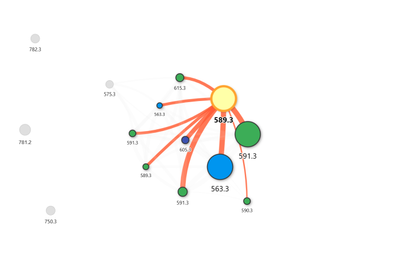
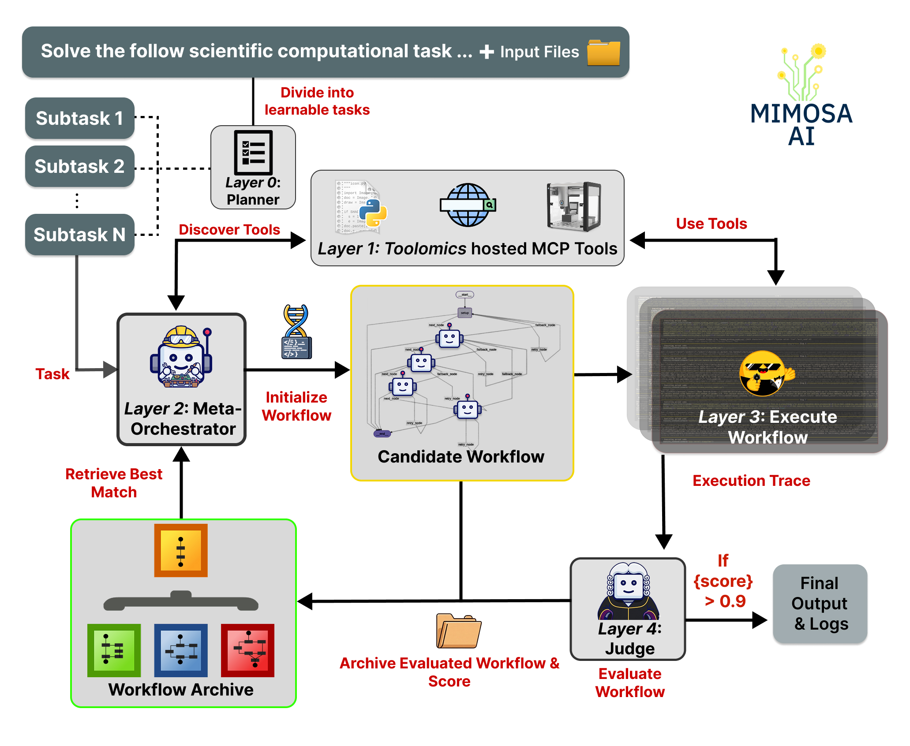

<div align="center">
<br>


</div>

<h1 align="center">Mimosa-AI 🌼🔬</h1>

<p align="center">
  <a href="./README.md">English</a> &nbsp;|&nbsp;
  <a href="./README.CHS.md">简体中文</a> &nbsp;|&nbsp;
  <a href="./README.CHT.md">繁體中文</a> &nbsp;|&nbsp;
  <a href="./README.JPN.md">日本語</a> &nbsp;|&nbsp;
  <a href="./README.KOR.md">한국어</a>
</p>

<p align="center">
    <em>자율 과학 연구를 위한 자기 진화형 멀티에이전트 프레임워크 — LLM 기반 워크플로우 합성, Quality-Diversity 진화 탐색, MCP 도구 자동 탐색.</em>
</p>

<p align="center">
  🧬 Quality-Diversity 워크플로우 진화 &nbsp;·&nbsp;
  🔍 MCP 기반 도구 자동 탐색 &nbsp;·&nbsp;
  🧪 다중 소스 클레임별 검증 &nbsp;·&nbsp;
  📦 완전한 감사 추적 및 재현성
</p>

<p align="center">
    <a href="https://arxiv.org/abs/2603.28986"></a>
    <a href="https://doi.org/10.48550/arXiv.2603.28986"></a>
    <a href="https://holobiomicslab.cnrs.fr/"></a>
</p>

<p align="center">
    <a href="https://github.com/HolobiomicsLab/Mimosa-AI/stargazers"></a>&nbsp;
    <a href="https://opensource.org/licenses/Apache-2.0"></a>
</p>

---

## TL;DR

Mimosa-AI는 **태스크마다 맞춤형 멀티에이전트 워크플로우를 작성**하고 이를 샌드박스에서 실행한 뒤, 에이전트가 실제로 수행한 작업을 여섯 개의 독립적인 관점(문헌, 사용자의 목표, 에이전트 내레이션, 수학적 불변량, 계산 재현성, 통계적 핑거프린트)에 비추어 검증합니다. 그리고 학습을 요청하면 **Quality-Diversity** 탐색을 통해 성능과 구조적 다양성을 모두 보존하며 세대를 거쳐 워크플로우를 진화시킵니다.

워크플로우는 순수 Python으로 출력됩니다. 검증기는 에이전트가 주장하는 내용을 재계산하는 결정론적 Python 검사를 실행합니다. 모든 세대는 그 계보와 해당 코드를 생성한 정확한 LLM 프롬프트와 함께 디스크에 저장됩니다.

```bash
uv sync && uv run main.py        # interactive onboarding
```

---

## 데모

<p align="center">
    <em>Mimosa-AI는 <a href="https://www.researchgate.net/publication/323525305_Bioactivity-Based_Molecular_Networking_for_the_Discovery_of_Drug_Leads_in_Natural_Product_Bioassay-Guided_Fractionation">Nothias et al. (2018)</a>의 LC-MS/MS 분자 네트워킹 파이프라인 — <code>.mzML</code> 파일에 대한 피처 검출(MZmine / OpenMS / matchms 계열 도구 스택 — 에이전트가 직접 선택), 정렬, 그리고 고전적 분자 네트워킹(GNPS 스타일 코사인 클러스터링) — 을 단일 명령으로, 사전에 고정된 파이프라인 없이 자율적으로 재생성했습니다.</em>
</p>

https://github.com/user-attachments/assets/dcd04ade-9c43-44a8-b3e3-a999d3dc895d

재현된 네트워크는 논문에서 보고된 토폴로지와 클러스터 수준에서 일치하며, Cytoscape에서 바로 불러올 수 있는 `.graphml` 파일과 그에 대응하는 피처 정량 테이블로 출력됩니다. 범위 참고: 이 재현은 **분자 네트워킹** 단계만을 대상으로 하며, 원 연구에서 다룬 생리활성 기반 분획, 수동 어노테이션 검토, 라이브러리 매칭(GNPS / SIRIUS / CSI:FingerID)은 자율 실행 범위 밖입니다.

<p align="center">
  
</p>

---

## 벤치마크

**ScienceAgentBench**(102개 태스크, `task` 모드 — 플래닝 레이어를 건너뛰어 워크플로우 합성 및 정제만을 독립적으로 평가)에서 평가했습니다:

| 모드                                    | 성공률 | Code-BLEU | 태스크당 비용 |
| --------------------------------------- | ------------ | --------- | ----------- |
| DeepSeek-V3.2 단일 에이전트              | 38.2 %       | 0.898     | $0.05       |
| DeepSeek-V3.2 원샷 멀티에이전트      | 32.4 %       | 0.794     | $0.38       |
| **DeepSeek-V3.2 반복 학습**    | **43.1 %**   | **0.921** | **$1.70**   |

> 반복 학습은 GPT-4o에서는 성능을 향상시키지만 Claude Haiku 4.5에서는 미세한 성능 저하를 보입니다 — 모델 의존적 동작은 [논문](https://arxiv.org/abs/2603.28986)에서 분석합니다. PaperBench 결과는 [`docs/papers_bench_evaluation.md`](./docs/papers_bench_evaluation.md)를 참조하세요.

> **비용과 실행 시간.** `$1.70/task` 수치는 기본 `--learn` 예산(최대 35세대, `overall_score > 0.97`에서 조기 종료) 기준으로 분할 상환된 값입니다. 일반적인 진화 실행은 DeepSeek-V3.2 기준 태스크당 실시간 30–90분이 소요되며, 모델 가격에 대체로 비례합니다. 단일 실행(`--learn` 미사용)은 약 5–15분이며 비용은 한 자릿수 배 더 저렴합니다.

---

## 작동 원리

다섯 개의 레이어가 작은 dataclass 스키마로 연결됩니다 — 전체 세부 사항은 [`docs/concepts/architecture.md`](./docs/concepts/architecture.md)를 참조하세요.

<p align="center">
  
</p>

| 레이어 | 컴포넌트 | 역할 |
|-------|-----------|--------------|
| 0 | **Planner** *(선택, `--goal` 전용)* | 고수준 목표를 개별 태스크로 분해합니다. |
| 1 | **ToolManager + Perspicacité** | 설정된 주소/포트 범위에서 MCP 도구를 탐색하고, 선택적으로 문헌 스니펫을 가져옵니다. |
| 2 | **EvolutionEngine** | 워크플로우를 합성하고 세대를 거쳐 진화시킵니다(아래 참조). |
| 3 | **WorkflowRunner** | 합성된 Python 워크플로우를 Hugging Face [SmolAgents](https://github.com/huggingface/smolagents)(`LocalPythonExecutor` + AST 허용 리스트 방식) 샌드박스에서 실행하며, LangGraph 상태를 공유합니다. |
| 4 | **VerifierEvaluator** | 다중 소스 클레임별 검증기. 다음 변이를 추동합니다. |

### 진화 루프 — 실제로 무엇이 진화하는가

워크플로우는 **완전한 Python 프로그램**이며, 소스 코드 수준에서 변이됩니다. 유전자형(genotype)은 워크플로우 파일이고, 표현형(phenotype)은 워크스페이스에서 그것이 산출하는 모든 것입니다.

- **선택: Quality-Diversity 아카이브** — 인구 50, `qd_score = (1−w)·quality + w·novelty` (`w=0.4`). 참신성(novelty)은 행동 기술자 `[n_agents, n_edges, n_branches, prompt_chars]` 상의 k-NN 거리(`k=25`)입니다. 부모는 자식 수의 역수에 비례하는 룰렛으로 선택되어 아카이브가 고르게 퍼지도록 합니다.
- **변이: 정체 기반 범위 조절** — 변이의 대담함은 마지막 4개의 프롬프트 그래디언트가 얼마나 반복되는지에 대한 연속 함수입니다. 거의 승리한 개체는 보호됩니다. 범위 대역은 "프롬프트만 미세 조정"부터 "완전한 토폴로지 재고"까지 이어집니다.
- **교차** — 약 30%의 세대에서 두 부모를 결합하며, 강한 쪽이 먼저 적용됩니다.
- **콜드 스타트** — 아카이브가 비어 있으면, 디스크의 과거 실행을 유사도 필터링(MiniLM 코사인 ≥ 0.5)으로 스캔하여 탐색을 시드합니다. 유용한 워크플로우는 태스크 간에 전이됩니다.

전체 메커니즘: [`docs/concepts/evolution-engine.md`](./docs/concepts/evolution-engine.md).

### 검증기 — 점수가 실제로 의미하는 것

각 실행 후, 여섯 개의 독립적인 클레임 소스가 워크스페이스를 살펴보고 성공-극성(success-polarity) 클레임을 산출합니다:

| 소스 | 관점 |
|--------|---------|
| **A** | 동료 평가된 관행(Perspicacité 문헌 그라운딩 경유) |
| **B** | 목표 텍스트 그 자체 — 에이전트가 요청받은 것을 전달했는가? |
| **C** | 에이전트 내레이션 — 주장된 수치/산출물을 디스크에서 재현할 수 있는가? |
| **D** | 수학적 불변량 — 확률은 [0,1] 범위, 형상 일관성, NaN 없음, 보존 |
| **E** | 계산 재현성 — 선언된 의존성이 사용된 import를 포함, 절대 경로 없음, 확률적 연산에 시드 설정 |
| **F** | 통계적 핑거프린트 — 베이스라인 초과, 퇴화된 예측 없음, 누출 시그니처 없음 |

각 클레임은 심판(judge)이 워크스페이스에 대해 작성하는 **결정론적 Python 프로그램**으로 검증됩니다 — 에이전트를 믿느냐고 LLM에 다시 묻는 방식이 아닙니다. 반(反)동어반복 트립와이어는 에이전트의 출력을 자신과 비교하는 프로그램을 거부합니다.

**변이기는 평가 기준(rubric)을 결코 보지 않습니다.** 되돌아 흐르는 유일한 신호는 `abstracted_prompt_gradient` — 클레임, 점수, 소스를 명명하지 않는 실패 모드의 암호화된 진단입니다. 구조적으로, 탐색은 결코 보지 않는 평가 기준의 어휘에 과적합할 수 없습니다.

전체 파이프라인: [`docs/concepts/evaluation-pipeline.md`](./docs/concepts/evaluation-pipeline.md).

---

## 빠른 시작

### 1. 설치

```bash
pip install uv
git clone https://github.com/HolobiomicsLab/Mimosa-AI.git
cd Mimosa-AI
uv sync
```

### 2. 최소 하나의 LLM 키 추가

프로젝트 루트에 `.env`를 생성하세요. 실제로 사용하는 제공자만 필요합니다.

```env
ANTHROPIC_API_KEY=...       # Claude — recommended for workflow synthesis
OPENAI_API_KEY=...
MISTRAL_API_KEY=...
DEEPSEEK_API_KEY=...
HF_TOKEN=...
OPENROUTER_API_KEY=...      # Any model via OpenRouter

# Optional: Langfuse observability
LANGFUSE_PUBLIC_KEY=...
LANGFUSE_PRIVATE_KEY=...
```

### 3. MCP 도구 노출

Mimosa는 설정의 주소/포트 범위(기본값 `0.0.0.0:5000–5100`)에서 도달 가능한 모든 MCP 서버를 탐색합니다.

- **가장 쉬운 경로:** 동반 플랫폼 **[Toolomics](https://github.com/HolobiomicsLab/toolomics)** 설치 — 워크스페이스별로 하나의 MCP shell 샌드박스를 제공하여 에이전트가 필요할 때 과학 패키지를 설치할 수 있고(동일 워크스페이스의 후속 실행은 이미 설치된 도구를 재사용), 일반적인 과학 도구 스택을 노출하는 사전 빌드된 MCP 서버, 공유 워크스페이스 관리, 정형화된 등록 흐름을 함께 제공합니다.
- **자체 도구 사용:** `discovery_addresses`를 도달 가능한 임의의 MCP 서버 — `fastmcp` 스크립트, ToolHive, 서드파티 MCP 컨테이너 — 로 지정하세요. Toolomics는 필수가 아닙니다. [`docs/concepts/tools-and-mcp.md`](./docs/concepts/tools-and-mcp.md#operating-without-toolomics)를 참조하세요.

### 4. 실행

```bash
uv run main.py                   # interactive onboarding (recommended first time)
```

또는 마법사를 건너뛰기:

```bash
uv run main.py --task "Train a multitask model on Clintox to predict toxicity and FDA approval"
uv run main.py --goal "Reproduce experiments from https://arxiv.org/pdf/2306.00306 and compare results"
```

원샷 대신 세대를 거쳐 진화시키려면 `--learn`을 추가하세요:

```bash
uv run main.py --task "..." --learn --config my_config.json
```

전체 빠른 시작: [`docs/getting-started/quickstart.md`](./docs/getting-started/quickstart.md).

### 5. (선택) Perspicacité를 통한 과학적 그라운딩

[Perspicacité](https://github.com/HolobiomicsLab/Perspicacite-AI)는 워크플로우 합성과 Source A 클레임을 문헌에 그라운딩합니다. 실행 중이면 Mimosa가 자동으로 인식합니다.

```bash
git clone https://github.com/HolobiomicsLab/Perspicacite-AI.git && cd Perspicacite-AI
uv sync && uv run web_app_full.py
```

---

## 실행 모드

| 모드 | 사용 시점 | 명령 |
|------|----------|---------|
| `--task` | 단일 집중 작업 | `uv run main.py --task "..."` |
| `--goal` | 계획이 필요한 다단계 목표 | `uv run main.py --goal "..."` |
| `--learn` | 위 두 모드에 추가 — 세대를 거쳐 진화 | `... --learn` |
| `--single_agent` | 멀티에이전트 합성 생략(빠름, 학습 없음) | `... --single_agent` |
| `--manual` | 개별 MCP 도구를 테스트하기 위한 대화형 CLI | `uv run main.py --manual` |
| 배치 | 태스크 CSV 평가 | `... --papers <csv>` |
| 벤치마크 | ScienceAgentBench | `... --science_agent_bench` |

세부 사항: [`docs/usage/modes.md`](./docs/usage/modes.md), [`docs/usage/learning.md`](./docs/usage/learning.md), [`docs/reference/cli.md`](./docs/reference/cli.md).

---

## 감사 추적 및 재생

Mimosa는 과학적 용도로 설계되었습니다 — 모든 결정은 사후에 검사 가능합니다.

| 도구 | 역할 |
|------|--------------|
| `uv run memory_explorer.py <uuid>` | 한 세대의 전체 추적 — 사고, 도구 호출, 출력, 상태 변화 — 을 단계별로 살펴봅니다. |
| `uv run main.py --memory_cli` | 완료된 실행의 메모리에 대한 RAG 기반 Q&A. 스크롤 대신 "*task_builder가 어떤 분류기를 사용했는가?*"라고 질문하세요. |
| `uv run memory_timelapse.py <uuid>` | 반복에 걸친 메모리 성장의 프레임별 애니메이션 뷰. |
| `sources/workflows/<uuid>/workflow_genotype_<uuid>.py` | 에이전트가 실행한 정확한 Python. DSL 없음. |
| `sources/workflows/<uuid>/lineage_<uuid>.json` | 이 세대의 부모와 연산자(`seed | mutation | crossover`). |
| `sources/workflows/<uuid>/evolution_prompt_<uuid>.md` | 이 코드를 생성한 정확한 LLM 프롬프트. 동일한 프롬프트 + 시드 = 동일한 코드. |
| `sources/workflows/<uuid>/evolution_tree.png` | 전체 `--learn` 실행의 렌더링된 계보 트리. |
| `sources/workflows/<uuid>/reward_progress.png` | 반복에 따른 점수 곡선. |
| `runs_capsule/<capsule_name>/` | 공유 또는 재실행을 위한 최종 워크스페이스의 아카이브 스냅샷. |

전체 레이아웃: [`docs/usage/transparency.md`](./docs/usage/transparency.md), [`docs/usage/workspace.md`](./docs/usage/workspace.md).

---

## 설정

`config_default.json`을 `my_config.json`으로 복사하여 편집하세요. 가장 자주 만지게 되는 필드는 다음과 같습니다:

| 필드 | 제어 대상 |
|-------|------------------|
| `workspace_dir` | 공유 워크스페이스 — 생성된 모든 파일이 여기에 나타납니다 |
| `discovery_addresses` | MCP 탐색을 위한 IP + 포트 범위 |
| `workflow_llm_model` | 멀티에이전트 워크플로우를 합성합니다 (예: `anthropic/claude-opus-4-5`) |
| `smolagent_model_id` | 실행 에이전트가 사용하는 모델 |
| `judge_model` | 검증기 프로그램을 작성하고 소프트 판정을 내리는 LLM |
| `learned_score_threshold` | `--learn` 모드에서의 조기 종료 임계값 (기본값 `0.97`) |
| `max_learning_evolve_iterations` | 세대 수 상한 (기본값 `35`) |
| `population_size` / `novelty_weight` / `min_improvement_threshold` | QD 아카이브 튜닝 |

전체 레퍼런스: [`docs/reference/configuration.md`](./docs/reference/configuration.md).

---

## 평가

```bash
# ScienceAgentBench (download dataset first — see docs)
uv run main.py --science_agent_bench --learn

# Quick smoke (10 tasks)
uv run main.py --science_agent_bench --csv_runs_limit 10

# PaperBench
uv run main.py --papers datasets/paper_bench.csv --csv_runs_limit 20 --learn

# Custom CSV
uv run main.py --papers datasets/<your_benchmark>.csv --learn
```

> ⚠️ 편향 없는 평가를 위해, Mimosa가 캐시된 워크플로우를 재사용하지 못하도록 먼저 `./cleanup.sh`를 실행하세요.

각 벤치마크에 대한 설정 세부 사항: [`docs/science_agent_bench_evaluation.md`](./docs/science_agent_bench_evaluation.md), [`docs/papers_bench_evaluation.md`](./docs/papers_bench_evaluation.md).

---

## 알림 및 텔레메트리

- **Pushover** — 휴대폰으로의 실시간 진행 상황 알림. `PUSHOVER_USER`와 `PUSHOVER_TOKEN`을 설정하세요. 세부 사항: [`docs/usage/notifications.md`](./docs/usage/notifications.md).
- **Langfuse** — 모든 LLM 호출의 스팬 수준 추적. Langfuse 저장소에서 `docker compose up -d`를 실행한 후, `.env`에 `LANGFUSE_PUBLIC_KEY` / `LANGFUSE_PRIVATE_KEY`를 추가하세요. 대시보드는 `http://localhost:3000`에서 확인 가능합니다. 세부 사항: [`docs/usage/telemetry.md`](./docs/usage/telemetry.md).

---

## 관련 연구

Mimosa-AI는 LLM 기반 프로그램 탐색 및 자율 연구 시스템의 작지만 활발한 계보에 위치합니다. 우리는 이들 중 어느 것도 포섭한다고 주장하지 않습니다 — 각 시스템은 서로 다른 질문에 답합니다:

| 프로젝트 | 역할 | Mimosa와의 차이 |
|---------|--------------|--------------------|
| [Sakana AI Scientist](https://github.com/SakanaAI/AI-Scientist) | ML 분야의 종단 간 논문 생성 | Mimosa는 전체 논문 생성이 아니라 QD+검증기를 사용한 **태스크별 워크플로우 합성**을 최적화합니다 |
| [DiscoPOP](https://github.com/SakanaAI/DiscoPOP) (Lange et al. 2024) | LLM 기반 선호 최적화 알고리즘의 발견 | 동일한 "코드에 대한 변이 연산자로서의 LLM" 패러다임. Mimosa는 이를 손실 함수가 아니라 멀티에이전트 워크플로우 코드에 적용합니다 |
| [FunSearch](https://github.com/google-deepmind/funsearch) (Romera-Paredes et al. 2024) | LLM이 안내하는 Python 함수에 대한 진화적 탐색 | Mimosa는 멀티에이전트 프로그램 전체를 진화시키며, 단일 적합도 함수 대신 다중 소스 클레임별 검증기를 추가합니다 |
| [ELM](https://github.com/CarperAI/OpenELM) (Lehman et al. 2022) | LLM 매개 코드에 대한 quality-diversity | 가장 가까운 QD 조상. Mimosa의 행동 기술자는 도메인 특화가 아니라 워크플로우 구조 기반입니다 |
| AIDE | Kaggle 유사 태스크에 대한 자동화된 ML 파이프라인 | Mimosa는 더 광범위한 과학적 재현(ScienceAgentBench, PaperBench, 실험실 데이터)을 대상으로 하며, 감사 가능한 클레임별 검증기를 함께 제공합니다 |

비교 연구를 출판하는 경우, [논문](https://arxiv.org/abs/2603.28986)에 상세한 포지셔닝이 있습니다.

---

## 전체 문서

```bash
uvx --with mkdocs-material mkdocs serve   # live preview at http://localhost:8000
uvx --with mkdocs-material mkdocs build   # static HTML to ./site
```

사이트 설정: [`mkdocs.yml`](./mkdocs.yml). 인덱스: [`docs/index.md`](./docs/index.md).

---

## 기여

패치, MCP 도구, 평가기, 새로운 클레임 소스 기여를 환영합니다. [`CONTRIBUTING.md`](./CONTRIBUTING.md), [Developer guide](./docs/DEVELOPER_GUIDE.md), 그리고 [`CLA/`](./CLA/)의 기여 조항부터 시작하세요.

---

## 라이선스

Apache 2.0. 기여 조항에 대해서는 [`NOTICE`](./NOTICE), [`docs/licensing-notes.md`](./docs/licensing-notes.md), [`CLA/`](./CLA/) 폴더를 참조하세요.

---

## 인용

<p align="center">
<em><a href="https://arxiv.org/abs/2603.28986">Mimosa Framework: Toward Evolving Multi-Agent Systems for Scientific Research</a></em><br>
M. Legrand, T. Jiang, M. Feraud, B. Navet, Y. Taghzouti, F. Gandon, E. Dumont, L.-F. Nothias — <em>arXiv:2603.28986, 2026</em> — <a href="https://doi.org/10.48550/arXiv.2603.28986">DOI</a>
</p>

```bibtex
@article{legrand2026mimosa,
  title   = {Mimosa Framework: Toward Evolving Multi-Agent Systems for Scientific Research},
  author  = {Legrand, Martin and Jiang, Tao and Feraud, Matthieu and Navet, Benjamin
             and Taghzouti, Yousouf and Gandon, Fabien and Dumont, Elise and Nothias, Louis-F{\'e}lix},
  journal = {arXiv preprint arXiv:2603.28986},
  year    = {2026}
}
```
