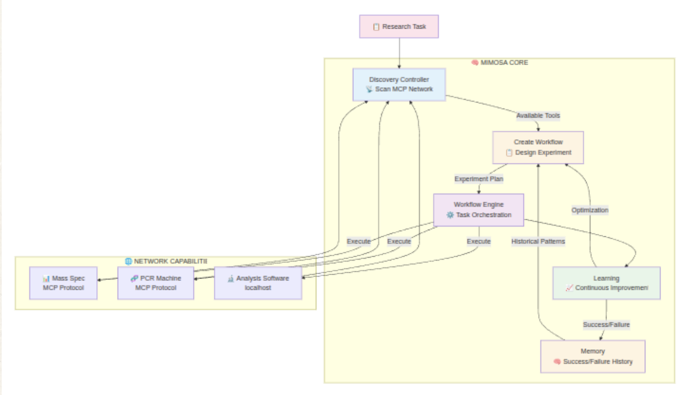

# Mimosa-AI


**An open framework for autonomous AI-driven science**

Mimosa is an automated AI-scientist framework built to reproduce published findings and carry out end-to-end research autonomously. Its goal is to offer a modular, transparent alternative to closed corporate systems, giving academics powerful AI tooling for real scientific discovery.

## Objectives

- Faithfully reproduce scientific studies with traceability and rigor
- Enable fully automated scientific pipelines—bioinformatics, docking, metabolomics, and more

## How does it work ?

The user gives Mimosa a research goal.

- Mimosa automatically discovers available MCP-based tools on the local network or via Toolhive (anything from data analysis utilities to web browsers or lab instruments like mass spectrometers).
- Using the user’s objective and the discovered tools, Mimosa decomposes the problem, builds a tailored multi-agent workflow for each tasks.
- Each task runs autonomously. Failures are used for self-improvement via a Darwin-/Gödel-Machine-inspired meta-learning loop.
- Mimosa generates a final capsule containing results, visualizations, reports, logs, and all relevant artifacts.

---

## Installation & Run

### Prerequisites

- Python 3.10 or higher
- pip3 package manager

### Step 1: Environment Setup

Choose one of the following options:

**Option A: Using pip**
```bash
python3 -m venv .venv
source .venv/bin/activate  # On Windows: .venv\Scripts\activate
```

**Option B: Using uv (faster alternative)**
```bash
pip install uv
uv venv .venv
source .venv/bin/activate  # On Windows: .venv\Scripts\activate
```

### Step 2: Configure Environment Variables

Create a `.env` file in the project root with your API keys:

```env
HF_TOKEN=your_hugging_face_token          # OR use DEEPSEEK_API_KEY
ANTHROPIC_API_KEY=your_anthropic_key
LANGFUSE_PUBLIC_KEY=your_langfuse_public_key    # Optional
LANGFUSE_PRIVATE_KEY=your_langfuse_private_key  # Optional
```

**Provider Options:**
- `HF_TOKEN`: Hugging Face token for LLM access
- `DEEPSEEK_API_KEY`: DeepSeek API key (alternative to HF_TOKEN)
- `ANTHROPIC_API_KEY`: Anthropic API for Claude models
- `LANGFUSE_*`: Optional telemetry keys for monitoring (see [Telemetry Setup](#telemetry-setup))

### Step 3: Install Dependencies

Navigate to the project directory and install dependencies:

```bash
cd mimosa
pip3 install -r requirements.txt
# OR with uv:
uv pip install -r requirements.txt
```

### Step 4: Launch MCP Server

Start the Toolomics MCP server following the instructions at [HolobiomicsLab/toolomics](https://github.com/HolobiomicsLab/toolomics).

You could add your custom MCPs to toolomics, see [toolomics documentation](https://github.com/HolobiomicsLab/toolomics/README.md).

Configure the server to run on a port range (e.g., 5000-5100).

### Step 5: Configure Mimosa-AI

Edit `config.py` with your settings. Key configuration parameters:

```python
# Toolomics workspace directory
self.workspace_dir = "/path/to/toolomics/workspace"

# LLM Model Selection
self.planner_llm_model = "anthropic/claude-opus-4-1-20250805"
self.prompts_llm_model = "anthropic/claude-opus-4-1-20250805"
self.workflow_llm_model = "anthropic/claude-opus-4-1-20250805"
self.smolagent_model_id = "anthropic/claude-haiku-4-5-20251001"

# MCP Server Discovery
self.discovery_addresses = [
    AddressMCP(ip="0.0.0.0", port_min=5000, port_max=5200) # same port range as toolomics
    # Add additional MCP servers from other machines as needed
]
```

### Step 6: Run Mimosa-AI

```bash
python3 main.py --goal "Your objective here"
# OR with uv:
uv run main.py --goal "Your objective here"
```

> **Note:** Remember to activate your virtual environment before running Mimosa-AI in future sessions.

### Access output files

Output files will appear in **toolomics** `workspace` folder, when the execution its content will be transfered inside a new folder in `runs_capsule/`

---

## Command Line Arguments

### Execution Modes

| Argument | Description |
|----------|-------------|
| `--goal GOAL` | Specify a high-level research objective, paper reproduction, or scientific question (planner mode) |
| `--task TASK` | Execute a single task: literature review, datasets download, implement a machine learning model... |
| `--manual` | Interactive CLI mode to debug MCPs and test Mimosa tools directly |
| `--papers CSV` | Evaluation on a CSV dataset containing research papers and prompts |
| `--scenario SCENARIO` | Run evaluation on a specific scenario |

### Learning & Optimization

| Argument | Description |
|----------|-------------|
| `--learn` | Enable learning mode using DGM to optimize task performance |
| `--max_dgm_iterations N` | Maximum DGM iterations for learning |
| `--csv_runs_limit N` | Limit number of CSV entries to evaluate |

### Examples

**Standard usage - accomplish a goal:**
```bash
uv run main.py --goal "Reproduce the experiments from 'Dual Aggregation Transformer for Image Super-Resolution' (https://arxiv.org/pdf/2306.00306) and compare results."
```

**Single task mode - no long-term planning:**
```bash
uv run main.py --task "Train a multitask model on the Clintox dataset to predict drug toxicity and FDA approval status" --judge
```

**Evaluation on OpenAI Paper Bench:**
```bash
uv run main.py --papers datasets/paper_bench.csv --csv_runs_limit 20 --learn
```

**ScienceAgentBench evaluation with learning:**
```bash
uv run main.py --science_agent_bench --csv_runs_limit 10 --max_dgm_iterations 10 --learn
```

> **Note:** Requires Toolomics to be installed and MCP servers to be running.

---

## Architecture



### System Overview

Mimosa-AI uses a **polymorphic meta-agent system** that dynamically synthesizes specialized workflows for scientific tasks. Rather than forcing tasks through fixed pipelines, the system composes custom multi-agent architectures on-demand and learns from execution patterns to optimize future performance.

The system operates on an **agent-within-agent** pattern:
- Goals decompose into learnable tasks
- Each task triggers synthesis of a specialized multi-agent workflow
- Successful workflow patterns are retained and refined over time
- The system continuously optimizes its own architecture through execution feedback

### Goal vs Task Philosophy

**Goal:** High-level scientific objective requiring multiple distinct complex tasks
- *Example:* "Develop a machine learning model to predict protein-ligand binding affinity"
- *Example:* "Reproduce research paper X and compare experimental results"

**Task:** Granular, repeatable operation frequently encountered across different goals
- *Example:* "Conduct literature review on topic X"
- *Example:* "Download dataset from source Y"
- *Example:* "Implement algorithm Z"

### Self-Improvement Mechanism (DGM)

The system implements a Darwinian-inspired evolution approach based on Gödel machine principles:

1. **Task Recognition**: For each task, the system:
   - Searches workflow library for similar historical tasks
   - If found: Uses best-performing workflow as template, adapting for current context
   - If novel: Synthesizes new workflow from scratch

2. **Evolutionary Optimization**: Over time, the system:
   - Maintains multiple workflow variants per task type
   - Selects high-performing workflows based on success metrics
   - Mutates/recombines successful patterns to explore architecture space

3. **Self-Improvement**: 
   - The system can propose modifications to its own workflow generation logic
   - Performance improvements are validated before integration (Gödel machine principle)
   - Meta-learning: Learns how to generate better workflows from execution history


**Progress visualization:**

Reward progress plot will be saved under the `sources/workflows/<uuid>` folder under the filename `reward_progress.png`.

***For example:***


---

## Phone Notifications

Receive real-time updates about Mimosa's status via Pushover notifications.

### Setup Instructions

1. **Create Pushover Account**
   - Visit [pushover.net](https://pushover.net/)
   - Register and note your **User Key**

2. **Create Application**
   - In Pushover dashboard, click "Create an Application/API Token"
   - Name it "Mimosa" and copy the generated **API Token**

3. **Configure Environment**
   ```bash
   export PUSHOVER_USER="your_user_key"
   export PUSHOVER_TOKEN="your_api_token"
   ```

4. **Install Mobile App**
   - Download Pushover from your device's app store
   - Log in with your Pushover account

---

## Telemetry Setup

Monitor and debug AI agents with real-time observability dashboards using Langfuse.

### Quick Start

1. **Deploy Langfuse Locally**
   ```bash
   git clone https://github.com/langfuse/langfuse.git
   cd langfuse
   docker compose up -d
   ```

2. **Configure Environment Variables**
   
   Add to your `.env` file:
   ```env
   LANGFUSE_PUBLIC_KEY=your_public_key
   LANGFUSE_PRIVATE_KEY=your_private_key
   ```

3. **Access Dashboard**
   
   While Mimosa-AI is running, visit `http://localhost:3000`

### Available Metrics

The telemetry dashboard provides:
- **Agent Execution Traces**: Step-by-step workflow visualization
- **Performance Metrics**: Response times and success rates
- **Error Debugging**: Detailed failure analysis
- **Resource Usage**: Token consumption and API calls

**Example Dashboard:**


> **Note:** Telemetry is optional but recommended for debugging and performance optimization.

---
