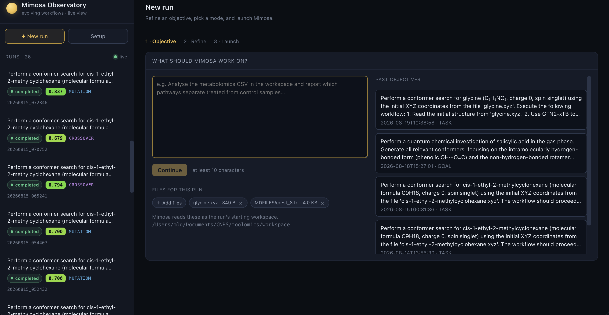

<div align="center">
<br>


</div>

<h1 align="center">Mimosa-AI — Evolving Multi-Agent Framework for Autonomous Scientific Research</h1>


<p align="center">
  <a href="./README.md">English</a> &nbsp;|&nbsp;
  <a href="./README.CHS.md">简体中文</a> &nbsp;|&nbsp;
  <a href="./README.CHT.md">繁體中文</a> &nbsp;|&nbsp;
  <a href="./README.JPN.md">日本語</a> &nbsp;|&nbsp;
  <a href="./README.KOR.md">한국어</a>
</p>

<p align="center">
    <em>Self-evolving multi-agent framework for autonomous scientific research — LLM-driven workflow synthesis, Quality-Diversity evolutionary search, MCP tool discovery.</em>
</p>

<p align="center">
    <a href="https://arxiv.org/abs/2603.28986"></a>
    <a href="https://doi.org/10.48550/arXiv.2603.28986"></a>
    <a href="https://holobiomicslab.cnrs.fr/"></a>
</p>

<p align="center">
    <a href="https://github.com/HolobiomicsLab/Mimosa-AI/stargazers"></a>&nbsp;
    <a href="https://opensource.org/licenses/Apache-2.0"></a>
</p>


---

## TL;DR

Mimosa-AI is an **open-source Python framework for autonomous scientific research**: it writes a **custom multi-agent workflow per task**, runs it in a sandbox, checks what the agents actually did against independent vantage points, and evolves the workflow across generations with a **Quality-Diversity** inspired search to find the optimal workflow for the task.

The workflow is emitted as plain Python — no DSL, no YAML — so any generation can be inspected, diffed, or re-run standalone. The verifier score workflows by running deterministic Python checks that verify litterature grounding, non-triviality, and quality metrics against artifacts that the agents produced. Every generation is on disk with its lineage and the exact LLM prompt that produced it.

## Automatic Installation

Run in a terminal:

```bash
curl https://raw.githubusercontent.com/HolobiomicsLab/Mimosa-AI/refs/heads/mimosa_v2/auto-install.sh | bash 
```

Note: This will automatically install and spin up our companion projects `Toolomics` and `Perspicacité`.

For manual installation see: [Manual Installation](##Manual-Installation)

## Web Interface

Open `http://localhost:5173/` in your browser to access the web interface.

<p align="center">
  
</p>


---

## Demo on Metabolomics (V1)

This demo was done with the V1 and will be updated.

<p align="center">
    <em>Mimosa-AI autonomously regenerated the LC-MS/MS molecular networking pipeline of <a href="https://www.researchgate.net/publication/323525305_Bioactivity-Based_Molecular_Networking_for_the_Discovery_of_Drug_Leads_in_Natural_Product_Bioassay-Guided_Fractionation">Nothias et al. (2018)</a> — feature detection on the <code>.mzML</code> files (MZmine / OpenMS / matchms-class tooling — the agents pick the stack), alignment, and classical molecular networking (GNPS-style cosine clustering).</em>
</p>

https://github.com/user-attachments/assets/dcd04ade-9c43-44a8-b3e3-a999d3dc895d

The reproduced network matches the topology reported in the paper at the cluster level, output as a Cytoscape-loadable `.graphml` plus the underlying feature quantification table. Scope note: this reproduces the **molecular networking** stage only — the bioactivity-guided fractionation, manual annotation review, and library matching (GNPS / SIRIUS / CSI:FingerID) from the original study are out of scope for the autonomous run.

<p align="center">
  
</p>

---


## How it works

Five layers, wired through small dataclass schemas — full details in [`docs/concepts/architecture.md`](./docs/concepts/architecture.md).

<p align="center">
  
</p>

| Layer | Component | What it does |
|-------|-----------|--------------|
| 0 | **Planner** *(optional, `--goal` only)* | Decomposes a high-level objective into discrete tasks. |
| 1 | **ToolManager + Perspicacité** | Discovers MCP tools on the configured address/port range; optionally pulls literature snippets. |
| 2 | **EvolutionEngine** | Synthesizes the workflow and evolves it across generations (see below). |
| 3 | **WorkflowRunner** | Runs the synthesized Python workflow in a sandbox using Hugging Face [SmolAgents](https://github.com/huggingface/smolagents) (`LocalPythonExecutor` with AST allow-list) and shared LangGraph state. |
| 4 | **VerifierEvaluator** | Multi-source per-claim verifier. Drives the next mutation. |

### The evolution loop — what's actually evolving

https://github.com/user-attachments/assets/744d2c34-4ac3-415c-bd8c-3454cd502271

Workflows are **full Python programs**, mutated as source code. The **code-as-genotype** is the workflow file; the phenotype is whatever it produces in the workspace.

- **Selection: Quality-Diversity archive** — **unstructured** (a flat list, not a discretised grid), capped at 20 members, scored by a single scalarised objective `qd_score = (1−w)·quality + w·novelty` (`w = novelty_weight = 0.25`); the lowest-`qd_score` member is evicted when full. **Novelty search** uses cosine-distance k-NN (`k = 15`) over the **genotype-embedding** behaviour descriptor — an L2-normalised embedding of the workflow's generated source code (local `all-MiniLM-L6-v2` by default; optional OpenAI `text-embedding-3-small`). Parents drawn by inverse-child-count roulette so the archive spreads (`MAX_CHILDREN_PER_PARENT = 8`).
- **Variation: Rechenberg-1/5 + plateau-driven scope** — mutation boldness blends the success rate of the last 5 scored offspring (Rechenberg 1/5 rule, threshold `0.20`) with an `iters_since_improvement` plateau counter (patience `6`). Near-winners (parent score > 0.95) get a damper. Scope bands run from `EXPLOITATION` (point mutation) to `RE-SPECIATION` (clean-slate redesign), gated by an effective-boldness threshold (`< 0.35 / 0.50 / 0.65 / 0.90 / 1.01`).
- **Crossover** — by default ~40 % of generations combine two parents, strongest-first, with offspring hard-capped at the highest parent agent count.
- **Cold start** — when the archive is empty, a similarity-filtered scan of past runs on disk (MiniLM cosine ≥ 0.8) seeds the search. Useful workflows transfer across tasks.

Full mechanics: [`docs/concepts/evolution-engine.md`](./docs/concepts/evolution-engine.md).

### The verifier — what scores actually mean

After each run, six independent claim sources look at the workspace and emit success-polarity claims:

| Source | Vantage |
|--------|---------|
| **A** | Peer-reviewed practice (via Perspicacité literature grounding) |
| **B** | The literal goal text — did the agents deliver what was asked? |
| **C** | Agent narration — can claimed numbers / artefacts be reproduced from disk? |
| **D** | Math invariants — probabilities in [0,1], shape consistency, no NaN, conservation |
| **E** | Computational reproducibility — declared deps cover used imports, no absolute paths, seeds on stochastic ops |
| **F** | Statistical fingerprint — beats a baseline, no degenerate predictions, no leakage signatures |

Each claim is verified by a **python program** the judge writes against the workspace — not by re-asking an LLM whether it believes the agent.

**Rubric-blind mutation — the mutator never sees the rubric.** The only signal that flows back is an `abstracted_prompt_gradient` — a code-named diagnosis of failure modes that does not name claims, scores, or sources. By construction the search cannot over-fit to a rubric vocabulary it never sees.

Full pipeline: [`docs/concepts/evaluation-pipeline.md`](./docs/concepts/evaluation-pipeline.md).

## Benchmark (V1)

Evaluated on **ScienceAgentBench** (102 tasks, `task` mode — planning layer bypassed so workflow synthesis and refinement are evaluated in isolation):

| Mode                                    | Success Rate | Code-BLEU | Cost / task |
| --------------------------------------- | ------------ | --------- | ----------- |
| DeepSeek-V3.2 single-agent              | 38.2 %       | 0.898     | $0.05       |
| DeepSeek-V3.2 one-shot multi-agent      | 32.4 %       | 0.794     | $0.38       |
| **DeepSeek-V3.2 iterative-learning**    | **43.1 %**   | **0.921** | **$1.70**   |

> **43.1 % success rate on ScienceAgentBench with DeepSeek-V3.2 iterative-learning — +4.9 pp over the single-agent baseline at $1.70 per task.**

> On ScienceAgentBench with DeepSeek-V3.2, iterative learning improves GPT-4o but yields marginal degradation on Claude Haiku 4.5 — model-dependent behaviour is analysed in the [manuscript](https://arxiv.org/abs/2603.28986). For PaperBench results, see [`docs/papers_bench_evaluation.md`](./docs/papers_bench_evaluation.md).

## Benchmark (V2)

**Currently under evaluation**

---

## Manual Installation

### 1. Expose MCP tools

Mimosa discovers any MCP server reachable on the address/port range in your config (default `0.0.0.0:5000–5100`).

- **Easiest path:** install our companion platform **[Toolomics](https://github.com/HolobiomicsLab/toolomics)** — a per-workspace MCP shell sandbox where agents install scientific packages on demand, plus pre-built MCP servers exposing common scientific stacks, shared workspace management, and an easy registration flow for new MCPs.
- **Bring-your-own:** point `discovery_addresses` at any reachable MCP server — `fastmcp` scripts, ToolHive, third-party MCP containers. Toolomics is not required; see [`docs/concepts/tools-and-mcp.md`](./docs/concepts/tools-and-mcp.md#operating-without-toolomics).

### 2. Install Mimosa

```bash
pip install uv
git clone https://github.com/HolobiomicsLab/Mimosa-AI.git
cd Mimosa-AI
uv sync
# then run with:
uv run main.py
```

**Or install as a standalone `mimosa` command**, usable from any directory:

```bash
uv tool install git+https://github.com/HolobiomicsLab/Mimosa-AI.git   # or: uv tool install /path/to/Mimosa-AI
mimosa
```

When installed this way, settings persist to `~/.config/mimosa/config.json` (written by the onboarding wizard, loaded automatically on every run), API keys can live in `~/.config/mimosa/.env`, and runtime state (memory, workflows, run capsules) goes to `~/.local/share/mimosa/`. Repo checkouts keep the historical layout: `config_default.json` and state directories inside the checkout.

Full quickstart: [`docs/getting-started/quickstart.md`](./docs/getting-started/quickstart.md).

### 3. (Optional) Scientific grounding via Perspicacité

[Perspicacité](https://github.com/HolobiomicsLab/Perspicacite-AI) grounds workflow synthesis and Source A claims in the literature. When it's running, Mimosa picks it up automatically.

```bash
git clone https://github.com/HolobiomicsLab/Perspicacite-AI.git && cd Perspicacite-AI
export DEEPSEEK_API_KEY="xxxxx" # export your api key; anthropic and openrouter also supported
uv run perspicacite -c config.yml serve
```

---

## Web interface (Observatory)

Mimosa is otherwise CLI-only; **Observatory** is an optional local web UI
(FastAPI + React) that renders what a run produces — lineage tree, replay,
workspace, and a setup/launch flow — so you can watch and inspect evolution
instead of reading logs. It's a single-operator, localhost tool with no
authentication; don't expose it on a shared or public network.

```bash
cd webui && ./deploy.sh    # installs deps, runs backend + frontend; open http://localhost:5173
```

Details, environment variables, and the full API surface:
[`webui/README.md`](./webui/README.md).

---

## Audit trail and replay

See: [`docs/usage/transparency.md`](./docs/usage/transparency.md), [`docs/usage/workspace.md`](./docs/usage/workspace.md).

---

## Configuration

See: [`docs/reference/configuration.md`](./docs/reference/configuration.md).

---

## Evaluation

Setup details for each benchmark: [`docs/science_agent_bench_evaluation.md`](./docs/science_agent_bench_evaluation.md), [`docs/papers_bench_evaluation.md`](./docs/papers_bench_evaluation.md).

---

## Notifications and telemetry

- **Pushover** — real-time progress on your phone. Set `PUSHOVER_USER` and `PUSHOVER_TOKEN`. Details: [`docs/usage/notifications.md`](./docs/usage/notifications.md).
- **Langfuse** — span-level traces of every LLM call. `docker compose up -d` from the Langfuse repo, then add `LANGFUSE_PUBLIC_KEY` / `LANGFUSE_PRIVATE_KEY` to `.env`. Dashboard at `http://localhost:3000`. Details: [`docs/usage/telemetry.md`](./docs/usage/telemetry.md).

---

## Related work

Mimosa-AI sits in a small but active lineage of LLM-driven program-search and autonomous-research systems. We don't claim to subsume any of them — they answer different questions:

| Project | What it does | How Mimosa differs |
|---------|--------------|--------------------|
| [Sakana AI Scientist](https://github.com/SakanaAI/AI-Scientist) | End-to-end paper generation in ML | Mimosa optimises **per-task workflow synthesis** with QD+verifier, not full-paper generation |
| [DiscoPOP](https://github.com/SakanaAI/DiscoPOP) (Lange et al. 2024) | LLM-driven discovery of preference-optimisation algorithms | Same "LLM as variation operator over code" paradigm; Mimosa applies it to multi-agent workflow code rather than loss functions |
| [FunSearch](https://github.com/google-deepmind/funsearch) (Romera-Paredes et al. 2024) | Evolutionary search over Python functions guided by an LLM | Mimosa evolves whole multi-agent programs and adds a multi-source per-claim verifier instead of a single fitness function |
| [ELM](https://github.com/CarperAI/OpenELM) (Lehman et al. 2022) | LLM-mediated quality-diversity over code | Closest QD ancestor; Mimosa's behaviour descriptor is a domain-agnostic embedding of the workflow's code rather than a hand-designed per-domain descriptor |
| AIDE | Automated ML pipelines on Kaggle-like tasks | Mimosa targets broader scientific reproduction (ScienceAgentBench, PaperBench, lab data) and ships an auditable per-claim verifier |

If you're publishing comparative work, the [manuscript](https://arxiv.org/abs/2603.28986) has the detailed positioning.

---

## Full documentation

```bash
uvx --with mkdocs-material mkdocs serve   # live preview at http://localhost:8000
uvx --with mkdocs-material mkdocs build   # static HTML to ./site
```

Site config: [`mkdocs.yml`](./mkdocs.yml). Index: [`docs/index.md`](./docs/index.md).

---

## Contributing

Patches, MCP tools, evaluators, and new claim sources welcome. Start with [`CONTRIBUTING.md`](./CONTRIBUTING.md), the [Developer guide](./docs/DEVELOPER_GUIDE.md), and the contribution terms in [`CLA/`](./CLA/).

---

## License

Apache 2.0. See [`NOTICE`](./NOTICE), [`docs/licensing-notes.md`](./docs/licensing-notes.md), and the [`CLA/`](./CLA/) folder for contribution terms.

---

## Cite this work

<p align="center">
<em><a href="https://arxiv.org/abs/2603.28986">Mimosa Framework: Toward Evolving Multi-Agent Systems for Scientific Research</a></em><br>
M. Legrand, T. Jiang, M. Feraud, B. Navet, Y. Taghzouti, F. Gandon, E. Dumont, L.-F. Nothias — <em>arXiv:2603.28986, 2026</em> — <a href="https://doi.org/10.48550/arXiv.2603.28986">DOI</a>
</p>

```bibtex
@article{legrand2026mimosa,
  title         = {Mimosa Framework: Toward Evolving Multi-Agent Systems for Scientific Research},
  author        = {Legrand, Martin and Jiang, Tao and Feraud, Matthieu and Navet, Benjamin
                   and Taghzouti, Yousouf and Gandon, Fabien and Dumont, Elise and Nothias, Louis-F{\'e}lix},
  journal       = {arXiv preprint arXiv:2603.28986},
  year          = {2026},
  eprint        = {2603.28986},
  archivePrefix = {arXiv},
  primaryClass  = {cs.AI}
}
```
