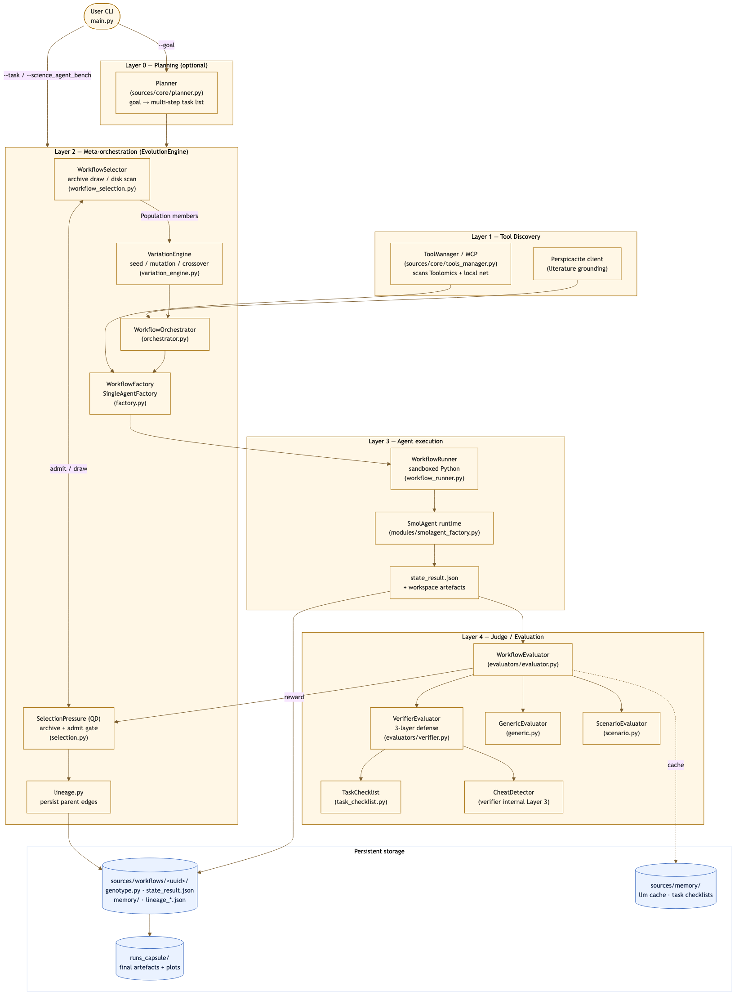
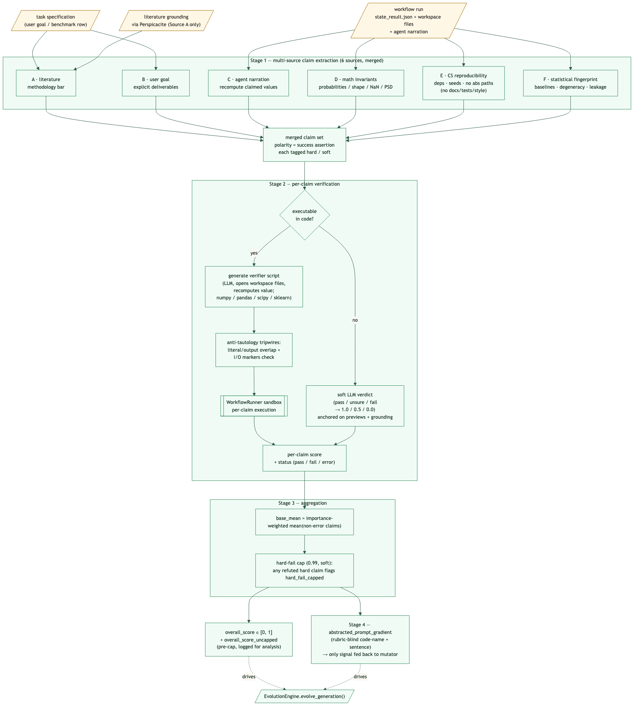

# Contributing to Mimosa-AI

> Technical contribution guide for Mimosa V2 (post `mimosa_v2` branch merge).

## Table of Contents
1. [Project Philosophy](#project-philosophy)
2. [Architecture Overview](#architecture-overview)
3. [Directory Structure](#directory-structure)
4. [Core Components](#core-components)
5. [Execution Flow](#execution-flow)
7. [Testing & Evaluation](#testing-evaluation)
8. [Contributing Guidelines](#contributing-guidelines)

---

## Project Philosophy

### Vision
Mimosa-AI is an **autonomous AI-scientist framework** that synthesizes
task-specific multi-agent workflows and refines them through execution
feedback. It targets reproducible scientific research and provides
academics with an open, auditable alternative to closed corporate systems.

### Core Principles

#### 1. Polymorphic Multi-Agent Architecture
Workflows are **synthesized on-demand** for each task as Python programs
that wire LLM agents, MCP tools, and control flow together. There is no
fixed pipeline — the meta-orchestrator emits a new graph per task.

#### 2. Code-space Neuroevolution
The framework evolves workflows as full Python source, not prompts or
fixed templates. A single evolution loop is a depth-first recursion over
generations seeded from a Quality-Diversity (QD) archive. See
[Evolution engine](concepts/evolution-engine.md) for the canonical mapping onto
neuroevolution primitives (representation / selection / variation /
evaluation).

#### 3. Verifier-driven evaluation

The judge that produces the evolutionary pressure signal is a
multi-source, per-claim verifier. It writes **deterministic Python
programs** that recompute the agent's claims from the workspace across
six vantages (literature, user goal, agent narration, math invariants,
computational reproducibility, statistical fingerprint), and falls back
to LLM verdicts only when no executable check is possible. The single
output handed to the mutator is a short **prompt gradient** describing
what to change next — it does not name the verified claims back, so the
mutator cannot turn the rubric vocabulary into an over-fitting target.

> Note — this verifier is **not** the ScienceAgentBench or PaperBench
> grader. Those benchmarks compare workflow outputs against author-
> provided ground-truth files; the verifier here drives workflow
> evolution. See
> [ScienceAgentBench](science_agent_bench_evaluation.md) and
> [PaperBench](papers_bench_evaluation.md).

See [Evaluation pipeline](concepts/evaluation-pipeline.md).

#### 4. Tool Discovery & Integration
Uses MCP (Model Context Protocol) for tool auto-discovery on the local
network and via Toolomics workspace exchange.

---

## Architecture Overview

Mimosa follows a five-layer architecture: `(0)` optional planning, `(1)`
tool discovery via MCP/Perspicacite, `(2)` meta-orchestration (the
evolution engine), `(3)` agent execution in a Python sandbox, and `(4)`
judge / evaluation.



Source: [diagrams/architecture_overall.mermaid](diagrams/architecture_overall.mermaid).

- Layer `0` plans and decomposes goals into tasks (skipped in `--task` /
  benchmark mode).
- Layer `1` discovers MCP tools exposed via Toolomics and queries
  Perspicacite for literature grounding.
- Layer `2` synthesizes and iteratively refines task-specific workflows
  via the `EvolutionEngine` (QD selection over a session archive).
- Layer `3` executes those workflows in a sandboxed runner with
  SmolAgents.
- Layer `4` runs the multi-source per-claim verifier and reports
  `overall_score`, `reward_uncapped`, and `abstracted_prompt_gradient`
  back into the loop.

---

## Directory Structure

```
mimosa-ai/
├── config.py                              # Configuration management
├── main.py                                # CLI entry point & mode dispatch
├── pyproject.toml                         # Project metadata + deps
├── cleanup.sh                             # Reset workflows + capsules
├── memory_explorer.py                     # Interactive trace replay
│
├── sources/
│   ├── core/
│   │   ├── evolution_engine.py            # Top-level evolutionary loop (depth-first recursion)
│   │   ├── selection.py                   # SelectionPressure (greedy/tournament/novelty/QD)
│   │   ├── variation_engine.py            # Mutation/crossover prompt assembly + annealing
│   │   ├── workflow_selection.py          # Parent retrieval (archive draw / disk scan)
│   │   ├── genotype_embedding.py          # Code-genotype embedding backend → QD behaviour descriptor
│   │   ├── code_features.py               # genotype_embedding_descriptor shim (QD novelty)
│   │   ├── failure_fingerprint.py         # Verifier verdicts → failure fingerprint (persisted diagnostic, 6-D centered)
│   │   ├── lineage.py                     # parent → child sidecar records
│   │   ├── orchestrator.py                # Grounding → factory → sandbox pipeline
│   │   ├── workflow_factory.py            # Multi-agent workflow synthesis
│   │   ├── single_agent_factory.py        # Single-agent baseline factory
│   │   ├── factory.py                     # Shared factory primitives
│   │   ├── workflow_runner.py             # Sandboxed Python execution
│   │   ├── workflow_info.py               # Workflow metadata reader
│   │   ├── tools_manager.py               # MCP tool discovery
│   │   ├── llm_provider.py                # Multi-provider LLM abstraction
│   │   ├── planner.py                     # Goal → Task decomposition (Layer 0)
│   │   ├── schema.py                      # IndividualRun, Plan, Task, SelectionLog
│   │   └── evaluators/
│   │       ├── evaluator.py               # WorkflowEvaluator facade (routes to backends)
│   │       ├── verifier.py                # Multi-source per-claim verifier (default)
│   │       ├── grounding.py               # Perspicacite literature-grounding adapter
│   │       ├── generic.py                 # Legacy LLM judge (4-criterion)
│   │       ├── scenario.py                # Rubric-based evaluation
│   │       ├── bs_detection.py            # BullshitDetector penalty
│   │       └── base.py                    # Shared evaluator primitives
│   │
│   ├── evaluation/
│   │   ├── csv_mode.py                    # Concurrent batch eval on CSV datasets
│   │   ├── capsule_evaluator.py           # ScienceAgentBench metrics (VER/SR/CBS)
│   │   ├── codebert_scorer.py             # Semantic code similarity
│   │   ├── execution_sandbox.py           # Safe code execution for benchmark eval
│   │   ├── scenario_loader.py             # Load scenario rubrics
│   │   ├── science_agent_bench.py         # ScienceAgentBench dataset integration
│   │   └── eval_workflow_generation.py    # Workflow-generation-quality eval
│   │
│   ├── cli/
│   │   ├── onboard_cli.py                 # Interactive zero-arg onboarding flow
│   │   ├── evaluation_cli.py              # Interactive ScienceAgentBench launcher
│   │   └── pretty_print.py                # Coloured CLI primitives (print_phase, …)
│   │
│   ├── extensibility/
│   │   ├── human_mode.py                  # Manual no-LLM CLI mode
│   │   └── text_to_speech.py              # TTS hook
│   │
│   ├── modules/                           # Pre-fab code injected into workflows
│   │   ├── state_schema.py                # Workflow state template
│   │   └── smolagent_factory.py           # SmolAgent factory template
│   │
│   ├── prompts/
│   │   ├── workflow_v11.md                # Current workflow generator prompt
│   │   ├── workflow_v10.md                # (kept for diffing)
│   │   ├── workflow_v9.md                 # (legacy reference)
│   │   ├── workflow_v8.md                 # (legacy reference)
│   │   ├── planner_reproduction.md        # Planner prompt — reproduction goal
│   │   ├── planner_paperbench_codedev.md  # Planner prompt — code-dev paperbench
│   │   └── smolagent_sys_prompt.md        # SmolAgent system prompt
│   │
│   ├── cache/
│   │   └── openrouter_pricing.json        # Cached pricing for cost tracking
│   │
│   ├── security/
│   │   └── check_package.py               # Pre-flight package vetting
│   │
│   ├── utils/
│   │   ├── pricing.py                     # LLM pricing (OpenRouter-aware)
│   │   ├── logging.py                     # Structured logging
│   │   ├── notify.py                      # Pushover notifications
│   │   ├── transfer_toolomics.py          # Workspace ↔ Toolomics transfer
│   │   ├── workspace_management.py        # Snapshot / restore best run
│   │   ├── perspicacite_client.py         # Literature grounding HTTP client
│   │   ├── planner_visualization.py       # Real-time plan visualisation
│   │   ├── evolution_tree.py              # Lineage → tree PNG renderer
│   │   ├── visualization.py               # Reward/assertion plots
│   │   ├── shared_visualization.py        # Shared plot primitives
│   │   ├── email_reporter.py              # Email run summaries
│   │   ├── openrouter_endpoints.py        # OpenRouter endpoint catalogue
│   │   ├── precheck.py                    # Environment validation
│   │   ├── list_files.py                  # Workspace listing helper
│   │   ├── dataset.py                     # CSV / scenario helpers
│   │   └── mock_data.py                   # Test fixtures
│   │
│   ├── memory/                            # LLM call cache + memory traces (runtime)
│   └── workflows/                         # Generated workflow storage (runtime)
│       └── <uuid>/                        # Per-execution folders
│           ├── workflow_genotype_<uuid>.py
│           ├── state_result.json
│           ├── evolution_prompt_<uuid>.md
│           ├── lineage_<uuid>.json
│           ├── reward_progress.png
│           └── memory/
│
├── runs_capsule/
│   └── <capsule_name>/                    # Per-execution capsule
│       ├── workflow.py
│       ├── results/
│       ├── logs/
│       └── evaluation_results.json
│
├── datasets/
│   ├── ScienceAgentBench.csv              # ScienceAgentBench tasks
│   ├── ScienceAgentBench/                 # Per-task workspaces
│   ├── our_benchmark.csv                  # Custom benchmark
│   ├── paper_bench.csv                    # OpenAI PaperBench
│   ├── paper_bench_light.csv              # Light variant
│   ├── papers_rejection_watch.csv         # Rejected-paper tracking
│   ├── datascience_papers.csv             # DS papers list
│   └── scenarios/                         # Scenario rubrics
│
├── docs/
│   ├── DEVELOPER_GUIDE.md                 # This file
│   ├── QUICK_RESEARCH_GUIDE.md            # Quick research workflow
│   ├── v2_evolution.md                    # Neuroevolution-lens view of the engine
│   ├── math_lens.md                       # Math-style analysis of representation/QD
│   ├── papers_bench_evaluation.md
│   ├── science_agent_bench_evaluation.md
│   ├── diagrams/                          # .mermaid sources + .puml
│   └── images/                            # Rendered .png diagrams
│
└── tests/
    ├── evaluator_test.py
    ├── scenario_rubric_test.py
    ├── judge_test.py
    ├── workflow_evaluator_test.py
    ├── tools_manager_test.py
    ├── pricing_test.py
    ├── memory_read.py
    └── cosine_similarity.py
```

---

## Core Components

### 1. `EvolutionEngine` — [`sources/core/evolution_engine.py`](https://github.com/HolobiomicsLab/Mimosa-AI/blob/main/sources/core/evolution_engine.py)

Top-level evolutionary loop.

Key collaborators (instantiated in `__init__`):
- `WorkflowSelector` — parent retrieval.
- `WorkflowOrchestrator` — grounding → factory → sandbox.
- `VariationEngine` — mutation / crossover prompt assembly.
- `WorkflowEvaluator` — multi-source per-claim verifier (default).
- `SelectionPressure` — QD archive (population_size=50, k=15,
  novelty_weight=0.25).

Each recursive step:
1. resets the workspace to the initial state,
2. orchestrates a workflow run (LLM → sandbox),
3. snapshots the workspace,
4. evaluates → `overall_score` / `reward_uncapped`,
5. calls `validate_survivor()` and admits to the archive if non-dominated
   on `(reward_uncapped, novelty)`,
6. selects the next parent(s) and chooses mutation vs crossover,
7. recurses.

Termination: `overall_score >= learned_score_threshold` (default 0.9) in
`--learn` mode, or `max_depth` reached
(`max_learning_evolve_iterations`, default 20; single-shot uses
`max_depth=1`).

### 2. `SelectionPressure` — [`sources/core/selection.py`](https://github.com/HolobiomicsLab/Mimosa-AI/blob/main/sources/core/selection.py)

Four strategies: `greedy`, `tournament`, `novelty`, `qd` (default). In
QD mode it maintains a session archive of up to `population_size`
members, weighted by `qd_score = (1-w)·quality_norm + w·novelty_norm`
(`w = novelty_weight = 0.25`). Quality is sourced from `reward_uncapped`
so the hard-fail cap (`_HARD_FAIL_CAP`, currently `0.99`) doesn't
flatten rank ordering. Admission is
gated by the validity check (improvement over baseline or
`qd_score > admit_threshold`); when capacity is hit, the lowest-
`qd_score` member is evicted. Parent draw applies an inverse-child-count
penalty `÷(1 + n_children_already)` and a hard
`MAX_CHILDREN_PER_PARENT = 2` cap to spread offspring.

### 3. `VariationEngine` — [`sources/core/variation_engine.py`](https://github.com/HolobiomicsLab/Mimosa-AI/blob/main/sources/core/variation_engine.py)

Prompt assembly for mutation and crossover. Mutation boldness is a
continuous function of two evidence signals — an
`iters_since_improvement` plateau counter *and* the Rechenberg 1/5
success rate of recent offspring — not a fixed phase schedule.

- `_iters_since_improvement()` — length of the trailing run of scored
  offspring that did not strictly beat best-so-far (failures and
  unscored entries skipped). Normalised as
  `plateau = min(1, iters / _PLATEAU_PATIENCE)` with
  `_PLATEAU_PATIENCE = 6`.
- `_compute_success_rate(window=5)` — fraction of the last 5 scored
  offspring that strictly beat the running best at production time.
  The Rechenberg 1/5 success rule threshold is `0.20`.
- `_get_prompt_step_size(parent_score)` — combines the two:
    * cold start (fewer than two comparable scored offspring) —
      `effective = 0.3 · plateau` (capped ramp),
    * `success_rate < 0.20` — `effective = 0.5 · deficit + 0.5 · plateau`
       with `deficit = (0.20 − success_rate) / 0.20` (escalate),
    * `success_rate ≥ 0.20` — `effective = plateau · (1 − progress)`
       with `progress = min(1, (success_rate − 0.20) / (0.80 − 0.20))`
       (damp boldness in proportion to real progress),
    * near-finish floor: when `parent_score > 0.95`, multiply by
       `(1 − 0.5 · (parent_score − 0.95) / 0.05)` so a 0.96 parent isn't
       gambled away one generation before early-stop,
    * RE-SPECIATION gate: unless `iters_since_improvement ≥ 8` *and*
      `success_rate ∈ {None, 0.0}`, `effective` is clamped to
      `_RESPECIATION_CLAMP = 0.89`, just below the EXPLORATION/
      RE-SPECIATION boundary at `0.90`.
  Then it grows the agent budget from the previous generation's count
  toward `max_possible_agents = 7` proportionally to `effective`, and
  samples the actual agent count with a Beta-Binomial biased upward by
  `effective`.

| Effective boldness | Mutation scope (advisory)                                                   |
|--------------------|-----------------------------------------------------------------------------|
| < 0.35             | `EXPLOITATION` — point mutation: minor phrasing / prompt-adjective tweaks   |
| < 0.50             | `ALIGNMENT` — interface optimization: refine handoff prompts, IO contracts  |
| < 0.65             | `ADAPTATION` — component overhaul: rewrite lagging agent prompts, swap tools |
| < 0.90             | `EXPLORATION` — macro structural mutation: add/merge agents, change routing |
| ≥ 0.90             | `RE-SPECIATION` — clean-slate redesign of the multi-agent architecture      |

Scope is an advisory line injected into the mutation prompt; the LLM
may still pick any topology. The hard control is the agent-count
budget carried in the same block.

`llm_think_mutation_directive(agent_answers, textual_gradient_block,
step_block, goal)` runs a dedicated LLM call between
`_get_prompt_step_size` and the orchestrator. It consumes the
parent's per-agent answers, the rubric-blind verifier diagnosis, and
the boldness/scope block, and emits a **≤ 3-sentence directive**
naming exactly one issue, the kind of mutation it implies (prompt
tweak, persona change, agent add/remove, topology change), and the
rationale. The system prompt fixes trust ranks (verifier diagnosis
trusted, agent self-reports not), and hard limits (one agent
add/remove per step, never above the boldness band, default to small
incremental changes).

`mutation_prompt(...)` is therefore now a thin wrapper: it passes the
parent code plus that one directive to the orchestrator inside a
`<directive>...</directive>` block, with explicit instructions to
**follow the directive exactly**, **add/remove at most one agent per
step**, **not change topology** unless the directive says so, **not
edit prompts outside the directive's scope**, and **keep ≥ 90 % of the
previous code and prompts unchanged**. The verifier diagnosis and raw
agent answers are no longer injected into the orchestrator's
context — they were only ever needed to *decide* the change, and that
decision is now made upstream. This split keeps orchestrator
cognitive load on synthesis (write valid LangGraph + agent code), not
on diagnosis. If the previous attempt failed to produce code at all
(`genotype is None`), the directive-LLM is skipped and a fixed
"Previous attempt failed completely. Fix syntax errors." directive is
substituted.

### 4. `WorkflowSelector` — [`sources/core/workflow_selection.py`](https://github.com/HolobiomicsLab/Mimosa-AI/blob/main/sources/core/workflow_selection.py)

Two-mode parent retrieval:

- **Steady state**: when `selection_pressure._archive` is populated, draws
  parents from the live session archive via QD-roulette.
- **Cold start**: empty archive → similarity-filtered disk scan
  (`cosine ≥ 0.8` on MiniLM embeddings of `original_task`, `score ≥ 0.1`)
  routed through the same `select_parents()` weighting.

### 5. `WorkflowOrchestrator` — [`sources/core/orchestrator.py`](https://github.com/HolobiomicsLab/Mimosa-AI/blob/main/sources/core/orchestrator.py)

End-to-end workflow execution per generation:

1. **Grounding**: queries Perspicacite for scientific literature context
   and prepends it to craft instructions.
2. **Generation**: calls `WorkflowFactory` (multi-agent) or
   `SingleAgentFactory` (`--single_agent`).
3. **Dependency install + sandbox run**: via `WorkflowRunner` with the
   pinned `runner_requirements` list from `config.py`.

Returns `(execution_output, uuid, workflow_genotype_code, executed)` —
`executed=False` is the structural failure signal that drives
re-attempts.

### 6. `LLMProvider` — [`sources/core/llm_provider.py`](https://github.com/HolobiomicsLab/Mimosa-AI/blob/main/sources/core/llm_provider.py)

Unified interface (via LiteLLM) over Anthropic Claude, OpenAI,
DeepSeek, Hugging Face, OpenRouter (with per-model provider routing),
and local MLX. Features:
- prompt-cache compatible request caching,
- retry/backoff,
- token counting + cost tracking,
- reasoning-effort support (Claude / GPT-5 `minimal|low|medium|high`).

### 7. `ToolManager` — [`sources/core/tools_manager.py`](https://github.com/HolobiomicsLab/Mimosa-AI/blob/main/sources/core/tools_manager.py)

MCP server auto-discovery on the configured `discovery_addresses` port
range. Generates the tool-binding code injected into each workflow
genotype.

### 8. Evaluation backends — [`sources/core/evaluators/`](https://github.com/HolobiomicsLab/Mimosa-AI/blob/main/sources/core/evaluators/)

| Backend          | File              | Use                                   |
|------------------|-------------------|---------------------------------------|
| `VerifierEvaluator` | `verifier.py`     | **Default**: multi-source per-claim verifier |
| `GenericEvaluator`  | `generic.py`     | Legacy 4-criterion LLM judge          |
| `ScenarioEvaluator` | `scenario.py`    | Rubric / assertion-based scoring      |
| `Perspicacite grounding` | `grounding.py` | Adapter used by verifier |
| `BullshitDetector` | `bs_detection.py` | Numerical-fraud penalty               |

The facade is `WorkflowEvaluator` (`evaluator.py`); the evolution engine
calls it with `evaluator_type="verifier"`.

### 9. Benchmark evaluation — [`sources/evaluation/`](https://github.com/HolobiomicsLab/Mimosa-AI/blob/main/sources/evaluation/)

- `csv_mode.py` — concurrent batch runner over a CSV dataset
  (controlled by `config.max_concurrent_eval_tasks` and
  `config.task_start_delay`).
- `capsule_evaluator.py` — computes ScienceAgentBench's VER (Valid
  Execution Rate), SR (Success Rate), and CBS (CodeBERT Score).
- `science_agent_bench.py` — dataset adapter.
- `eval_workflow_generation.py` — workflow-generation-quality eval mode.

---

## Execution Flow

### Mode 1: Task mode (`--task`)
```
main.py --task "<task>" [--learn] [--single_agent]
    ↓
EvolutionEngine.start_workflow_evolution(goal)
    ├─ reset session archive
    ├─ rehydrate parent if --template_uuid (else None)
    ├─ first run: seed prompt OR template mutation
    └─ evolve_generation()   ← depth-first recursion
        ├─ orchestrate_workflow()
        │   ├─ Perspicacite grounding
        │   ├─ workflow_factory.craft_workflow()
        │   └─ workflow_runner.execute() (sandbox)
        ├─ WorkflowEvaluator.evaluate(evaluator_type="verifier")
        ├─ SelectionPressure.validate_survivor() → archive admit?
        ├─ record_lineage()
        ├─ select next parent (archive QD-roulette)
        ├─ choose crossover (default crossover_rate=0.1, once initial_population met) or mutation
        └─ recurse → stop on threshold OR max_depth
    ↓
WorkspaceManager.restore_best(best_uuid)
```

### Mode 2: Goal mode (`--goal`)
```
main.py --goal "Reproduce paper X"
    ↓
Planner.start_planner(goal)
    ├─ generate multi-step plan
    ├─ human approval prompt
    └─ for each step:
        └─ start_workflow_evolution(step_task)
    ↓
LocalTransfer.transfer_workspace_files_to_capsule()
```

### Mode 3: Benchmark batch (`--science_agent_bench`)
```
main.py --science_agent_bench --csv_runs_limit N --config my_config.json [--learn] [--single_agent]
    ↓
CsvEvaluationMode(max_concurrent_tasks=config.max_concurrent_eval_tasks)
    ↓
parallel start_workflow_evolution() per row, with task_start_delay between launches
    ↓
capsule_evaluator → ScienceAgentBench metrics (VER / SR / CBS)
```

### Mode 4: Onboarding / Evaluation CLI (zero-args)
```
main.py                       # interactive setup wizard (OnboardCLI)
main.py --evaluation_cli      # guided model/workspace/mode picker (EvaluationCLI)
```

---

## Evaluation & the multi-source per-claim verifier



Source diagram: [`docs/diagrams/verifiers_judge.mermaid`](https://github.com/HolobiomicsLab/Mimosa-AI/blob/main/docs/diagrams/verifiers_judge.mermaid).

For each generation:

1. **Multi-source claim extraction**: six independent prompts emit
   success-polarity claims from different vantage points — `A` literature
   (Perspicacité), `B` user goal, `C` agent narration (anti-hallucination),
   `D` math invariants, `E` non-negotiable computational reproducibility
   (deps manifest covers used imports, no absolute paths, seeds on
   stochastic ops; **explicitly forbids** README / docs / tests / style /
   type-hint claims), `F` statistical fingerprint (baseline, degeneracy,
   leakage). Claims are tagged `hard` or `soft`; bare file-existence is
   never `hard`.
2. **Per-claim verification**: each claim is classified as executable or
   soft. Executable claims get an LLM-written verifier script that opens
   workspace files and recomputes the asserted value; anti-tautology
   tripwires (literal/output overlap ≥ 80 chars, I/O markers presence)
   reject scripts that parse the agent's answer back to itself. The
   verifier runner has `numpy`, `pandas`, `scipy`, and `scikit-learn`
   pre-installed (lazy one-shot install per process). Soft claims get a
   `pass/unsure/fail` LLM verdict against workspace previews + literature
   grounding (mapped to `1.0 / 0.5 / 0.0`).
3. **Behavioral pressure against shortcut workflows** comes from Source
   C's recompute-from-disk verifiers, the inverted-score "Used fallback"
   claim type, and the anti-tautology tripwires.
4. **Aggregation**:
   ```
   overall = clamp(base_mean, 0, 1)
   if any hard claim refuted:
       overall = min(overall, 0.99)        # _HARD_FAIL_CAP (soft, for now)
   ```
   `base_mean` is the importance-weighted mean of per-claim scores.
5. **Prompt gradient** — plain-language single-sentence diagnosis
   prefixed with a short code name (e.g. `FALLBACK_ECFP_CLASSIFIER`). It
   is the **only** verifier signal the mutator sees, and recent history
   is included so recurring failure modes reuse the same code names
   across generations. The gradient deliberately does not name the
   verified claims, scores, or which of the six sources raised them — so
   the mutator can correct the workflow without being handed a rubric to
   over-fit against.

Detail: [Evaluation pipeline](concepts/evaluation-pipeline.md).

---

## Testing & Evaluation

### Running tests

```bash
# All tests
python -m pytest tests/

# Specific test
python -m pytest tests/evaluator_test.py

# Verbose + coverage
python -m pytest tests/ -v --cov=sources
```

### Running evaluations

```bash
# Papers dataset (custom CSV)
python main.py --papers datasets/our_benchmark.csv --csv_runs_limit 10 --config my_config.json

# ScienceAgentBench (full sweep)
uv run main.py --science_agent_bench --csv_runs_limit 102 --config my_config.json

# ScienceAgentBench with iterative learning
uv run main.py --science_agent_bench --csv_runs_limit 7 --config my_config.json --learn

# Single-agent baseline
uv run main.py --science_agent_bench --csv_runs_limit 7 --config my_config.json --single_agent
```

### Inspecting a workflow run

```bash
# Generated workflow code (genotype)
cat sources/workflows/<uuid>/workflow_genotype_<uuid>.py

# Execution state & per-claim scores
cat sources/workflows/<uuid>/state_result.json

# Variation prompt that produced this run
cat sources/workflows/<uuid>/evolution_prompt_<uuid>.md

# Lineage record (parents + operator)
cat sources/workflows/<uuid>/lineage_<uuid>.json

# Memory traces
ls sources/workflows/<uuid>/memory/

# Interactive replay
python memory_explorer.py <uuid>
```

### Pushover notifications (optional)

1. Create a Pushover account at pushover.net.
2. Export `PUSHOVER_TOKEN` and `PUSHOVER_USER`.
3. Receive per-iteration completion and best-uuid notifications.

---

## Contributing Guidelines

### Before submitting a PR
1. ✅ `pytest tests/`
2. ✅ Follow existing style; see [Evolution engine](concepts/evolution-engine.md)
   for conventions on new evolution-layer components.
3. ✅ Add docstrings on public functions.
4. ✅ Update the relevant doc page(s) under `docs/`. If you change
   architecture, also update the `.mermaid` source under
   `docs/diagrams/` and regenerate the `.png` under `docs/images/`.

### PR description should include
- **Problem** — what does this solve?
- **Solution** — how does it solve it?
- **Testing** — how was it tested? (Pytest output, benchmark numbers.)
- **Backwards compatibility** — any breaking changes?

### Re-rendering diagrams

```bash
cd docs
npx -y -p @mermaid-js/mermaid-cli mmdc \
  -i diagrams/<name>.mermaid -o images/<name>.png \
  -t neutral -b white -w 1800
```

---

## Questions & Support

Open an Issue for any question or support request.
