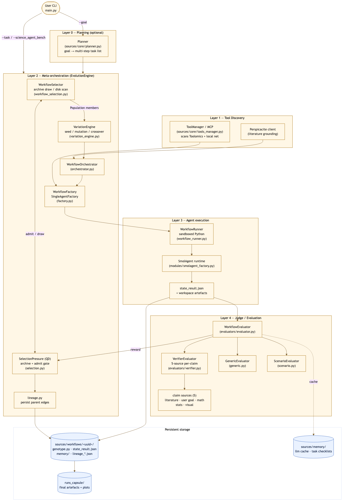

# Contributing to Mimosa-AI

> Technical contribution guide for Mimosa V2 (post `mimosa_v2` branch merge).

## Table of Contents
1. [Project Philosophy](#project-philosophy)
2. [Architecture Overview](#architecture-overview)
3. [Directory Structure](#directory-structure)
4. [Core Components](#core-components)
5. [Execution Flow](#execution-flow)
7. [Testing & Evaluation](#testing-evaluation)
8. [Contributing Guidelines](#contributing-guidelines)

---

## Project Philosophy

### Vision
Mimosa-AI is an **autonomous AI-scientist framework** that synthesizes
task-specific multi-agent workflows and refines them through execution
feedback. It targets reproducible scientific research and provides
academics with an open, auditable alternative to closed corporate systems.

### Core Principles

#### 1. Polymorphic Multi-Agent Architecture
Workflows are **synthesized on-demand** for each task as Python programs
that wire LLM agents, MCP tools, and control flow together. There is no
fixed pipeline — the meta-orchestrator emits a new graph per task.

#### 2. Code-space Neuroevolution
The framework evolves workflows as full Python source, not prompts or
fixed templates. A single evolution loop is a depth-first recursion over
generations seeded from a Quality-Diversity (QD) archive. See
[Evolution engine](concepts/evolution-engine.md) for the canonical mapping onto
neuroevolution primitives (representation / selection / variation /
evaluation).

#### 3. Verifier-driven evaluation

The judge that produces the evolutionary pressure signal is the
**hybrid temporal-ladder verifier**
([`sources/evaluators/hybrid_verifier/`](https://github.com/HolobiomicsLab/Mimosa-AI/blob/main/sources/evaluators/hybrid_verifier/),
default since 2026-09-24). Per task it extracts 8–12 stage-tagged key
claims forming a temporal ladder (`script` → `log` → `result`), turns
each claim into a cached **deterministic Python policy scorer** that
grades any workspace of the task on a continuous 0..1 scale, and
computes the reward as a **pairwise win-rate** over the task's previous
generations — each pair decided at the earliest ladder stage where the
two differ. The single output handed to the mutator is the
**textual gradient**, which leads with the elimination point: the
earliest stage/claim where this generation lost, with measured
evidence.

> Note — this verifier is **not** the ScienceAgentBench or PaperBench
> grader. Those benchmarks compare workflow outputs against author-
> provided ground-truth files; the verifier here drives workflow
> evolution. See
> [ScienceAgentBench](science_agent_bench_evaluation.md) and
> [PaperBench](papers_bench_evaluation.md).

See [Evaluation pipeline](concepts/evaluation-pipeline.md).

#### 4. Tool Discovery & Integration
Uses MCP (Model Context Protocol) for tool auto-discovery on the local
network and via Toolomics workspace exchange.

---

## Architecture Overview

Mimosa follows a five-layer architecture: `(0)` optional planning, `(1)`
tool discovery via MCP/Perspicacite, `(2)` meta-orchestration (the
evolution engine), `(3)` agent execution in a Python sandbox, and `(4)`
judge / evaluation.



Source: [diagrams/architecture_overall.mermaid](diagrams/architecture_overall.mermaid).

- Layer `0` plans and decomposes goals into tasks (skipped in `--task` /
  benchmark mode).
- Layer `1` discovers MCP tools exposed via Toolomics and queries
  Perspicacite for literature grounding.
- Layer `2` synthesizes and iteratively refines task-specific workflows
  via the `EvolutionEngine` (QD selection over a session archive).
- Layer `3` executes those workflows in a sandboxed runner with
  SmolAgents.
- Layer `4` runs the hybrid temporal-ladder verifier and reports
  `overall_score` (the pairwise win-rate reward) and the
  `abstracted_textual_gradient` back into the loop; QD selection ranks
  on `overall_score`.

---

## Directory Structure

```
mimosa-ai/
├── config.py                              # Configuration management
├── main.py                                # CLI entry point & mode dispatch
├── pyproject.toml                         # Project metadata + deps
├── cleanup.sh                             # Reset workflows + capsules
├── memory_explorer.py                     # Interactive trace replay
│
├── sources/
│   ├── core/
│   │   ├── evolution_engine.py            # Top-level evolutionary loop (depth-first recursion)
│   │   ├── selection.py                   # SelectionPressure (greedy/tournament/novelty/QD)
│   │   ├── variation_engine.py            # Mutation/crossover prompt assembly + annealing
│   │   ├── workflow_selection.py          # Parent retrieval (archive draw / disk scan)
│   │   ├── genotype_embedding.py          # Code-genotype embedding backend → QD behaviour descriptor
│   │   ├── code_features.py               # genotype_embedding_descriptor shim (QD novelty)
│   │   ├── failure_fingerprint.py         # Legacy verifier failure fingerprint (deprecated; hybrid writes a neutral placeholder)
│   │   ├── lineage.py                     # parent → child sidecar records
│   │   ├── orchestrator.py                # Grounding → factory → sandbox pipeline
│   │   ├── workflow_factory.py            # Multi-agent workflow synthesis
│   │   ├── single_agent_factory.py        # Single-agent baseline factory
│   │   ├── factory.py                     # Shared factory primitives
│   │   ├── workflow_runner.py             # Sandboxed Python execution
│   │   ├── workflow_info.py               # Workflow metadata reader
│   │   ├── tools_manager.py               # MCP tool discovery
│   │   ├── llm_provider.py                # Multi-provider LLM abstraction
│   │   ├── planner.py                     # Goal → Task decomposition (Layer 0)
│   │   ├── schema.py                      # IndividualRun, Plan, Task, SelectionLog
│   │   └── evaluators/
│   │       ├── evaluator.py               # WorkflowEvaluator facade (routes to backends)
│   │       ├── hybrid_verifier/           # Hybrid temporal-ladder verifier (default): claims, digest,
│   │       │                              # scorers, registry, aggregation, gradient, layers
│   │       ├── verifier.py                # Legacy multi-source per-claim verifier (deprecated)
│   │       ├── grounding.py               # Perspicacite literature-grounding adapter (legacy verifier / generic)
│   │       ├── generic.py                 # Legacy LLM judge (4-criterion)
│   │       ├── scenario.py                # Rubric-based evaluation
│   │       ├── bs_detection.py            # BullshitDetector penalty
│   │       └── base.py                    # Shared evaluator primitives
│   │
│   ├── evaluation/
│   │   ├── csv_mode.py                    # Concurrent batch eval on CSV datasets
│   │   ├── capsule_evaluator.py           # ScienceAgentBench metrics (VER/SR/CBS)
│   │   ├── codebert_scorer.py             # Semantic code similarity
│   │   ├── execution_sandbox.py           # Safe code execution for benchmark eval
│   │   ├── scenario_loader.py             # Load scenario rubrics
│   │   ├── science_agent_bench.py         # ScienceAgentBench dataset integration
│   │   └── eval_workflow_generation.py    # Workflow-generation-quality eval
│   │
│   ├── cli/
│   │   ├── onboard_cli.py                 # Interactive zero-arg onboarding flow
│   │   ├── evaluation_cli.py              # Interactive ScienceAgentBench launcher
│   │   └── pretty_print.py                # Coloured CLI primitives (print_phase, …)
│   │
│   ├── extensibility/
│   │   ├── human_mode.py                  # Manual no-LLM CLI mode
│   │   └── text_to_speech.py              # TTS hook
│   │
│   ├── modules/                           # Pre-fab code injected into workflows
│   │   ├── state_schema.py                # Workflow state template
│   │   └── smolagent_factory.py           # SmolAgent factory template
│   │
│   ├── prompts/
│   │   ├── workflow_v11.md                # Current workflow generator prompt
│   │   ├── workflow_v10.md                # (kept for diffing)
│   │   ├── workflow_v9.md                 # (legacy reference)
│   │   ├── workflow_v8.md                 # (legacy reference)
│   │   ├── planner_reproduction.md        # Planner prompt — reproduction goal
│   │   ├── planner_paperbench_codedev.md  # Planner prompt — code-dev paperbench
│   │   └── smolagent_sys_prompt.md        # SmolAgent system prompt
│   │
│   ├── cache/
│   │   └── openrouter_pricing.json        # Cached pricing for cost tracking
│   │
│   ├── security/
│   │   └── check_package.py               # Pre-flight package vetting
│   │
│   ├── utils/
│   │   ├── pricing.py                     # LLM pricing (OpenRouter-aware)
│   │   ├── logging.py                     # Structured logging
│   │   ├── notify.py                      # Pushover notifications
│   │   ├── transfer_toolomics.py          # Workspace ↔ Toolomics transfer
│   │   ├── workspace_management.py        # Snapshot / restore best run
│   │   ├── perspicacite_client.py         # Literature grounding HTTP client
│   │   ├── planner_visualization.py       # Real-time plan visualisation
│   │   ├── evolution_tree.py              # Lineage → tree PNG renderer
│   │   ├── visualization.py               # Reward/assertion plots
│   │   ├── shared_visualization.py        # Shared plot primitives
│   │   ├── email_reporter.py              # Email run summaries
│   │   ├── openrouter_endpoints.py        # OpenRouter endpoint catalogue
│   │   ├── precheck.py                    # Environment validation
│   │   ├── list_files.py                  # Workspace listing helper
│   │   ├── dataset.py                     # CSV / scenario helpers
│   │   └── mock_data.py                   # Test fixtures
│   │
│   ├── memory/                            # LLM call cache + memory traces (runtime)
│   └── workflows/                         # Generated workflow storage (runtime)
│       └── <uuid>/                        # Per-execution folders
│           ├── workflow_genotype_<uuid>.py
│           ├── state_result.json
│           ├── evolution_prompt_<uuid>.md
│           ├── lineage_<uuid>.json
│           ├── reward_progress.png
│           └── memory/
│
├── runs_capsule/
│   └── <capsule_name>/                    # Per-execution capsule
│       ├── workflow.py
│       ├── results/
│       ├── logs/
│       └── evaluation_results.json
│
├── datasets/
│   ├── ScienceAgentBench.csv              # ScienceAgentBench tasks
│   ├── ScienceAgentBench/                 # Per-task workspaces
│   ├── our_benchmark.csv                  # Custom benchmark
│   ├── paper_bench.csv                    # OpenAI PaperBench
│   ├── paper_bench_light.csv              # Light variant
│   ├── papers_rejection_watch.csv         # Rejected-paper tracking
│   ├── datascience_papers.csv             # DS papers list
│   └── scenarios/                         # Scenario rubrics
│
├── docs/
│   ├── DEVELOPER_GUIDE.md                 # This file
│   ├── QUICK_RESEARCH_GUIDE.md            # Quick research workflow
│   ├── v2_evolution.md                    # Neuroevolution-lens view of the engine
│   ├── math_lens.md                       # Math-style analysis of representation/QD
│   ├── papers_bench_evaluation.md
│   ├── science_agent_bench_evaluation.md
│   ├── diagrams/                          # .mermaid sources + .puml
│   └── images/                            # Rendered .png diagrams
│
└── tests/
    ├── evaluator_test.py
    ├── scenario_rubric_test.py
    ├── judge_test.py
    ├── workflow_evaluator_test.py
    ├── tools_manager_test.py
    ├── pricing_test.py
    ├── memory_read.py
    └── cosine_similarity.py
```

---

## Core Components

### 1. `EvolutionEngine` — [`sources/core/evolution_engine.py`](https://github.com/HolobiomicsLab/Mimosa-AI/blob/main/sources/core/evolution_engine.py)

Top-level evolutionary loop.

Key collaborators (instantiated in `__init__`):
- `WorkflowSelector` — parent retrieval.
- `WorkflowOrchestrator` — grounding → factory → sandbox.
- `VariationEngine` — mutation / crossover prompt assembly.
- `WorkflowEvaluator` — hybrid temporal-ladder verifier (default).
- `SelectionPressure` — QD archive (population_size=50, k=15,
  novelty_weight=0.25).

Each recursive step:
1. resets the workspace to the initial state,
2. orchestrates a workflow run (LLM → sandbox),
3. snapshots the workspace,
4. evaluates → `overall_score` (surfaced as `reward` on the run),
5. calls `validate_survivor()` and admits to the archive on improvement
   or `qd_score > admit_threshold` (quality term from the capped `reward`),
6. selects the next parent(s) and chooses mutation vs crossover,
7. recurses.

Termination: `overall_score >= learned_score_threshold` (default 0.9) in
`--learn` mode, or `max_depth` reached
(`max_learning_evolve_iterations`, default 20; single-shot uses
`max_depth=1`).

### 2. `SelectionPressure` — [`sources/core/selection.py`](https://github.com/HolobiomicsLab/Mimosa-AI/blob/main/sources/core/selection.py)

Four strategies: `greedy`, `tournament`, `novelty`, `qd` (default). In
QD mode it maintains a session archive of up to `population_size`
members, weighted by `qd_score = (1-w)·quality_norm + w·novelty_norm`
(`w = novelty_weight = 0.25`). Quality is sourced from `reward` (the
verifier's `overall_score` — under the hybrid verifier, the pairwise
win-rate over the task's previous generations), and admission is
gated by the validity check (improvement over baseline or
`qd_score > admit_threshold`); when capacity is hit, the lowest-
`qd_score` member is evicted. Parent draw applies an inverse-child-count
penalty `÷(1 + n_children_already)` and a hard
`MAX_CHILDREN_PER_PARENT = 2` cap to spread offspring.

### 3. `VariationEngine` — [`sources/core/variation_engine.py`](https://github.com/HolobiomicsLab/Mimosa-AI/blob/main/sources/core/variation_engine.py)

Prompt assembly for mutation and crossover. There is no step-size
controller: mutation magnitude is **directive-implicit** — the
directive LLM judges how bold the next change should be from a
deterministic, read-only `<search_state>` block; hard guardrails stay
in code.

- `_iters_since_improvement()` — observer: length of the trailing run
  of scored offspring that did not strictly beat best-so-far (failures
  and unscored entries skipped). Normalised as
  `plateau = min(1, iters / _PLATEAU_PATIENCE)` with
  `_PLATEAU_PATIENCE = 6`.
- `_compute_success_rate(window=5)` — observer: fraction of the last 5
  scored offspring that strictly beat the running best at production
  time (`None` with fewer than two comparable scored offspring).
- `_search_state_block(parent_score, iteration_count, max_iterations)`
  — assembles the `<search_state>` payload from those signals plus the
  parent score, iteration progress and a last-5 score trajectory
  (score-only, no rubric text). Also refreshes
  `last_variation_state` telemetry (`iters_since_improvement`,
  `plateau`, `success_rate`, `parent_score`, `agent_budget`).
- `_sample_mutation_agent_budget(parent_agents)` — parent-centered
  budget: uniform draw in `[max(1, parent_agents − 1),
  min(max_possible_agents = 7, parent_agents + 1)]`. The parent's
  agent count comes from the distinct `step_name` entries of its
  `state_result` (retry-loop repeats collapsed), falling back to the
  last sampled budget. Seed generation keeps its `[1, 4]` draw.

The former step-size arithmetic (`_get_prompt_step_size`, effective
boldness, five scope bands, RE-SPECIATION hysteresis gate) was
removed: it never actuated a real knob (temperature is sampled
randomly at the workflow factory) and measured behaviour was
noise-dominated — the directive wording predicted realised edit size
far better than the scalar.

`llm_think_mutation_directive(agent_answers, textual_gradient_block,
search_state, goal)` runs a dedicated LLM call before the
orchestrator. It consumes the parent's per-agent answers, the
verifier's textual gradient, and the search-state block, and emits
a **≤ 3-sentence directive** naming exactly one issue, the kind of
mutation it implies (prompt tweak, persona change, agent add/remove,
topology change), the intended magnitude (small tweak, component
rewrite, structural redesign) justified by the search state, and the
rationale. The system prompt fixes trust ranks (verifier diagnosis
trusted, agent self-reports not), and hard limits (one agent
add/remove per step, default to small incremental changes).

`mutation_prompt(...)` is therefore now a thin wrapper: it passes the
parent code plus that one directive to the orchestrator inside a
`<directive>...</directive>` block, with explicit instructions to
**follow the directive exactly**, **add/remove at most one agent per
step**, **not change topology** unless the directive says so, **not
edit prompts outside the directive's scope**, and **keep ≥ 90 % of the
previous code and prompts unchanged**. The verifier diagnosis and raw
agent answers are no longer injected into the orchestrator's
context — they were only ever needed to *decide* the change, and that
decision is now made upstream. This split keeps orchestrator
cognitive load on synthesis (write valid LangGraph + agent code), not
on diagnosis. If the previous attempt failed to produce code at all
(`genotype is None`), the directive-LLM is skipped and a fixed
"Previous attempt failed completely. Fix syntax errors." directive is
substituted.

### 4. `WorkflowSelector` — [`sources/core/workflow_selection.py`](https://github.com/HolobiomicsLab/Mimosa-AI/blob/main/sources/core/workflow_selection.py)

Two-mode parent retrieval:

- **Steady state**: when `selection_pressure._archive` is populated, draws
  parents from the live session archive via QD-roulette.
- **Cold start**: empty archive → similarity-filtered disk scan
  (`cosine ≥ 0.8` on MiniLM embeddings of `original_task`, `score ≥ 0.1`)
  routed through the same `select_parents()` weighting.

### 5. `WorkflowOrchestrator` — [`sources/core/orchestrator.py`](https://github.com/HolobiomicsLab/Mimosa-AI/blob/main/sources/core/orchestrator.py)

End-to-end workflow execution per generation:

1. **Grounding**: queries Perspicacite for scientific literature context
   and prepends it to craft instructions.
2. **Generation**: calls `WorkflowFactory` (multi-agent) or
   `SingleAgentFactory` (`--single_agent`).
3. **Dependency install + sandbox run**: via `WorkflowRunner` with the
   pinned `runner_requirements` list from `config.py`.

Returns `(execution_output, uuid, workflow_genotype_code, executed)` —
`executed=False` is the structural failure signal that drives
re-attempts.

### 6. `LLMProvider` — [`sources/core/llm_provider.py`](https://github.com/HolobiomicsLab/Mimosa-AI/blob/main/sources/core/llm_provider.py)

Unified interface (via LiteLLM) over Anthropic Claude, OpenAI,
DeepSeek, Hugging Face, OpenRouter (with per-model provider routing),
and local MLX. Features:
- prompt-cache compatible request caching,
- retry/backoff,
- token counting + cost tracking,
- reasoning-effort support (Claude / GPT-5 `minimal|low|medium|high`).

### 7. `ToolManager` — [`sources/core/tools_manager.py`](https://github.com/HolobiomicsLab/Mimosa-AI/blob/main/sources/core/tools_manager.py)

MCP server auto-discovery on the configured `discovery_addresses` port
range. Generates the tool-binding code injected into each workflow
genotype.

### 8. Evaluation backends — [`sources/evaluators/`](https://github.com/HolobiomicsLab/Mimosa-AI/blob/main/sources/evaluators/)

| Backend          | File              | Use                                   |
|------------------|-------------------|---------------------------------------|
| `HybridVerifierEvaluator` | `hybrid_verifier/` | **Default**: hybrid temporal-ladder verifier (claims → policy scorers → pairwise reward) |
| `VerifierEvaluator` | `verifier.py`     | Legacy multi-source per-claim verifier (deprecated; `verifier_kind="legacy"`) |
| `GoldFeedbackEvaluator` | `gold_feedback/` | ORACLE / BENCHMARK-LEAKING research control (`verifier_kind="gold"`): hybrid reward + benchmark-grader gradient; never report its scores |
| `GenericEvaluator`  | `generic.py`     | Legacy 4-criterion LLM judge          |
| `ScenarioEvaluator` | `scenario.py`    | Rubric / assertion-based scoring      |
| `Perspicacite grounding` | `grounding.py` | Adapter used by the legacy verifier and `GenericEvaluator` |
| `BullshitDetector` | `bs_detection.py` | Numerical-fraud penalty               |

The facade is `WorkflowEvaluator` (`evaluator.py`); the evolution engine
calls it with `evaluator_type="verifier"`, and the backend is chosen by
`config.verifier_kind` (`hybrid` default | `legacy` | `gold`; unknown values fall back to `hybrid`).

### 9. Benchmark evaluation — [`sources/evaluation/`](https://github.com/HolobiomicsLab/Mimosa-AI/blob/main/sources/evaluation/)

- `csv_mode.py` — concurrent batch runner over a CSV dataset
  (controlled by `config.max_concurrent_eval_tasks` and
  `config.task_start_delay`).
- `capsule_evaluator.py` — computes ScienceAgentBench's VER (Valid
  Execution Rate), SR (Success Rate), and CBS (CodeBERT Score).
- `science_agent_bench.py` — dataset adapter.
- `eval_workflow_generation.py` — workflow-generation-quality eval mode.

---

## Execution Flow

### Mode 1: Task mode (`--task`)
```
main.py --task "<task>" [--learn] [--single_agent]
    ↓
EvolutionEngine.start_workflow_evolution(goal)
    ├─ reset session archive
    ├─ rehydrate parent if --template_uuid (else None)
    ├─ first run: seed prompt OR template mutation
    └─ evolve_generation()   ← depth-first recursion
        ├─ orchestrate_workflow()
        │   ├─ Perspicacite grounding
        │   ├─ workflow_factory.craft_workflow()
        │   └─ workflow_runner.execute() (sandbox)
        ├─ WorkflowEvaluator.evaluate(evaluator_type="verifier")
        ├─ SelectionPressure.validate_survivor() → archive admit?
        ├─ record_lineage()
        ├─ select next parent (archive QD-roulette)
        ├─ choose crossover (default crossover_rate=0.1, once initial_population met) or mutation
        └─ recurse → stop on threshold OR max_depth
    ↓
WorkspaceManager.restore_best(best_uuid)
```

### Mode 2: Goal mode (`--goal`)
```
main.py --goal "Reproduce paper X"
    ↓
Planner.start_planner(goal)
    ├─ generate multi-step plan
    ├─ human approval prompt
    └─ for each step:
        └─ start_workflow_evolution(step_task)
    ↓
LocalTransfer.transfer_workspace_files_to_capsule()
```

### Mode 3: Benchmark batch (`--science_agent_bench`)
```
main.py --science_agent_bench --csv_runs_limit N --config my_config.json [--learn] [--single_agent]
    ↓
CsvEvaluationMode(max_concurrent_tasks=config.max_concurrent_eval_tasks)
    ↓
parallel start_workflow_evolution() per row, with task_start_delay between launches
    ↓
capsule_evaluator → ScienceAgentBench metrics (VER / SR / CBS)
```

### Mode 4: Onboarding / Evaluation CLI (zero-args)
```
main.py                       # interactive setup wizard (OnboardCLI)
main.py --evaluation_cli      # guided model/workspace/mode picker (EvaluationCLI)
```

---

## Evaluation & the hybrid temporal-ladder verifier

Source diagram: [`docs/diagrams/verifiers_judge.mermaid`](https://github.com/HolobiomicsLab/Mimosa-AI/blob/main/docs/diagrams/verifiers_judge.mermaid).

For each generation (`sources/evaluators/hybrid_verifier/`):

1. **Temporal-ladder claim extraction**: ONE judge call per task (cached
   in the per-task registry) turns the goal + a workspace inventory
   into 8–12 stage-tagged claims in temporal order — `script` (delivered
   code exists, is structurally valid, reads the goal's inputs),
   `log` (execution/training dynamics parsed from logs: loss decreasing,
   best/final loss, accuracy at step X, no NaN), `result` (artifact
   fidelity: prediction-CSV columns match the ORIGINAL input column
   names exactly — no spurious `_pred` suffixes — completeness vs input
   rows, prediction sanity). Generic claims are dropped at validation.
2. **Format digests**: ONE cached judge call per task samples
   deterministic head/middle/tail slices of the deliverable files and
   writes short format digests (columns, log-line grammar, value
   formats), injected into every policy-writer prompt.
3. **Policy scorers**: ONE judge call per claim writes a
   self-contained deterministic Python script that scores a single
   workspace 0..1 on that claim, printing one JSON line
   (`claim_id`, `score`, `evidence` with measured numbers). Imports are
   screened to stdlib + `numpy` + `pandas` + `PIL`; write/network APIs
   are statically banned. Scorers run as plain subprocesses of the
   **host interpreter** (`sys.executable`, cwd = the agents' workspace,
   60 s timeout knob) — the SmolAgents AST sandbox applies to workflow
   agents only, not to verifier checks — and are repaired at most twice
   from stderr feedback. The accepted script is cached and re-run
   verbatim for every later generation of the task.
4. **Registry + variance filter**: a per-task JSON registry
   (`sha256(goal + version)` keying, like the legacy rubric cache)
   stores the claim set, scorer scripts, digests, and every
   generation's score vector. Claims with zero variance across all
   scored workspaces are non-discriminative — dropped and replaced by
   refined claims (≤ `hybrid_verifier_refinement_rounds` per
   generation).
5. **Pairwise reward (temporal elimination)**: `overall_score` is the
   win-rate of this generation against every previous generation of the
   task (ties = 0.5); each pair is decided at the EARLIEST ladder stage
   where the two differ (higher pass-count, score ≥ 0.5; tie → stage
   mean score-diff), so a script-stage failure dominates any
   result-stage advantage. The first generation of a task falls back to
   the mean claim score. Modes: `temporal` (default), `temporal_strict`,
   `sign_sum`, `mean_diff`, `escalation`.
6. **Textual gradient** — elimination-point-first: leads with the
   earliest stage/claim where this generation lost to a rival (both
   scores, measured evidence, goal-anchored requirement), then the
   remaining stages in temporal order and the dead-claim report. It is
   the **only** verifier signal the mutator sees
   (`abstracted_textual_gradient` + the `textual_gradient.txt` sidecar;
   `evaluation.txt` renders the stage headers).

New evidence channels (e.g. clean-room re-execution / verifier-owned
holdout) plug in via the `EvidenceLayer` protocol (`layers.py`) without
touching aggregation, registry, reward, or gradient code.

Detail — including the deprecated multi-source per-claim verifier
(pre-2026-09-24 default) — in
[Evaluation pipeline](concepts/evaluation-pipeline.md).


*(The figure depicts the deprecated legacy verifier; see the mermaid
source diagram above for the current hybrid flow.)*

---

## Testing & Evaluation

### Running tests

```bash
# All tests
python -m pytest tests/

# Specific test
python -m pytest tests/evaluator_test.py

# Verbose + coverage
python -m pytest tests/ -v --cov=sources
```

### Running evaluations

```bash
# Papers dataset (custom CSV)
python main.py --papers datasets/our_benchmark.csv --csv_runs_limit 10 --config my_config.json

# ScienceAgentBench (full sweep)
uv run main.py --science_agent_bench --csv_runs_limit 102 --config my_config.json

# ScienceAgentBench with iterative learning
uv run main.py --science_agent_bench --csv_runs_limit 7 --config my_config.json --learn

# Single-agent baseline
uv run main.py --science_agent_bench --csv_runs_limit 7 --config my_config.json --single_agent
```

### Inspecting a workflow run

```bash
# Generated workflow code (genotype)
cat sources/workflows/<uuid>/workflow_genotype_<uuid>.py

# Execution state & verifier scores (evaluation.verifier.*)
cat sources/workflows/<uuid>/state_result.json

# Variation prompt that produced this run
cat sources/workflows/<uuid>/evolution_prompt_<uuid>.md

# Lineage record (parents + operator)
cat sources/workflows/<uuid>/lineage_<uuid>.json

# Memory traces
ls sources/workflows/<uuid>/memory/

# Interactive replay
python memory_explorer.py <uuid>
```

### Pushover notifications (optional)

1. Create a Pushover account at pushover.net.
2. Export `PUSHOVER_TOKEN` and `PUSHOVER_USER`.
3. Receive per-iteration completion and best-uuid notifications.

---

## Contributing Guidelines

### Before submitting a PR
1. ✅ `pytest tests/`
2. ✅ Follow existing style; see [Evolution engine](concepts/evolution-engine.md)
   for conventions on new evolution-layer components.
3. ✅ Add docstrings on public functions.
4. ✅ Update the relevant doc page(s) under `docs/`. If you change
   architecture, also update the `.mermaid` source under
   `docs/diagrams/` and regenerate the `.png` under `docs/images/`.

### PR description should include
- **Problem** — what does this solve?
- **Solution** — how does it solve it?
- **Testing** — how was it tested? (Pytest output, benchmark numbers.)
- **Backwards compatibility** — any breaking changes?

### Re-rendering diagrams

```bash
cd docs
npx -y -p @mermaid-js/mermaid-cli mmdc \
  -i diagrams/<name>.mermaid -o images/<name>.png \
  -t neutral -b white -w 1800
```

---

## Questions & Support

Open an Issue for any question or support request.
