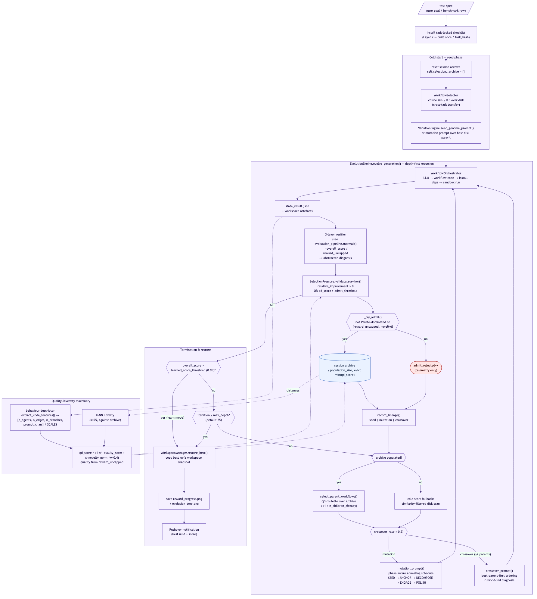

# Mimosa-AI: Quick Iterative Research Guide

**For AI researchers studying self-evolving multi-agent systems — and
for agentic systems (including Mimosa itself) iterating on Mimosa.**

---

## Table of Contents

1. [Overview](#overview)
2. [Quick Start](#quick-start)
3. [Understanding the Architecture](#understanding-the-architecture)
4. [The Evolution Loop](#the-evolution-loop)
5. [Evaluation Protocol](#evaluation-protocol)
6. [Key Improvement Areas](#key-improvement-areas)
7. [Research Workflow](#research-workflow)
8. [Debugging and Analysis](#debugging-and-analysis)
9. [File Structure Reference](#file-structure-reference)
10. [Common Pitfalls](#common-pitfalls)

---

## Overview

Mimosa V2 is a **code-space neuroevolution framework** that maintains a
session **Quality-Diversity (QD) archive** of multi-agent workflows,
draws parents from it, varies them via LLM-driven mutation/crossover,
and scores survivors with a **3-layer Goodhart-resistant verifier**.

A few invariants worth knowing before you change anything:

- **The session archive is reset at the start of every task.** Cross-task
  transfer happens only via the cold-start similarity scan in
  `workflow_selection.py`.
- **The mutator only sees Layer-1 abstracted diagnosis.** Raw claim ids,
  judge output, and cheat *mechanism* findings are intentionally
  withheld — that's the anti-Goodhart contract.
- **The 3-layer verifier is independent epistemologies**, not a
  rubric chain. Don't shortcut one layer with another's signal.

Refer to [v2_evolution.md](v2_evolution.md) for the full neuroevolution
reading and to [DEVELOPER_GUIDE.md](DEVELOPER_GUIDE.md) for the file map.

---

## Quick Start

### Prerequisites

```bash
# 1. Set up a config
cp config_default.json my_config.json     # if a default exists; otherwise see Config in config.py
# 2. Edit my_config.json (model choice, workspace_dir, MCP discovery range)
# 3. Export at least one provider key (ANTHROPIC_API_KEY / OPENAI_API_KEY / DEEPSEEK_API_KEY / OPENROUTER_API_KEY / HF_TOKEN)
```

### Quick experiments

**Single-agent baseline (no evolution, 7 tasks):**
```bash
uv run main.py --science_agent_bench --csv_runs_limit 7 \
               --config my_config.json --single_agent
```

**Self-evolving multi-agent (7 tasks, iterative learning):**
```bash
uv run main.py --science_agent_bench --csv_runs_limit 7 \
               --config my_config.json --learn
```

**One-shot multi-agent (no evolution loop, 7 tasks):**
```bash
uv run main.py --science_agent_bench --csv_runs_limit 7 \
               --config my_config.json
```

Recommended: keep `csv_runs_limit ≤ 7` for hypothesis triage; expand to
102 only after the smaller sweep shows signal.

At the end of an evaluation you should see something like:

```
                           ScienceAgentBench Metrics
--------------------------------------------------------------------------------
VER (Valid Execution Rate): 44/102 (43.1%)
SR (Success Rate): 44/102 (43.1%)
CBS (CodeBERT Score) Average: 0.921
Total API Cost: $173.4
Average API Cost per Task: $1.7
================================================================================
```

### Clean slate

```bash
# Wipe cached workflows + capsules for an unbiased run
./cleanup.sh

# Fresh evaluation
uv run main.py --science_agent_bench --csv_runs_limit 7 --config my_config.json
```

---

## Understanding the Architecture

### Five-layer architecture


Source: [diagrams/architecture_overall.mermaid](diagrams/architecture_overall.mermaid).

```
┌──────────────────────────────────────────────────────────────┐
│  Layer 0 (Optional): Planning                                │
│  - Goal → Task decomposition                                 │
│  - Bypassed in --task / --science_agent_bench modes          │
│  - Source: sources/core/planner.py                           │
└──────────────────────────────────────────────────────────────┘
                              ↓
┌──────────────────────────────────────────────────────────────┐
│  Layer 1: Tool Discovery + Literature Grounding              │
│  - MCP server scan on discovery_addresses port range         │
│  - Perspicacite query for literature context                 │
│  - Sources: sources/core/tools_manager.py,                   │
│             sources/utils/perspicacite_client.py             │
└──────────────────────────────────────────────────────────────┘
                              ↓
┌──────────────────────────────────────────────────────────────┐
│  Layer 2: Meta-Orchestration (EvolutionEngine)               │
│  ┌────────────────────────────────────────────────────────┐  │
│  │ Parent selection                                       │  │
│  │  - archive draw (steady-state) OR disk scan (cold)     │  │
│  │  - QD roulette weighted by qd_score ÷ (1 + n_children) │  │
│  │  - Source: sources/core/workflow_selection.py          │  │
│  └────────────────────────────────────────────────────────┘  │
│  ┌────────────────────────────────────────────────────────┐  │
│  │ Variation (mutation / crossover)                       │  │
│  │  - phase-aware annealing schedule                      │  │
│  │  - rubric-blind diagnosis fed back                     │  │
│  │  - Source: sources/core/variation_engine.py            │  │
│  └────────────────────────────────────────────────────────┘  │
│  ┌────────────────────────────────────────────────────────┐  │
│  │ Workflow synthesis & sandbox execution                 │  │
│  │  - Sources: sources/core/orchestrator.py,              │  │
│  │            sources/core/workflow_factory.py,           │  │
│  │            sources/core/workflow_runner.py             │  │
│  │  - Prompt:  sources/prompts/workflow_v10.md            │  │
│  └────────────────────────────────────────────────────────┘  │
│  ┌────────────────────────────────────────────────────────┐  │
│  │ Survival selection & archive admit                     │  │
│  │  - SelectionPressure (QD, population_size=50)          │  │
│  │  - Pareto admit gate on (reward_uncapped, novelty)     │  │
│  │  - Source: sources/core/selection.py                   │  │
│  └────────────────────────────────────────────────────────┘  │
└──────────────────────────────────────────────────────────────┘
                              ↓
┌──────────────────────────────────────────────────────────────┐
│  Layer 3: Agent Execution                                    │
│  - SmolAgent runtime, code-generating agents                 │
│  - Workspace snapshots per run (WorkspaceManager)            │
│  - Source: sources/core/workflow_runner.py                   │
└──────────────────────────────────────────────────────────────┘
                              ↓
┌──────────────────────────────────────────────────────────────┐
│  Layer 4: Judge / 3-layer Verifier                           │
│  - Layer 1: abstracted diagnosis (rubric-blind)              │
│  - Layer 2: task-locked checklist (per task_hash, cached)    │
│  - Layer 3: independent cheat detector                       │
│  - Source: sources/core/evaluators/verifier.py               │
└──────────────────────────────────────────────────────────────┘
```

### Results location

```
sources/workflows/<uuid>/
├── workflow_genotype_<uuid>.py        # Generated workflow code
├── state_result.json                  # Per-claim scores + verifier output
├── evolution_prompt_<uuid>.md         # The mutation/crossover prompt that produced this run
├── lineage_<uuid>.json                # {parents, evolution_kind, iteration}
├── reward_progress.png                # Reward curve across iterations
├── assertion_progress.png             # (scenario mode only)
└── memory/                            # LLM cache + agent traces

sources/workflows/_task_checklists/
└── task_checklist_<task_hash>.json    # Cached Layer-2 checklist per task

runs_capsule/<timestamp>_<task_name>/
├── workflow.py
├── results/                           # Final workspace snapshot
├── logs/
└── evaluation_results.json
```

`sources/workflows/<uuid>/` is the audit trail per run;
`runs_capsule/` preserves the final workspace snapshot copied via
`LocalTransfer`. Use `python memory_explorer.py <uuid>` to replay a
trace interactively, or `python memory_timelapse.py` for memory
growth across iterations.

---

## The Evolution Loop



Source: [diagrams/evolution_loop.mermaid](diagrams/evolution_loop.mermaid).

Per iteration (`EvolutionEngine.evolve_generation()`):

1. **Reset workspace** to its initial state (the verifier needs
   reproducible artefacts).
2. **Orchestrate workflow**: Perspicacite grounding → workflow factory
   → install deps → sandbox execution.
3. **Snapshot workspace** under that uuid.
4. **Evaluate** with the 3-layer verifier → `overall_score` (capped),
   `reward_uncapped` (uncapped), `abstracted_diagnosis`.
5. **Validate survivor**: `valid = (relative_improvement > θ) OR
   (qd_score > admit_threshold)`. `is_valid` candidates pass through
   the Pareto admit gate; rejections increment telemetry but lineage is
   still recorded.
6. **Record lineage** (`seed | mutation | crossover` + parent uuids).
7. **Select next parent(s)**: archive QD-roulette ÷ inverse-child-count.
8. **Choose variation**: crossover (rate ≈ 0.3, requires ≥ 2 parents
   post-rehydration) or mutation.
9. **Recurse** until `overall_score > learned_score_threshold` (0.95) in
   `--learn` mode, or `max_depth` reached.
10. **Restore best workspace** at termination.

Key defaults (set in `EvolutionEngine.__init__`):
- `strategy="qd"`, `population_size=50`, `novelty_k=25`,
  `novelty_weight=0.4`, `min_improvement_threshold=0.01`.
- `initial_population=2` — mutation/crossover are gated by this; the
  first two runs are always seeded fresh (then archive draws kick in).

---

## Evaluation Protocol


Source: [diagrams/evaluation_pipeline.mermaid](diagrams/evaluation_pipeline.mermaid).

The verifier is the fitness function. Three independent surfaces:

| Surface | Sees | Hidden from |
|---|---|---|
| **Verifier (Layer 2)** | task spec + checklist + workspace artefacts | agent narration during checklist build |
| **Cheat detector (Layer 3)** | task spec + workflow source | claims, evaluation output, verifier scripts |
| **Mutator** | abstracted diagnosis (Layer 1) + behavioral cheat findings | raw claim list, judge logs, cheat *mechanism* findings |

Aggregation:
```
overall = clamp(base_mean + info_bonus, 0, 1)
if any hard claim refuted:
    overall = min(overall, 0.94)        # _HARD_FAIL_CAP
overall = max(0, overall - cheat_penalty)
```
- `info_bonus(n_hard_pass) = 0.15 · (1 − exp(−n_hard_pass / 8))` — saturates,
  so spam claims yield diminishing returns.
- `reward_uncapped = base_mean + info_bonus − cheat_penalty` (no cap),
  used as the quality signal in the QD archive so distinct
  refuted-but-improving runs stay rank-ordered.

Detail: [v2_evolution.md §5](v2_evolution.md#5-evaluation--the-3-layer-verifier).

---

## Key Improvement Areas

If you are picking an axis to research, these are the live leveraged
moves (from [v2_evolution.md §7](v2_evolution.md#7-where-mimosa-v2-stands-vs-the-neuroevolution-canon)):

1. **Behaviour descriptor upgrade**. Current AST descriptor covers
   *granularity* only. Adding **basin identity** (prompt-content
   embedding) and **boundary discontinuity D** (logprob surprisal)
   is the cleanest next axis. See `code_features.py`.
2. **MAP-Elites grid**. Replace the unbounded-capacity archive
   (evicting by `qd_score`) with binned elites. See `selection.py`.
3. **Skill library** (Voyager / CASCADE direction). Persist verified
   high-`n_hard_pass` code fragments as reusable components exposed to
   the mutator.
4. **Multi-judge ensemble for borderline aggregates** (RewardBench-2
   k=3 finding). Today every claim is checked once.
5. **Behaviour-aware retrieval** for cold start. Pure MiniLM cosine
   collapses behaviorally distinct solutions.

---

## Research Workflow

### Standard hypothesis iteration

```bash
# 1. HYPOTHESIS
# Example: "Per-axis perturbation in DECOMPOSE phase boosts SR by ≥3pts"

# 2. IMPLEMENTATION
# Edit: sources/core/variation_engine.py  (or workflow_v10.md)
# Example tweak: change agent-count band in DECOMPOSE phase

# 3. BASELINE (clean slate, single-agent)
./cleanup.sh
uv run main.py --science_agent_bench --csv_runs_limit 7 \
               --single_agent --config my_config.json

# 4. EXPERIMENTAL CONDITION
./cleanup.sh
uv run main.py --science_agent_bench --csv_runs_limit 7 \
               --learn --config my_config.json

# 5. ITERATE
# Improvement on 7 → expand to 21; persistent → run the full 102
```

### Full evaluation protocol

```bash
./cleanup.sh
uv run main.py --science_agent_bench --csv_runs_limit 102 \
               --learn --config my_config.json \
               > full_evaluation.log 2>&1

# Results: runs_capsule/science_agent_bench_<timestamp>/
```

### A/B testing

```bash
# Condition A: baseline
uv run main.py --science_agent_bench --csv_runs_limit 7 \
               --config config_baseline.json > results_A.log 2>&1

# Condition B: modified
uv run main.py --science_agent_bench --csv_runs_limit 7 \
               --config config_experiment.json > results_B.log 2>&1
```

> ⚠️ Logs can be very long — redirect, don't tail. Use `grep
> "ScienceAgentBench Metrics" -A 6` to recover the headline numbers.

---

## Debugging and Analysis

### Workflow generation failed

```bash
tail -f logs/mimosa.log | grep "WORKFLOW_GENERATION_ERROR"
```
Common causes:
1. No MCP servers running → check Toolomics / `discovery_addresses` range.
2. Workflow prompt syntax issue → diff `sources/prompts/workflow_v10.md`.
3. LLM timeout → bump `runner_default_timeout` (default 3600).
4. Provider-specific failure → try Claude Opus to isolate.

### Workflow execution timed out

```python
# my_config.json
"runner_default_timeout": 7200   # seconds
```

### Archive not growing

Check `state_result.json` for `selection_log.admit_rejected = true`.
Common cause: every candidate is Pareto-dominated by the bootstrap
member. Investigate `code_features.py` to confirm the behaviour
descriptor isn't degenerate (e.g., `[0,0,0,0]` for syntactically
broken genotypes).

### Replay a single workflow run

```bash
python memory_explorer.py <uuid>           # interactive trace replay
python memory_timelapse.py                 # memory growth visualisation
```

---

## Parameter Tuning

```python
# Learning parameters (config.py)
"learned_score_threshold": 0.95,           # When --learn stops
"max_learning_evolve_iterations": 25,      # Max iterations per task

# Selection parameters (set in EvolutionEngine.__init__, selection.py)
strategy="qd"                              # greedy | tournament | novelty | qd
population_size=50                         # Max archive members
novelty_k_neighbours=25                    # k for k-NN novelty
novelty_weight=0.4                         # 0 = pure quality, 1 = pure novelty
min_improvement_threshold=0.01             # Greedy validation floor
admit_threshold=0.3                        # qd_score floor for novelty-driven admit

# Cold-start parent retrieval (workflow_selection.py)
threshold_similarity=0.5                   # cosine floor for disk parents
threshold_score=0.05                       # score floor for disk parents
```

---

## Quick Reference Card

```bash
# Essential commands
./cleanup.sh                                              # Reset workflows + capsules
uv run main.py --task "<task>" --config X                # Single task
uv run main.py --task "<task>" --learn --config X        # Single task with evolution
uv run main.py --goal "<goal>" --config X                # Multi-step planning mode
uv run main.py --science_agent_bench --csv_runs_limit 7 --config X         # Quick eval
uv run main.py --science_agent_bench --csv_runs_limit 7 --learn --config X # Quick eval + evolution
uv run main.py --science_agent_bench --csv_runs_limit 7 --single_agent --config X  # Baseline
uv run main.py --evaluation_cli                          # Guided launcher
uv run main.py                                            # Zero-arg onboarding wizard

# Key files to modify
sources/prompts/workflow_v10.md                          # Workflow generation prompt
sources/core/variation_engine.py                         # Mutation / crossover / annealing
sources/core/selection.py                                # SelectionPressure (QD archive)
sources/core/code_features.py                            # Behaviour descriptor
sources/core/workflow_selection.py                       # Parent retrieval
sources/core/evaluators/verifier.py                      # 3-layer verifier
sources/core/evaluators/task_checklist.py                # Layer 2 builder

# Results
sources/workflows/<uuid>/                                # Per-run artefacts
sources/workflows/_task_checklists/                      # Cached Layer-2 checklists
runs_capsule/<timestamp>_<name>/                         # Final capsules
logs/mimosa.log                                          # System logs
```

---

## Common Pitfalls

- **Feeding raw judge output to the mutator.** Breaks the Layer-1
  invariant. Use `wf_info.abstracted_diagnosis` only.
- **Skipping the `./cleanup.sh` between A/B runs.** The cold-start disk
  scan will silently inject parents from the previous condition.
- **Setting `learned_score_threshold` too low.** `--learn` will stop on
  the first lucky run instead of finding the genuine maximum.
- **Editing `state_result.json` by hand.** It feeds back into both the
  verifier (claim re-extraction) and the archive (descriptor / reward).
- **Forgetting `--learn`.** Without it, `max_depth=1` and the engine
  exits after a single run regardless of `max_learning_evolve_iterations`.
- **Confusing `reward` and `reward_uncapped`.** Use `reward_uncapped` for
  ranking; `reward` is admissibility-only (it carries the 0.94 hard-fail
  cap).
