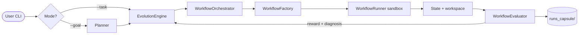

# Architecture

Mimosa-AI is built as five collaborating layers. Each layer has a single
responsibility, and components are wired through small dataclass schemas
([`sources/core/schema.py`](https://github.com/HolobiomicsLab/Mimosa-AI/blob/main/sources/core/schema.py))
rather than ad-hoc dictionaries.

{ width="100%" }

## The five layers

### Layer 0 — Planning *(optional)*

When you run with `--goal`, the **Planner** (
[`sources/core/planner.py`](https://github.com/HolobiomicsLab/Mimosa-AI/blob/main/sources/core/planner.py))
breaks a high-level objective into discrete tasks. It then drives Mimosa one
task at a time. With `--task` (or the ScienceAgentBench benchmark mode) the
planner is bypassed and a single task is run.

### Layer 1 — Tool discovery & grounding

Two components live here:

- **ToolManager** ([`tools_manager.py`](https://github.com/HolobiomicsLab/Mimosa-AI/blob/main/sources/core/tools_manager.py))
  scans the IP / port range in `Config.discovery_addresses` for MCP servers
  exposed by Toolomics, queries them for their tool schemas, and emits the
  Python binding code injected into each generated workflow.
- **Perspicacité client** ([`perspicacite_client.py`](https://github.com/HolobiomicsLab/Mimosa-AI/blob/main/sources/utils/perspicacite_client.py))
  fetches literature snippets that ground both workflow synthesis and the
  judge's soft-claim verdicts. See [Scientific grounding](grounding.md).

### Layer 2 — Meta-orchestration

This is the brain. The **EvolutionEngine** ([`evolution_engine.py`](https://github.com/HolobiomicsLab/Mimosa-AI/blob/main/sources/core/evolution_engine.py))
recursively evolves workflows, with help from:

- **WorkflowSelector** — picks parents from the live archive or, on a cold
  start, from previous runs on disk (filtered by task-text cosine similarity).
- **SelectionPressure** — Quality-Diversity archive (`population_size=50`,
  `k=25`, `novelty_weight=0.4`). Admission is gated by the validity check
  (improvement over baseline or `qd_score > admit_threshold`); capacity is
  curated by lowest-`qd_score` eviction.
- **VariationEngine** — assembles mutation or crossover prompts, with a
  phase-aware annealing schedule that gates topology complexity by progress.
- **WorkflowOrchestrator** — wraps "grounding → factory → sandbox" into one
  callable per generation.

Full mechanics in [Evolution engine](evolution-engine.md).

### Layer 3 — Agent execution

The synthesized workflow is a Python program. The **WorkflowRunner**
([`workflow_runner.py`](https://github.com/HolobiomicsLab/Mimosa-AI/blob/main/sources/core/workflow_runner.py))
installs dependencies and runs it in a sandbox with per-run limits on time,
memory, and CPU. Inside the sandbox, [SmolAgents](https://github.com/huggingface/smolagents)
provide the per-agent code-execution runtime, with MCP tool calls and a
shared LangGraph state.

### Layer 4 — Judge & evaluation

Once execution finishes, the **WorkflowEvaluator** facade
([`evaluators/evaluator.py`](https://github.com/HolobiomicsLab/Mimosa-AI/blob/main/sources/core/evaluators/evaluator.py))
routes to one of:

- **VerifierEvaluator** (default) — the three-layer verifier
  ([Evaluation pipeline](evaluation-pipeline.md)).
- **GenericEvaluator** — legacy 4-criterion LLM judge.
- **ScenarioEvaluator** — rubric/assertion-based scoring for benchmarks.

The evaluator returns `(overall_score, reward_uncapped, abstracted diagnosis)`.
Only the diagnosis feeds back into the mutator — the raw rubric never does.

## Persistent storage

Three locations make every run auditable:

```
sources/workflows/<uuid>/        # genotype + state + lineage + memory
runs_capsule/<capsule_name>/     # archive snapshot for the run
sources/memory/                  # LLM call cache + task checklists
```

See [Workspace & audit trail](../usage/workspace.md) for what each file
contains.

## Execution flow at a glance



The loop in the middle — `Orchestrator → Factory → Runner → Evaluator →
Orchestrator` — is the heart of Mimosa. Every other component exists to
make that loop faster, fairer, or more auditable.

## Where to go next

- [Evolution engine](evolution-engine.md) — what happens inside the loop.
- [Evaluation pipeline](evaluation-pipeline.md) — how scores are produced.
- [Developer guide](../DEVELOPER_GUIDE.md) — full code-level deep dive.
