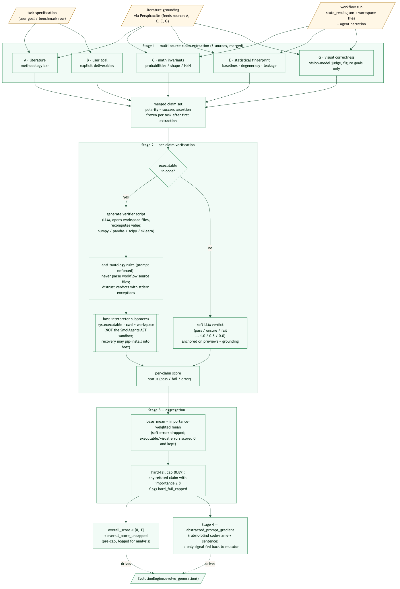

# Evaluation pipeline

> This page describes the **judge** that runs after every workflow
> execution — the [`VerifierEvaluator`](https://github.com/HolobiomicsLab/Mimosa-AI/blob/main/sources/evaluators/verifier.py)
> in `sources/evaluators/`. It is the **pressure signal that drives
> workflow evolution**, not a benchmark grader.
>
> If you are looking for ScienceAgentBench or PaperBench grading — those
> are different systems that compare the workflow's output against
> author-provided ground-truth files. See
> [ScienceAgentBench evaluation](../science_agent_bench_evaluation.md)
> and [PaperBench evaluation](../papers_bench_evaluation.md).

Mimosa scores each workflow run with a **multi-source, per-claim
verifier**. The verifier writes and executes **deterministic Python
programs** in the workspace to confirm what the agents claim they did,
across five independent vantage points (literature, user goal, math
invariants, statistical fingerprint, visual correctness). The single
signal that flows back to the mutator is a short
**prompt gradient** that summarizes failure modes without leaking the
verified claims themselves.

The same per-claim verdicts are also projected into a 7-dim **failure
fingerprint** — a centered vector of per-source pass rates that records
*how* a run failed. It is deprecated (its module header says so) and
persisted as a diagnostic only; it is **not** the QD
behaviour descriptor: novelty is measured in genotype-embedding space
(see [Selection](evolution-engine.md#behaviour-descriptor-genotype-embedding)).

{ width="100%" }

## The pipeline

The verifier runs four stages per workflow run:

1. **Multi-source claim extraction** — five independent prompts each look at
   the run from a different vantage point and emit success-polarity claims.
   Extraction runs **once per task**: the first successful extraction is
   frozen as the task rubric (cache key `sha256(goal + _RUBRIC_VERSION)`)
   and reused verbatim — ids, descriptions, importances — for every later
   generation; only each claim's `likely_relevant_files` hints are
   re-validated against the current workspace.
2. **Per-claim verification** — for each claim, the judge either writes a
   small Python program that recomputes the asserted value from workspace
   files (the default path), or renders a soft LLM verdict when no
   deterministic check is possible.
3. **Aggregation** — per-claim scores combine into `overall_score` as an
   importance-weighted mean with a hard-fail cap.
4. **Prompt gradient** — a plain-language summary of failure modes, the
   **only** signal that reaches the mutator. It does not name claims,
   scores, or sources, so the mutator cannot turn the verified-claim
   vocabulary back into a rubric to optimize against.

## The five claim sources

Each source is a different definition of "success" — claims from each are
merged and verified by the same per-claim machinery downstream. The
letters are the code labels registered in the `SOURCES` tuple of
`sources/evaluators/verifier_claim_sources.py` (`a`/`b`/`c`/`e`/`g`);
letters `d` and `f` are retired and never emitted.

| Source | Vantage | What it asks |
| ------ | ------- | ------------ |
| **A — Literature** | Peer-reviewed practice (via [Perspicacité](grounding.md)) | Does the science meet the methodology bar the field would demand? |
| **B — User goal** | The literal goal text | Did the agents deliver the deliverable the user spelled out (format, columns, bars, scope)? |
| **C — Math invariants** | The type of object produced | Do the artefacts satisfy mathematical sanity properties (probabilities in [0,1], symmetry, no NaN, shape consistency, conservation)? |
| **E — Statistical fingerprint** | A skeptical statistician | Is the result *real*, not vacuous? Does it beat a baseline, avoid degenerate predictions, show no leakage signatures? |
| **G — Visual correctness** | A vision-capable judge model | Is the figure deliverable scientifically plausible? Only emits claims when the goal asks for a visual deliverable. |

A few important constraints on these sources, enforced via the shared
`_CLAIM_RULES_BLOCK`:

- **Positive polarity** — every claim asserts a *success condition*. A
  workflow that produced nothing fails the claim "produced the deliverable",
  not passes "the answer is empty".
- **Discrimination test** — an artifact claim only counts when chained
  to a functional property (e.g. "predictions.csv contains a valid
  probability for every row"); the shared rules block rejects bare
  file-existence or file-size claims as too weak. There is no separate
  `hard` tag in code — "hard claim" means rated importance ≥ 8 (see
  [Aggregation](#aggregation)).

## Per-claim verification

The verifier prefers a deterministic Python program for every claim and
only falls back to an LLM verdict when no executable check is possible.

=== "Executable claims (preferred)"

    An LLM writes a small Python program *per claim*. The program opens
    workspace files and **recomputes the asserted value** from disk,
    then emits a single JSON line. Programs run with the agents'
    workspace as working directory, under the **same host interpreter
    that runs Mimosa** (`sys.executable`), with `numpy`, `pandas`,
    `scipy`, `scikit-learn` and other helpers pip-installed by the
    verifier on first use (see the security note below).

    Because the check is deterministic Python touching the same files
    the agents produced, the verdict does not depend on the judge LLM
    re-believing the agent's narration.

    **Anti-tautology rules** (enforced in the generation prompt and the
    file-selection logic, not by a separate code pass):

    - Verifier scripts must never read or parse the workflow's own
      source files (`.py`, `.R`, notebooks) as evidence — result
      artefacts and the goal's ground-truth schema only.
    - A printed pass/fail verdict is distrusted when exception markers
      (tracebacks, import errors) leak into the verifier's own stderr.

    Each executable claim returns `pass / fail / error` → `1.0 / 0.0 /
    0.0`. Unlike soft-claim errors, executable (and visual) errors
    **stay in the mean at score 0** — see [Aggregation](#aggregation).

    **Security note — verifier checks are NOT sandboxed.** The
    SmolAgents `LocalPythonExecutor` AST allow-list applies to workflow
    agents only. Verifier scripts run as plain subprocesses of the host
    interpreter (`python_executable=sys.executable`, cwd = the agents'
    workspace), and the dependency-recovery path can pip-install up to 6
    LLM-vetted packages **into the host environment** (with
    `--break-system-packages`). Verifier scripts are untrusted
    LLM-written code executing with the operator's Python.

=== "Soft claims (fallback)"

    Things that can't be recomputed from disk (e.g. "this approach is
    appropriate for X"). An LLM verdict is rendered against workspace
    previews and literature grounding, with three outcomes:

    - `pass` → `1.0`
    - `unsure` → `0.5`
    - `fail` → `0.0`

    A soft-claim `error` (judge call failed) is **dropped from the
    mean**, unlike executable/visual errors which are scored `0.0` and
    kept in.

## Aggregation

```python
included  = [claims with status pass / fail / unsure]   # soft errors dropped
included += [executable and visual errors]              # re-scored at 0.0
base_mean = importance_weighted_mean(score for c in included)
pre_cap   = clamp(base_mean, 0, 1)

hard_fail = any(c.importance >= 8 and c.status == "fail")   # _HARD_FAIL_IMPORTANCE
overall_score = min(pre_cap, hard_fail_cap) if hard_fail else pre_cap
```

- Per-claim weights come from the claim's rated importance (1–10), so an
  importance-10 deliverable claim moves the score ~5× more than a
  low-importance hygiene claim.
- Error handling is asymmetric: an `error` on a **soft** claim is
  excluded from the mean, while an `error` on an **executable** or
  **visual** claim is scored `0.0` and kept in — a check that could not
  run counts as a failed check.
- `hard_fail_cap = _HARD_FAIL_CAP = 0.89`; the cap fires when any claim
  with importance ≥ 8 (`_HARD_FAIL_IMPORTANCE = 8`) is refuted, and
  flags `hard_fail_capped = True`. The cap — like `max_claims` and the
  verifier timeouts — is a constructor-only default of
  `VerifierEvaluator`, not plumbed into `config.py` or the CLI.
- The engine still records `overall_score_uncapped` (pre-cap) for
  analysis, but QD ranks on the capped `overall_score` — a run that
  refuted a hard claim cannot top the archive on its other claims alone.

## Failure fingerprint (diagnostic)

The verifier also projects the same per-claim verdicts into a **failure
fingerprint**: a centered vector of per-source pass rates that records
*how* a candidate fails, not *whether* it failed.

```python
# Per source letter (a–g, fixed length — absent sources get a neutral value).
pass_rate[s] = passes[s] / total[s]              if total[s] > 0  else 0.5
presence[s]  = 1.0                                if total[s] > 0  else 0.0
# Center so the vector encodes profile shape, not quality level.
mean_present = mean(pass_rate[s] for s where presence[s] == 1)
vector[s]    = pass_rate[s] - mean_present       if presence[s] == 1
             = 0                                  otherwise
```

Centering means an all-pass run and an all-fail run both collapse to the
zero profile (asserted by `test_all_pass_yields_zero_profile` and
`test_all_fail_yields_zero_profile`), so the vector captures the *shape*
of which sources fail rather than the overall quality level.

The fingerprint is computed by
[`compute_failure_fingerprint`](https://github.com/HolobiomicsLab/Mimosa-AI/blob/main/sources/core/failure_fingerprint.py)
at the end of `VerifierEvaluator.evaluate()` and persisted under
`state_result.json` → `evaluation.verifier.failure_fingerprint`.

> **Diagnostic only — not the novelty descriptor.** The QD behaviour
> descriptor is the **genotype embedding** of the workflow's source code,
> and novelty is cosine distance in that space (see
> [Selection](evolution-engine.md#behaviour-descriptor-genotype-embedding)).
> `SelectionPressure` no longer reads the failure fingerprint; it remains
> persisted so failure profiles can be inspected offline. The module
> header itself is marked `[DEPRECATED]` — expect it to be removed.
Full info-flow audit of the QD behaviour descriptor:
[`docs/info-flow/genotype_embedding.md`](../info-flow/genotype_embedding.md).

## Prompt gradient

After aggregation the verifier composes a single-sentence diagnosis (the
**prompt gradient**) from the per-claim report and recent history of
similar runs. It is the **only** verifier output that reaches the
mutator, and it is written so it does not leak the verified claims back:

- It does not name specific claims, scores, or which of the five sources
  raised the issue.
- It encodes failure modes by short code names (e.g.
  `FALLBACK_ECFP_CLASSIFIER`) so recurring patterns can be tracked across
  generations without spelling out the underlying check.

The intent is informational, not punitive: the mutator learns *what
direction to push the workflow next* without being handed a vocabulary
it can over-fit against.

> **Known issue (code bug, not design).** Normal runs persist the
> gradient twice: as the structured-state key
> `evaluation.verifier.abstractec_textual_gradient` and as the
> `textual_gradient.txt` sidecar next to the evaluation report. The
> structured key carries a typo (`abstractec_` where the reader expects
> `abstracted_`), so for short-circuited generations — workflow failed
> to generate or execute, no sidecar written — the reader finds neither
> and the mutator sees an **empty gradient** for that round.

## Behavioral pressure against shortcut workflows

Pressure against shortcut or fabricated workflows comes from the
verifier pipeline itself:

- The per-claim recompute-from-disk verifiers (Stage 2), which judge
  produced artefacts rather than the agents' narration.
- Source E's non-triviality claims: a degenerate, hard-coded or
  fallback-patterned output fails the claim outright (success-polarity —
  there is no score inversion in the code).
- The anti-tautology rules in the per-claim verifier generator.

## Why this design?

| Concern | Mitigation |
| ------- | ---------- |
| The judge LLM repeats the agent's claims verbatim. | Per-claim deterministic Python recomputation, with anti-tautology tripwires. |
| The mutator over-fits to a numeric rubric. | Only the prompt gradient is returned — and it does not name the verified claims. |
| The hard-fail cap collapses ranking among failed runs. | Deliberate: QD ranks on the capped `overall_score`, with ties at the cap broken by novelty; `overall_score_uncapped` is still logged for analysis. |
| One vantage point misses the failure. | Five independent sources, claims merged. |
| Cosmetic hygiene gets gamed as "quality". | Source E only rewards non-trivial, statistically real results; no source emits docs/tests/style hygiene claims. |
| Artifact existence checks reward "moved files around". | `_CLAIM_RULES_BLOCK` only accepts artifact claims chained to a functional property. |
| Soft-claim judges hallucinate. | Verdicts are grounded in workspace previews and Perspicacité. |

## Other evaluator backends

The default is `VerifierEvaluator`, but you can swap it via
`WorkflowEvaluator`:

| Backend             | File                                                                                                                                            | Use                                       |
| ------------------- | ----------------------------------------------------------------------------------------------------------------------------------------------- | ----------------------------------------- |
| `VerifierEvaluator` | [`verifier.py`](https://github.com/HolobiomicsLab/Mimosa-AI/blob/main/sources/evaluators/verifier.py)                                       | **Default** — multi-source per-claim.     |
| `GenericEvaluator`  | [`generic.py`](https://github.com/HolobiomicsLab/Mimosa-AI/blob/main/sources/evaluators/generic.py)                                         | Legacy 4-criterion LLM judge.             |
| `ScenarioEvaluator` | [`scenario.py`](https://github.com/HolobiomicsLab/Mimosa-AI/blob/main/sources/evaluators/scenario.py)                                       | Rubric / assertion-based scoring.         |
| Perspicacité grounding | [`grounding.py`](https://github.com/HolobiomicsLab/Mimosa-AI/blob/main/sources/evaluators/grounding.py)                                  | Adapter used by Source A.                 |
| `BullshitDetector`  | [`bs_detection.py`](https://github.com/HolobiomicsLab/Mimosa-AI/blob/main/sources/evaluators/bs_detection.py)                               | Numerical-fraud penalty.                  |

## See also

- [Evolution engine](evolution-engine.md) — how scores drive selection.
- [Scientific grounding](grounding.md) — how Perspicacité is wired in.
- [Developer guide](../DEVELOPER_GUIDE.md) — class layout under `evaluators/`.
