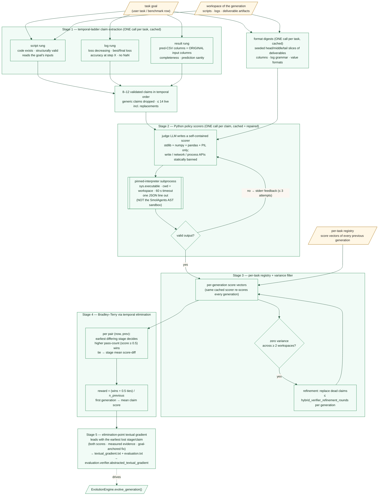

# Evaluation pipeline

> This page describes the **judge** that runs after every workflow
> execution — the hybrid verifier
> ([`sources/evaluators/hybrid_verifier/`](https://github.com/HolobiomicsLab/Mimosa-AI/blob/main/sources/evaluators/hybrid_verifier/),
> default since 2026-09-24; the legacy
> [`VerifierEvaluator`](https://github.com/HolobiomicsLab/Mimosa-AI/blob/main/sources/evaluators/verifier.py)
> is described further down). It is the **pressure signal that drives
> workflow evolution**, not a benchmark grader.
>
> If you are looking for ScienceAgentBench or PaperBench grading — those
> are different systems that compare the workflow's output against
> author-provided ground-truth files. See
> [ScienceAgentBench evaluation](../science_agent_bench_evaluation.md)
> and [PaperBench evaluation](../papers_bench_evaluation.md).

The current default is the **hybrid temporal-ladder verifier**
([`sources/evaluators/hybrid_verifier/`](https://github.com/HolobiomicsLab/Mimosa-AI/blob/main/sources/evaluators/hybrid_verifier/)).
Per task it extracts a small ladder of stage-tagged **key claims**
(`script` → `log` → `result`), turns each claim into a cached
deterministic **Python policy scorer** that grades any single workspace
of the task on a continuous 0..1 scale, and computes the reward as a
**pairwise win-rate** over the task's previous generations, each pair
decided at the earliest ladder stage where the generations differ. The
signal fed back to the mutator is the **textual gradient**
(`evaluation.verifier.abstracted_textual_gradient` in
`state_result.json`, plus the `textual_gradient.txt` sidecar), which
leads with the *elimination point* — the earliest stage/claim where
this generation lost to a rival.

The previous default — the multi-source per-claim `VerifierEvaluator`
with its five claim sources (`a`/`b`/`c`/`e`/`g`), self-rated claim
importances, importance-weighted mean and 0.89 hard-fail cap — is
**deprecated (2026-09-24)** and described in
[Legacy multi-source verifier](#legacy-multi-source-verifier-deprecated)
below; it remains reachable via `verifier_kind = "legacy"`.

## The hybrid temporal-ladder verifier (default since 2026-09-24)

Implemented in
[`sources/evaluators/hybrid_verifier/`](https://github.com/HolobiomicsLab/Mimosa-AI/blob/main/sources/evaluators/hybrid_verifier/):
`evaluator.py` (`HybridVerifierEvaluator`) orchestrates, and the stages
live in `claims.py`, `digest.py`, `scorers.py`, `registry.py`,
`aggregation.py`, `gradient.py`, `layers.py`. One evaluation of one
generation runs:

1. **Key-claim extraction — the temporal ladder** — ONE judge-LLM call
   per task (cached) turns the goal plus a workspace inventory (file
   sizes, CSV rows×cols, PNG dimensions) into 8–12 stage-tagged claims
   in temporal order (`claims.py`).
2. **Format digests** — ONE judge-LLM call per task (cached) samples
   deterministic head/middle/tail slices of the deliverable files and
   writes a short format digest per file, injected into every
   policy-writer prompt (`digest.py`).
3. **Python policy scorers** — ONE judge-LLM call per claim writes a
   self-contained deterministic Python script that scores a single
   workspace 0..1 on that claim; the same cached script re-scores every
   generation of the task, with a bounded repair loop on execution
   failures (`scorers.py`, `layers.py`).
4. **Aggregation — Bradley–Terry via temporal elimination** — the
   reward is the win-rate of this generation against every previous
   generation of the same task, each pair decided at the earliest
   ladder stage where the two differ; zero-variance (dead) claims are
   dropped and replaced by refined claims (`aggregation.py`,
   `registry.py`).
5. **Elimination-point gradient** — a textual gradient that leads with
   the earliest stage/claim where this generation lost, plus
   `evaluation.txt` with stage headers (`gradient.py`).



### The temporal claim ladder (`script` → `log` → `result`)

ONE judge-LLM call per task (`claims.extract_claims_prompt`) reads the
goal plus the union inventory of the candidate workspaces and emits
8–12 claims (target `hybrid_verifier_num_claims = 10`, extraction
accepts ±2), each tagged with a ladder stage and a temporal index:

| Stage | Rung meaning | Typical claims |
| ------ | ------------ | -------------- |
| `script` (earliest) | the delivered **code** exists, is structurally valid, reads the goal's input files correctly, implements the intended pipeline — checkable by reading the candidate's own scripts | required method / featurization present in the code; the goal's input files opened correctly |
| `log` (middle) | execution / training dynamics parsed from the run's **logs** | loss decreasing; best/final loss value; accuracy at step X; no NaN or crash markers |
| `result` (latest) | **artifact fidelity** | prediction-CSV columns match the ORIGINAL input file's column names exactly (no spurious `_pred` suffixes); one row per input row (completeness); prediction sanity (probabilities in [0,1], non-negative counts) |

Every claim must be **task-defining** (only properties the goal's own
words specify or imply — a demanded-but-unmeasured artifact is a
hallucinated requirement), **decidable** by deterministic Python from
the workspace's files alone (no gold outputs, no reference labels, no
network), **decisive** (a claim every workspace will pass — or none can
— is worthless), and **graded** (the scoring rule must measure a
quantity and map it to continuous 0..1 partial credit). Validation
(`claims.validate_claims`) drops generic claims — a scoring rule that
names no measurable quantity — enforces stage tagging and temporal
order, and the live claim set is capped at 14 including replacements
(`layers.MAX_CLAIMS_TOTAL`).

### Format digests

ONE judge-LLM call per task (`digest.py`), cached in the registry,
samples deterministic head/middle/tail slices (1 200 bytes each;
offsets derived from the file size and a per-path seed, so the same
bytes are sampled on every machine and re-run) of up to
`hybrid_verifier_digest_max_files` (default 8) deliverable-ish files
and writes a short format digest per file: column names, log-line
grammar, value formats. The digests are injected into every
policy-writer prompt, so the code-writing LLM sees the real file
*formats*, not just their names.

### Python policy scorers

ONE judge-LLM call per claim (`scorers.scorer_prompt`) writes a
**self-contained deterministic Python script** that grades a *single*
workspace of the task on that claim, printing exactly one JSON line:

```json
{"claim_id": "C3", "score": 0.85, "evidence": "341/400 rows carry a probability in [0,1]"}
```

- **Policy contract** — imports are restricted to the standard library
  + `numpy` + `pandas` + `PIL` (`scorers.ALLOWED_IMPORTS`); a static
  screen (`static_violations`) rejects network, subprocess, randomness
  and write APIs (including write-mode `open(...)`) before anything
  runs.
- **Execution** — scorers run as plain subprocesses of the pinned host
  interpreter (`sys.executable`, cwd = the workspace) under a
  `hybrid_verifier_scorer_timeout_s` (default 60 s) timeout. Like the
  legacy verifier's checks, these are **not** run inside the SmolAgents
  AST sandbox (which applies to workflow agents only) — they are
  LLM-written code executing with the operator's Python, bounded by the
  import screen above.
- **Repair loop** — a scorer that fails statically or at runtime is
  regenerated from its exit-status/stderr feedback at most twice
  (`scorers.MAX_CODE_ATTEMPTS = 3` attempts total).
- **Reuse** — the accepted script is cached in the per-task registry
  and re-run verbatim for every later generation of the task, so scores
  are comparable across the evolution history and the measurement is
  deterministic and symmetric by construction.

### Per-task registry, variance filter, refinement

`registry.py` persists one JSON file per task
(`hybrid_registry_<key>.json`, key = first 16 hex chars of
`sha256(goal + REGISTRY_VERSION)` — the same keying scheme as the
legacy rubric cache, so a registry is shared across generations of one
goal and distinct between goals). It stores the claim set (statement,
target, scoring rule, stage, temporal index), the cached scorer scripts
and format digests, every generation's per-claim score vector, and the
union workspace inventory.

A claim whose scores have **zero variance** across all scored
workspaces (≥ 2 observations, `aggregation.claim_stats`) is
non-discriminative — it cannot separate candidates — and is dropped
("dead"), as is a claim every workspace fails. Dead claims are
replaced by refined claims (`claims.refinement_prompt`) up to
`hybrid_verifier_refinement_rounds` (default 2) replacements per
generation; the dead-claim report appears at the end of the gradient.

### Reward — Bradley–Terry via temporal elimination

`aggregation.win_rate_reward` computes the reward as the mean
**win-rate** of the current generation against *every previous
generation of the same task* (ties count 0.5) — a Bradley–Terry
aggregation across the evolution history. The first generation of a
task has no rivals and falls back to its mean claim score
(`reward_fallback = "mean_claim"`).

The pairwise policy is **temporal elimination** (default mode
`temporal`): a pair (A, B) is decided at the **earliest ladder stage
where the two generations differ** — the stage pass-count (number of
the stage's claims scoring ≥ `PASS_THRESHOLD = 0.5`) decides; a
pass-count tie falls to that stage's mean score difference; if the
whole ladder ties, the pair is a tie. "Whoever makes it longer in the
temporal ladder wins": a script-stage failure loses regardless of
result-stage quality.

| Mode | Policy |
| ---- | ------ |
| `temporal` (default) | earliest differing **stage** decides (pass-count, then stage mean-diff) |
| `temporal_strict` | the first differing **claim** in temporal order wins outright |
| `sign_sum` | flat: more claims scored higher wins |
| `mean_diff` | flat: larger total score difference wins |
| `escalation` | flat: sign-sum, then mean-diff tie-break |

Zero-variance (dead) claims are excluded from all comparisons. Layer
`gate` hooks (below) cap the reward: `reward = min(reward, *caps)`.

### Gradient and artifacts

The gradient (`gradient.py`) is **elimination-point-first**: it leads
with the earliest stage/claim where this generation lost to a rival —
both scores, the measured evidence (with numbers), and the goal-anchored
requirement — then the remaining stage losses/wins in temporal order,
the full per-claim transcript, the pairwise record, and the dead-claim
report. It is a faithful transcript of measured facts: no
editorializing, no labels.

Artifacts per generation (same downstream locations as the legacy
verifier):

- `sources/workflows/<uuid>/evaluation.txt` — human-readable report
  with stage headers;
- `sources/workflows/<uuid>/textual_gradient.txt` — the gradient
  sidecar;
- `state_result.json` → `evaluation.verifier.*` — structured scores:
  `overall_score` (the win-rate reward), `overall_score_uncapped`,
  `mean_claim_score`, `win_rate`, `n_pairs` / `n_wins` / `n_losses` /
  `n_ties`, `pairwise_mode`, `reward_fallback`, `n_claims` /
  `n_surviving` / `n_dropped` / `n_scored` / `n_scorer_failures` /
  `n_replacements`, a per-claim `claim_summary` (id, category,
  statement, score, surviving, evidence), and
  `abstracted_textual_gradient` (the legacy `abstractec_` typo key is
  also written for one release so old readers keep working).

The evolution engine consumes the gradient through
`workflow_info.abstracted_textual_gradient` (structured key first, then
the sidecar). A generation whose workflow failed to generate or execute
short-circuits: one synthetic `execution_produced_artifacts` claim
scored from the workspace listing, reward 0.0, and a non-empty gradient
— the mutator never sees an empty diagnosis. The legacy
`failure_fingerprint` key is still written, but as a **neutral
placeholder** (zero vector, 0.5 pass rates) for schema compatibility —
the hybrid verifier does not compute per-source pass rates.

### Extension interface — `EvidenceLayer`

`layers.py` defines the extension point. The aggregator, registry,
reward and gradient code are layer-agnostic — they consume
`(claim_id, score)` pairs keyed only by id. A new evidence layer (e.g.
E24-style clean-room re-execution or verifier-owned holdout checks)
implements the `EvidenceLayer` protocol and is passed to
`HybridVerifierEvaluator(extra_layers=[...])`:

- `collect(context) -> list[LayerScore]` — measure one workspace; never
  raises (degrade per-item);
- `revise(context, dead_claim_ids)` *(optional)* — replace dead claims
  after the variance filter;
- `gate(context, collected) -> float | None` *(optional)* — cap the
  final reward (`reward = min(reward, *caps)`).

The default layer, `ClaimsEvidenceLayer`, is the claims+scorers pipeline
above and stays as-is beside custom layers.

### Configuration

| Knob | Default | What it controls |
| ---- | ------- | ---------------- |
| `verifier_kind` | `hybrid` | `hybrid` (default) or `legacy` (deprecated multi-source per-claim verifier) |
| `hybrid_verifier_num_claims` | `10` | target key-claim count per task (extraction accepts ±2) |
| `hybrid_verifier_refinement_rounds` | `2` | max replacement claims per generation for dead claims |
| `hybrid_verifier_scorer_timeout_s` | `60` | per scorer-subprocess timeout (seconds) |
| `hybrid_verifier_pairwise_mode` | `temporal` | pairwise reward mode (see the table above) |
| `hybrid_verifier_digest_max_files` | `8` | max deliverable files sampled by the format digest |

All knobs follow the standard plumbing — default in `config.py`, JSON
config override, CLI flags `--verifier_kind` / `--hybrid_verifier_*`
(see [CLI reference](../reference/cli.md) and
[Configuration reference](../reference/configuration.md)).

### Why this design (measured)

The hybrid verifier was measured best-of-six feedback channels in the
offline + live E19 / E19b / E19c experiments (2026-09-23..25,
`experiments_verifiers/`): the legacy verifier's reward
**anti-correlated** with benchmark success at the top of the archive
(Kendall τ ≈ −0.82) and its gradients hallucinated ~65 % of
"requirements" the goal never stated, against ~25 % for the hybrid
channel (E19b v2: gold-relevance 0.672, hallucination 0.252; ~$0.38
per full tournament). Determinism and symmetry are by construction —
the same cached scorer scripts grade every generation.

## Legacy multi-source verifier (deprecated)

> **Deprecated 2026-09-24.** The campaigns currently on disk were
> produced by this verifier; the current default is the hybrid
> temporal-ladder verifier described above. Still reachable via
> `verifier_kind = "legacy"`.

The sections below describe the previous default — the multi-source
per-claim `VerifierEvaluator` (`verifier.py` and its mixin modules) —
kept for reference and research replay. It scored each workflow run by
writing and executing **deterministic Python programs** in the workspace
to confirm what the agents claimed they did, across five independent
vantage points (literature, user goal, math invariants, statistical
fingerprint, visual correctness). The single signal that flowed back to
the mutator was a short **prompt gradient** summarizing failure modes
without leaking the verified claims themselves.

{ width="100%" }

*(The figure shows the legacy pipeline; the current flow is the mermaid
diagram above.)*


The verifier runs four stages per workflow run:

1. **Multi-source claim extraction** — five independent prompts each look at
   the run from a different vantage point and emit success-polarity claims.
   Extraction runs **once per task**: the first successful extraction is
   frozen as the task rubric (cache key `sha256(goal + _RUBRIC_VERSION)`)
   and reused verbatim — ids, descriptions, importances — for every later
   generation; only each claim's `likely_relevant_files` hints are
   re-validated against the current workspace.
2. **Per-claim verification** — for each claim, the judge either writes a
   small Python program that recomputes the asserted value from workspace
   files (the default path), or renders a soft LLM verdict when no
   deterministic check is possible.
3. **Aggregation** — per-claim scores combine into `overall_score` as an
   importance-weighted mean with a hard-fail cap.
4. **Prompt gradient** — a plain-language summary of failure modes, the
   **only** signal that reaches the mutator. It does not name claims,
   scores, or sources, so the mutator cannot turn the verified-claim
   vocabulary back into a rubric to optimize against.

## The five claim sources

Each source is a different definition of "success" — claims from each are
merged and verified by the same per-claim machinery downstream. The
letters are the code labels registered in the `SOURCES` tuple of
`sources/evaluators/verifier_claim_sources.py` (`a`/`b`/`c`/`e`/`g`);
letters `d` and `f` are retired and never emitted.

| Source | Vantage | What it asks |
| ------ | ------- | ------------ |
| **A — Literature** | Peer-reviewed practice (via [Perspicacité](grounding.md)) | Does the science meet the methodology bar the field would demand? |
| **B — User goal** | The literal goal text | Did the agents deliver the deliverable the user spelled out (format, columns, bars, scope)? |
| **C — Math invariants** | The type of object produced | Do the artefacts satisfy mathematical sanity properties (probabilities in [0,1], symmetry, no NaN, shape consistency, conservation)? |
| **E — Statistical fingerprint** | A skeptical statistician | Is the result *real*, not vacuous? Does it beat a baseline, avoid degenerate predictions, show no leakage signatures? |
| **G — Visual correctness** | A vision-capable judge model | Is the figure deliverable scientifically plausible? Only emits claims when the goal asks for a visual deliverable. |

A few important constraints on these sources, enforced via the shared
`_CLAIM_RULES_BLOCK`:

- **Positive polarity** — every claim asserts a *success condition*. A
  workflow that produced nothing fails the claim "produced the deliverable",
  not passes "the answer is empty".
- **Discrimination test** — an artifact claim only counts when chained
  to a functional property (e.g. "predictions.csv contains a valid
  probability for every row"); the shared rules block rejects bare
  file-existence or file-size claims as too weak. There is no separate
  `hard` tag in code — "hard claim" means rated importance ≥ 8 (see
  [Aggregation](#aggregation)).

## Per-claim verification

The verifier prefers a deterministic Python program for every claim and
only falls back to an LLM verdict when no executable check is possible.

=== "Executable claims (preferred)"

    An LLM writes a small Python program *per claim*. The program opens
    workspace files and **recomputes the asserted value** from disk,
    then emits a single JSON line. Programs run with the agents'
    workspace as working directory, under the **same host interpreter
    that runs Mimosa** (`sys.executable`), with `numpy`, `pandas`,
    `scipy`, `scikit-learn` and other helpers pip-installed by the
    verifier on first use (see the security note below).

    Because the check is deterministic Python touching the same files
    the agents produced, the verdict does not depend on the judge LLM
    re-believing the agent's narration.

    **Anti-tautology rules** (enforced in the generation prompt and the
    file-selection logic, not by a separate code pass):

    - Verifier scripts must never read or parse the workflow's own
      source files (`.py`, `.R`, notebooks) as evidence — result
      artefacts and the goal's ground-truth schema only.
    - A printed pass/fail verdict is distrusted when exception markers
      (tracebacks, import errors) leak into the verifier's own stderr.

    Each executable claim returns `pass / fail / error` → `1.0 / 0.0 /
    0.0`. Unlike soft-claim errors, executable (and visual) errors
    **stay in the mean at score 0** — see [Aggregation](#aggregation).

    **Security note — verifier checks are NOT sandboxed.** The
    SmolAgents `LocalPythonExecutor` AST allow-list applies to workflow
    agents only. Verifier scripts run as plain subprocesses of the host
    interpreter (`python_executable=sys.executable`, cwd = the agents'
    workspace), and the dependency-recovery path can pip-install up to 6
    LLM-vetted packages **into the host environment** (with
    `--break-system-packages`). Verifier scripts are untrusted
    LLM-written code executing with the operator's Python.

=== "Soft claims (fallback)"

    Things that can't be recomputed from disk (e.g. "this approach is
    appropriate for X"). An LLM verdict is rendered against workspace
    previews and literature grounding, with three outcomes:

    - `pass` → `1.0`
    - `unsure` → `0.5`
    - `fail` → `0.0`

    A soft-claim `error` (judge call failed) is **dropped from the
    mean**, unlike executable/visual errors which are scored `0.0` and
    kept in.

## Aggregation

```python
included  = [claims with status pass / fail / unsure]   # soft errors dropped
included += [executable and visual errors]              # re-scored at 0.0
base_mean = importance_weighted_mean(score for c in included)
pre_cap   = clamp(base_mean, 0, 1)

hard_fail = any(c.importance >= 8 and c.status == "fail")   # _HARD_FAIL_IMPORTANCE
overall_score = min(pre_cap, hard_fail_cap) if hard_fail else pre_cap
```

- Per-claim weights come from the claim's rated importance (1–10), so an
  importance-10 deliverable claim moves the score ~5× more than a
  low-importance hygiene claim.
- Error handling is asymmetric: an `error` on a **soft** claim is
  excluded from the mean, while an `error` on an **executable** or
  **visual** claim is scored `0.0` and kept in — a check that could not
  run counts as a failed check.
- `hard_fail_cap = _HARD_FAIL_CAP = 0.89`; the cap fires when any claim
  with importance ≥ 8 (`_HARD_FAIL_IMPORTANCE = 8`) is refuted, and
  flags `hard_fail_capped = True`. The cap — like `max_claims` and the
  verifier timeouts — is a constructor-only default of
  `VerifierEvaluator`, not plumbed into `config.py` or the CLI.
- The engine still records `overall_score_uncapped` (pre-cap) for
  analysis, but QD ranks on the capped `overall_score` — a run that
  refuted a hard claim cannot top the archive on its other claims alone.

## Failure fingerprint (diagnostic)

The verifier also projects the same per-claim verdicts into a **failure
fingerprint**: a centered vector of per-source pass rates that records
*how* a candidate fails, not *whether* it failed.

```python
# Per source letter (a–g, fixed length — absent sources get a neutral value).
pass_rate[s] = passes[s] / total[s]              if total[s] > 0  else 0.5
presence[s]  = 1.0                                if total[s] > 0  else 0.0
# Center so the vector encodes profile shape, not quality level.
mean_present = mean(pass_rate[s] for s where presence[s] == 1)
vector[s]    = pass_rate[s] - mean_present       if presence[s] == 1
             = 0                                  otherwise
```

Centering means an all-pass run and an all-fail run both collapse to the
zero profile (asserted by `test_all_pass_yields_zero_profile` and
`test_all_fail_yields_zero_profile`), so the vector captures the *shape*
of which sources fail rather than the overall quality level.

The fingerprint was computed by
[`compute_failure_fingerprint`](https://github.com/HolobiomicsLab/Mimosa-AI/blob/main/sources/core/failure_fingerprint.py)
at the end of `VerifierEvaluator.evaluate()` and persisted under
`state_result.json` → `evaluation.verifier.failure_fingerprint`. The
hybrid verifier keeps writing that key, but only as a neutral
placeholder (zero vector, 0.5 pass rates) for schema compatibility.


> **Diagnostic only — not the novelty descriptor.** The QD behaviour
> descriptor is the **genotype embedding** of the workflow's source code,
> and novelty is cosine distance in that space (see
> [Selection](evolution-engine.md#behaviour-descriptor-genotype-embedding)).
> `SelectionPressure` no longer reads the failure fingerprint; it remains
> persisted so failure profiles can be inspected offline. The module
> header itself is marked `[DEPRECATED]` — expect it to be removed.
Full info-flow audit of the QD behaviour descriptor:
[`docs/info-flow/genotype_embedding.md`](../info-flow/genotype_embedding.md).

## Prompt gradient

After aggregation the verifier composes a single-sentence diagnosis (the
**prompt gradient**) from the per-claim report and recent history of
similar runs. It is the **only** verifier output that reaches the
mutator, and it is written so it does not leak the verified claims back:

- It does not name specific claims, scores, or which of the five sources
  raised the issue.
- It encodes failure modes by short code names (e.g.
  `FALLBACK_ECFP_CLASSIFIER`) so recurring patterns can be tracked across
  generations without spelling out the underlying check.

The intent is informational, not punitive: the mutator learns *what
direction to push the workflow next* without being handed a vocabulary
it can over-fit against.

> **Historical bug, fixed by the hybrid verifier.** The legacy verifier
> persisted the gradient under the misspelled structured key
> `evaluation.verifier.abstractec_textual_gradient` (`abstractec_`
> instead of `abstracted_`), so for short-circuited generations —
> workflow failed to generate or execute, no sidecar written — the
> reader found neither key and the mutator saw an **empty gradient**.
> The hybrid verifier writes the corrected
> `abstracted_textual_gradient` key (the legacy typo key is also
> written for one release) and always writes a non-empty gradient, even
> on the short-circuit path.

## Behavioral pressure against shortcut workflows

Pressure against shortcut or fabricated workflows comes from the
verifier pipeline itself:

- The per-claim recompute-from-disk verifiers (Stage 2), which judge
  produced artefacts rather than the agents' narration.
- Source E's non-triviality claims: a degenerate, hard-coded or
  fallback-patterned output fails the claim outright (success-polarity —
  there is no score inversion in the code).
- The anti-tautology rules in the per-claim verifier generator.

## Why this design? *(legacy verifier rationale)*

| Concern | Mitigation |
| ------- | ---------- |
| The judge LLM repeats the agent's claims verbatim. | Per-claim deterministic Python recomputation, with anti-tautology tripwires. |
| The mutator over-fits to a numeric rubric. | Only the prompt gradient is returned — and it does not name the verified claims. |
| The hard-fail cap collapses ranking among failed runs. | Deliberate: QD ranks on the capped `overall_score`, with ties at the cap broken by novelty; `overall_score_uncapped` is still logged for analysis. |
| One vantage point misses the failure. | Five independent sources, claims merged. |
| Cosmetic hygiene gets gamed as "quality". | Source E only rewards non-trivial, statistically real results; no source emits docs/tests/style hygiene claims. |
| Artifact existence checks reward "moved files around". | `_CLAIM_RULES_BLOCK` only accepts artifact claims chained to a functional property. |
| Soft-claim judges hallucinate. | Verdicts are grounded in workspace previews and Perspicacité. |

## Other evaluator backends

The default verifier channel is `HybridVerifierEvaluator`; switch with
`config.verifier_kind` (or `--verifier_kind`):

| Backend             | File                                                                                                                                            | Use                                       |
| ------------------- | ----------------------------------------------------------------------------------------------------------------------------------------------- | ----------------------------------------- |
| `HybridVerifierEvaluator` | [`hybrid_verifier/`](https://github.com/HolobiomicsLab/Mimosa-AI/blob/main/sources/evaluators/hybrid_verifier/)                             | **Default** — E19/E19b temporal claim ladder + policy scorers + pairwise reward.  |
| `VerifierEvaluator` | [`verifier.py`](https://github.com/HolobiomicsLab/Mimosa-AI/blob/main/sources/evaluators/verifier.py)                                       | Deprecated multi-source per-claim (`verifier_kind="legacy"`). |
| `GenericEvaluator`  | [`generic.py`](https://github.com/HolobiomicsLab/Mimosa-AI/blob/main/sources/evaluators/generic.py)                                         | Legacy 4-criterion LLM judge.             |
| `ScenarioEvaluator` | [`scenario.py`](https://github.com/HolobiomicsLab/Mimosa-AI/blob/main/sources/evaluators/scenario.py)                                       | Rubric / assertion-based scoring.         |
| Perspicacité grounding | [`grounding.py`](https://github.com/HolobiomicsLab/Mimosa-AI/blob/main/sources/evaluators/grounding.py)                                  | Adapter used by the legacy verifier (Source A) and `GenericEvaluator`; the hybrid verifier does not call it. |
| `BullshitDetector`  | [`bs_detection.py`](https://github.com/HolobiomicsLab/Mimosa-AI/blob/main/sources/evaluators/bs_detection.py)                               | Numerical-fraud penalty.                  |

## See also

- [Evolution engine](evolution-engine.md) — how scores drive selection.
- [Scientific grounding](grounding.md) — how Perspicacité is wired in.
- [Developer guide](../DEVELOPER_GUIDE.md) — class layout under `evaluators/`.
