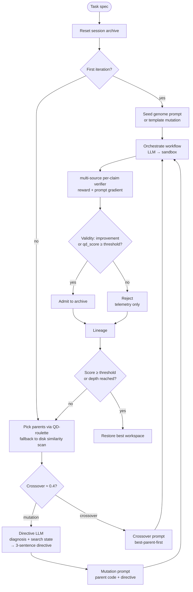

# Evolution engine

Mimosa-AI is a **self-evolving multi-agent system**. Rather than forcing
every task through a fixed pipeline, the engine composes a custom workflow
per task and refines it over generations. This page walks through what
actually happens inside the loop.

## Big picture

The [`EvolutionEngine`](https://github.com/HolobiomicsLab/Mimosa-AI/blob/main/sources/core/evolution_engine.py)
runs a **depth-first recursion** seeded from a Quality-Diversity (QD) archive:

A more detailed view lives in the source diagram
[`docs/diagrams/evolution_loop.mermaid`](https://github.com/HolobiomicsLab/Mimosa-AI/blob/main/docs/diagrams/evolution_loop.mermaid).

## Each recursive step

1. **Reset** the workspace to the initial state.
2. **Orchestrate** a workflow run (LLM writes Python → sandbox runs it).
3. **Snapshot** the workspace.
4. **Evaluate** — get `overall_score` (which drives QD quality) plus an
   `abstracted_prompt_gradient`; `overall_score_uncapped` is still
   persisted for analysis.
5. **`validate_survivor()`** — admit to the archive when the candidate
   improves over baseline or clears `qd_score > admit_threshold`;
   capacity is curated by lowest-`qd_score` eviction.
6. **Select** next parent(s) and choose mutation vs. crossover.
7. **Recurse** until the score threshold is hit or `max_depth` is reached.

Termination:

- `overall_score >= learned_score_threshold` (default `0.92`) in `--learn` mode, *or*
- `max_depth` reached — `1` in single-shot mode, `max_learning_evolve_iterations`
  (default `25`) in `--learn` mode.

## Selection: Quality-Diversity (QD)

[`SelectionPressure`](https://github.com/HolobiomicsLab/Mimosa-AI/blob/main/sources/core/selection.py)
implements four strategies — `greedy`, `tournament`, `novelty`, and `qd`
(default, set via config's `selection_strategy`). In QD mode:

- A **session archive** holds up to `population_size = 20` members
  (config field, ablation-tunable).
- Each member has `qd_score = (1−w)·quality_norm + w·novelty_norm`, with
  `w = novelty_weight = 0.25`. Quality and novelty are **additive** — never
  multiplied — so high quality cannot rescue a redundant profile and high
  novelty cannot drag a broken run above peers.
- Quality is sourced from `reward` (the capped `overall_score`), so a run
  that refuted a hard claim ranks at its capped score and cannot top the
  archive on its other claims alone; ties at the cap are broken by the
  novelty and length-penalty terms.
- Novelty is cosine-distance k-NN (`k = 15`) in **genotype-embedding**
  space. The descriptor is the L2-normalised embedding of the workflow's
  generated source code (its *genotype*), produced by
  [`genotype_embedding.py`](https://github.com/HolobiomicsLab/Mimosa-AI/blob/main/sources/core/genotype_embedding.py)
  through the [`code_features.py`](https://github.com/HolobiomicsLab/Mimosa-AI/blob/main/sources/core/code_features.py)
  shim (see below).
- Admission gate: candidate is admitted when it either improves over
  baseline by `min_improvement_threshold` (default `0.01`) or clears
  `qd_score > admit_threshold` (default `0.3`). When the archive reaches
  capacity, the lowest-`qd_score` member is evicted.
- Parent draw applies an inverse-child-count penalty
  `÷ (1 + n_children_already)`, and parents are hard-capped at
  `MAX_CHILDREN_PER_PARENT = 8` before that penalty kicks in, so the
  offspring stream stays spread across the archive.

All of the above — `min_improvement_threshold`, `population_size`,
`novelty_k_neighbours`, `novelty_weight`, `admit_threshold` — are `Config`
fields (see [Configuration reference](../reference/configuration.md#qd-novelty-selection-variation)),
not hardcoded constants; touch them only for ablation studies.

When the archive is empty (cold start), [`WorkflowSelector`](https://github.com/HolobiomicsLab/Mimosa-AI/blob/main/sources/core/workflow_selection.py)
falls back to a **similarity-filtered disk scan** (`cosine ≥
parent_threshold_similarity` — default `0.8` — on MiniLM embeddings of
`original_task`, `score ≥ parent_threshold_score` — default `0.01`) — this
lets useful workflows transfer across tasks.

### Behaviour descriptor: genotype embedding

The novelty signal compares candidates in **genotype-embedding** space.
Each workflow's generated source code (its *genotype*) is embedded into a
dense vector and L2-normalised; novelty is the mean **cosine distance**
(`1 − cosine_similarity`, range `[0, 2]`) from a candidate to its
comparison set. Two workflows whose code is semantically similar collapse
to nearly the same point and are treated as redundant; two that explored
different approaches land far apart, and both earn a seat in the archive.
This reads "how different is the generated approach" directly, rather
than inferring it from a proxy.

The embedding backend is pluggable
([`genotype_embedding.py`](https://github.com/HolobiomicsLab/Mimosa-AI/blob/main/sources/core/genotype_embedding.py)):

- **Default — local `all-MiniLM-L6-v2`** (sentence-transformers): no
  network at runtime, deterministic, free. Embeddings are cached per
  process by the SHA-1 of the source, so the QD inner loop stays cheap
  even when archive refresh walks dozens of members.
- **Optional — OpenAI `text-embedding-3-small`**, used only when both
  `MIMOSA_GENOTYPE_EMBEDDING_BACKEND=openai` and `OPENAI_API_KEY` are
  set; it falls back to MiniLM if the client can't be constructed.

The descriptor dimension is whatever the backend emits (384 for MiniLM),
not a fixed width — drain the archive if you switch backends mid-run.

When a genotype is degenerate — missing, empty, or the backend errors —
the embedder returns `None` and
`SelectionPressure._extract_behaviour_descriptor` treats the missing
signal as **neutral** (no novelty) rather than max-novel, so broken
offspring are never rewarded merely for being "different".

> **The failure fingerprint is no longer the novelty signal.** Earlier
> versions derived QD novelty from a *failure fingerprint* — a 6-D
> centered vector of per-source verifier pass rates — and, before that,
> from a structural descriptor `[n_agents, n_edges, n_branches,
> prompt_chars]`. Both have been retired as the behaviour descriptor. The
> failure fingerprint is **still computed and persisted** by the verifier
> under `state_result.json` → `evaluation.verifier.failure_fingerprint`,
> but only as a diagnostic — selection no longer reads it. The structural
> descriptor is gone entirely; `code_features.py` is now the
> genotype-embedding shim.

## Variation: directive-implicit mutation scope

[`VariationEngine`](https://github.com/HolobiomicsLab/Mimosa-AI/blob/main/sources/core/variation_engine.py)
assembles mutation and crossover prompts. There is **no step-size
controller any more**: mutation magnitude ("how bold") is decided
implicitly by the directive LLM, informed by a deterministic,
read-only `<search_state>` block assembled in code.

An earlier design computed an "effective boldness" scalar from a
success-rate rule blended with a plateau counter, mapped it onto five
advisory scope bands (EXPLOITATION → RE-SPECIATION), and grew the
agent budget with it. That controller was removed because it
never actuated a real knob: generation temperature is sampled
randomly at the workflow factory, the band text reached only the
directive LLM as prose, and offline measurement showed the scalar's
influence on realised edit size was noise-dominated — directive
word-choice predicted the outcome far better than the boldness value
itself.

What survived is the **observer**. For every mutation the engine
assembles a `<search_state>` block from recorded history: the parent
score, the iteration progress (`iteration / max_iterations`), the
plateau streak `_iters_since_improvement()` (scored offspring since
the last strict improvement, normalised by `_PLATEAU_PATIENCE = 6`),
the success rate `_compute_success_rate(window=5)` over the last 5
scored offspring, and a short score-only trajectory (last 5 child
scores). The block deliberately contains no rubric or diagnosis text,
so the verifier's rubric-blindness firewall is preserved. The same
fields are written to `variation_state` telemetry.

Magnitude guidance lives in the directive prompt instead: the LLM
judges for itself how bold the next change should be — small tweak vs
component rewrite vs structural redesign — justified by the search
state (recent improvements and a rising trajectory call for small
tweaks; a long plateau, a 0 % success rate, or repeated identical
failures call for bolder restructuring). Hard guardrails remain in
code, not prose: the mutation agent budget is sampled
**parent-centered** — uniformly within ±1 agent of the parent's agent
count, hard-capped to `[1, max_possible_agents = 7]` (seed generation
still draws from `[1, 4]`; crossover is still capped at the highest
parent agent count) — and the mutation prompt keeps the deterministic
mandates: add or remove at most 1 agent, do not change topology unless
the directive explicitly suggests it, keep 90 % of the previous
workflow prompts and code unchanged.

### Mutation directive: offloading reasoning from the orchestrator

The orchestrator LLM has one job: write the next workflow's Python
code. Earlier revisions dumped the raw diagnosis and the per-agent
answers into the orchestrator prompt and asked it to figure out the
right intervention while also coding it.
That mixed two very different kinds of reasoning into one call —
diagnosis ("what went wrong, and what kind of change does that imply?")
and synthesis ("emit valid LangGraph + agent code") — and the
orchestrator routinely either over-edited (rewriting unrelated agents
because it re-litigated the diagnosis) or under-edited (touching only
phrasing while the diagnosis pointed at a missing agent).

`VariationEngine.llm_think_mutation_directive()` splits these two
reasoning steps. Before the orchestrator is invoked, a dedicated LLM
call reads:

- the parent's per-agent answers (`<agents_answers>`),
- the rubric-blind textual gradient from the verifier
  (`<diagnosis>` — trusted as ground truth),
- the read-only search-state block produced by `_search_state_block`
  (`<search_state>` — plain search statistics: parent score, iteration
  progress, plateau streak, success rate, score trajectory),
- and the goal,

and emits a **≤ 3-sentence directive** that names exactly one issue,
the kind of mutation it implies (prompt tweak, persona change, agent
add/remove, topology change), the **intended magnitude** (small tweak,
component rewrite, structural redesign) justified by the search state,
and the rationale. The system prompt is explicit about trust ranks —
the verifier diagnosis is trusted; agent self-reports may mislead —
and about action limits — add or remove at most one agent per step,
and prefer small incremental changes unless the diagnosis and search
state say the approach is fundamentally flawed.

The orchestrator then receives only the parent code and that single
directive, wrapped in `<directive>...</directive>` with hard
instructions:

- **follow the directive exactly** as the only change-guideline,
- **do not add or remove more than 1 agent at a time** and never beyond
  the budget,
- **do not change topology** unless the directive says so,
- **do not edit prompt instructions outside the directive's scope**,
- **keep ≥ 90 % of the previous workflow code and prompts unchanged**.

The pre-digested directive is grounded — every claim it makes is
sourced from the search state and the verifier diagnosis, never
from the orchestrator's own re-reading of the rubric — and precise —
the orchestrator is no longer asked to weigh evidence, only to
implement one named change. This consistently reduces drift between
generations and prevents the change mandate from leaking into
unintended structural rewrites.

## Crossover

With probability `crossover_rate` per generation (default `0.4`, and only
once at least `initial_population` — default `2` — runs have happened),
`n_parents` (default `2`) parents are combined instead of one being
mutated. The crossover prompt is **best-parent-first**: the strongest
parent's code structure leads, weaker parents contribute specific
improvements rather than competing for the skeleton, and the offspring
is hard-capped at the highest parent agent count to prevent runaway
complexity.

## Lineage & reproducibility

After each generation, [`lineage.py`](https://github.com/HolobiomicsLab/Mimosa-AI/blob/main/sources/core/lineage.py)
writes a sidecar record `sources/workflows/<uuid>/lineage_<uuid>.json`
with the parents and the operator used (`seed | mutation | crossover`).
Combined with `evolution_prompt_<uuid>.md` (the exact LLM prompt used),
runs are fully reproducible — same prompt, same code path, same seed
yields the same code.

## Watching evolution happen

The directive LLM, the QD archive, the
crossover roll — none of it is visible inside a single generation.
The shape of the search only emerges when you step back across a
whole run, and that's what the lineage tree in
`sources/workflows/<best_uuid>/evolution_tree.png` is for: it lays
every workflow the engine produced on the same canvas, with the
operator that linked each pair drawn explicitly. It's the most
direct way to confirm that the mechanics on this page are doing
something on your task.

{ width="60%" }

Generation depth runs down the y-axis, each node is a workflow
coloured by its `overall_score` (red → green), solid edges are
mutation parents and dashed edges are crossover parents. Failed runs
stay in the picture as labelled red nodes off the main trunk so you
can see *where* a branch died, not just that it did. Read top-down
to follow the ratchet — a 0.48 seed branching into 0.64 and 0.62
children, those crossing over into the 0.67/0.69 generation, then a
0.73 mutation finally bridging into a 0.74 leaf — and watch for the
dashed edges that span the tree horizontally: those are the
recombinations that pulled in a structural idea the local mutation
chain wouldn't have reached on its own. Long mutation runs at the
same colour are the plateau the directive LLM sees in its search
state; the colour jump that follows them is what a deliberately bolder
mutation looks like.

## Run metrics artifacts

Each iteration also writes structured metrics for post-hoc analysis:

- `sources/workflows/<uuid>/run_metrics.json` — one file per workflow.
  Captures `iteration`, `evolution_kind`, `parent_uuids`,
  `iteration_wall_time_s`, `iteration_cost_usd`, `cumulative_cost_usd`,
  `overall_score{,_uncapped}`, `qd_descriptor`, `qd_score`,
  `novelty_score`, the `selection_log`, and the
  `variation_state` (`iters_since_improvement`, `plateau`,
  `success_rate`, `parent_score`, and the parent-centered
  `agent_budget` sample) that produced this offspring. Historical files
  from before the controller removal may additionally hold
  `effective_boldness` / `respeciation_gate_open`.
- `sources/workflows/qd_archive.jsonl` — append-only, one line per
  `validate_survivor` call. Records the candidate's descriptor,
  `qd_score`, `novelty_score`, admission verdict, and the `evicted_uuid`
  (if the archive was at capacity).
- `sources/workflows/variation_log.jsonl` — append-only, one line per
  mutation/crossover/seed prompt assembled. Lets you retrace the
  search-state observer without rerunning the engine.

All three are best-effort and fail-soft: an I/O error logs a warning
but never aborts a run.

## See also

- [Evaluation pipeline](evaluation-pipeline.md) — what the verifier actually returns.
- [Iterative learning](../usage/learning.md) — running the engine end-to-end.
- [Developer guide](../DEVELOPER_GUIDE.md) — code paths and class wiring.
