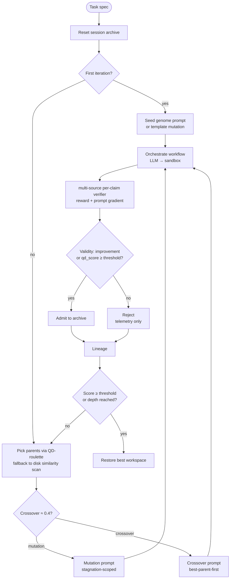

# Evolution engine

Mimosa-AI is a **self-evolving multi-agent system**. Rather than forcing
every task through a fixed pipeline, the engine composes a custom workflow
per task and refines it over generations. This page walks through what
actually happens inside the loop.

## Big picture

The [`EvolutionEngine`](https://github.com/HolobiomicsLab/Mimosa-AI/blob/main/sources/core/evolution_engine.py)
runs a **depth-first recursion** seeded from a Quality-Diversity (QD) archive:

A more detailed view lives in the source diagram
[`docs/diagrams/evolution_loop.mermaid`](https://github.com/HolobiomicsLab/Mimosa-AI/blob/main/docs/diagrams/evolution_loop.mermaid).

## Each recursive step

1. **Reset** the workspace to the initial state.
2. **Orchestrate** a workflow run (LLM writes Python → sandbox runs it).
3. **Snapshot** the workspace.
4. **Evaluate** — get `overall_score` and `reward_uncapped` (i.e.
   `overall_score_uncapped` in the persisted JSON) plus an
   `abstracted_prompt_gradient`.
5. **`validate_survivor()`** — admit to the archive when the candidate
   improves over baseline or clears `qd_score > admit_threshold`;
   capacity is curated by lowest-`qd_score` eviction.
6. **Select** next parent(s) and choose mutation vs. crossover.
7. **Recurse** until the score threshold is hit or `max_depth` is reached.

Termination:

- `overall_score > learned_score_threshold` (default `0.94`) in `--learn` mode, *or*
- `max_depth` reached — `1` in single-shot mode, `max_learning_evolve_iterations`
  (default `45`) in `--learn` mode.

## Selection: Quality-Diversity (QD)

[`SelectionPressure`](https://github.com/HolobiomicsLab/Mimosa-AI/blob/main/sources/core/selection.py)
implements four strategies — `greedy`, `tournament`, `novelty`, and `qd`
(default). In QD mode:

- A **session archive** holds up to `population_size = 50` members.
- Each member has `qd_score = (1−w)·quality_norm + w·novelty_norm`, with
  `w = novelty_weight = 0.25`.
- Quality is sourced from `reward_uncapped` so the hard-fail cap doesn't
  flatten rank ordering.
- Novelty is k-NN distance (`k = 15`) in behaviour-descriptor space, where
  the descriptor is `[n_agents, n_edges, n_branches, prompt_chars]`
  extracted by [`code_features.py`](https://github.com/HolobiomicsLab/Mimosa-AI/blob/main/sources/core/code_features.py).
- Admission gate: candidate is admitted when it either improves over
  baseline by `min_improvement_threshold` or clears
  `qd_score > admit_threshold`. When the archive reaches capacity, the
  lowest-`qd_score` member is evicted.
- Parent draw applies an inverse-child-count penalty
  `÷ (1 + n_children_already)`, and parents are hard-capped at
  `MAX_CHILDREN_PER_PARENT = 2` before that penalty kicks in, so the
  offspring stream stays spread across the archive.

When the archive is empty (cold start), [`WorkflowSelector`](https://github.com/HolobiomicsLab/Mimosa-AI/blob/main/sources/core/workflow_selection.py)
falls back to a **similarity-filtered disk scan** (`cosine ≥ 0.5` on MiniLM
embeddings of `original_task`, `score ≥ 0.05`) — this lets useful workflows
transfer across tasks.

## Variation: evidence-driven mutation scope (Rechenberg 1/5 rule)

[`VariationEngine`](https://github.com/HolobiomicsLab/Mimosa-AI/blob/main/sources/core/variation_engine.py)
assembles mutation and crossover prompts. There is no fixed phase
schedule by iteration progress; mutation boldness is a continuous
function of two evidence signals — how much the population is
repeating itself, *and* how often recent offspring have actually
improved on the best-so-far.

**Stagnation signal.** `_compute_stagnation(window=4)` takes the last
4 non-failure prompt gradients, computes their pairwise MiniLM cosine
similarity, and rescales the mean (`0.4` ≈ unrelated → `0`,
`0.8+` ≈ fully stagnated → `1`).

**Success-rate signal.** `_compute_success_rate(window=5)` counts the
fraction of the last 5 scored offspring whose `overall_score` strictly
beat the running best at the moment they were produced. The classical
Rechenberg 1/5 success rule (1973) is the threshold: below `0.20`
the search is "stuck" and step size must grow; above it, real progress
is happening and step size should be damped.

**Effective boldness.** Combining the two signals:

- **Cold start** (no scored offspring yet) — `effective = raw_stagnation`.
- **Below 1/5** (`success_rate < 0.20`) — escalate at least to the
  deficit: `effective = max(raw_stagnation, deficit)`, where
  `deficit = (0.20 − success_rate) / 0.20`. A repeated gradient and a
  flat reward curve both force scope up.
- **Above 1/5** — damp boldness in proportion to how far above
  threshold we are: `effective = raw_stagnation · (1 − progress)`,
  where `progress = min(1, (success_rate − 0.20) / (0.80 − 0.20))`.
  At `success_rate ≥ 0.80` boldness collapses regardless of stagnation.
- **Near-finish floor** — only in the last 5 % of the score range,
  `effective` is multiplied by `(1 − 0.5 · near_finish)` where
  `near_finish = (parent_score − 0.95) / 0.05`. This is the *only*
  point where the parent's absolute score re-enters the boldness
  calculation, so a 0.96 parent isn't gambled away one generation
  before early-stop.

Notably, `parent_score` no longer multiplies the whole signal — that
older behaviour locked high-score lineages into "tiny tweak" mode even
when the gradient kept repeating identically.

**Agent budget.** The current agent count grows toward
`max_possible_agents = 7` proportionally to `effective`, then a
Beta-Binomial draw samples the actual count inside that window
(biased upward by `effective`). The seed generation samples agents
from `[1, 4]` with a `0.5` stagnation prior.

**Scope band.** A single advisory line is added to the mutation prompt,
chosen by `effective`:

| Effective boldness  | Mutation scope                                                         |
| ------------------- | ---------------------------------------------------------------------- |
| < 0.20              | prompt-only little tweak                                               |
| < 0.40              | prompt, handoff, tools — improve information flow                      |
| < 0.60              | significant redesign while keeping topology                            |
| < 0.80              | bold rewire — restructure or grow the agent set                        |
| ≥ 0.80              | complete rethink — discard inherited topology / prompts                |

The bands are advisory text steered to the LLM, not hard gates: the
LLM can still pick any topology. The hard control is the agent-count
budget passed in the same prompt block.

## Crossover

With probability ~0.4 per generation (and only once at least
`initial_population = 2` runs have happened), two parents are combined
instead of one being mutated. The crossover prompt is
**best-parent-first**: the strongest parent's code structure leads,
weaker parents contribute specific improvements rather than competing
for the skeleton, and the offspring is hard-capped at the highest
parent agent count to prevent runaway complexity.

## Lineage & reproducibility

After each generation, [`lineage.py`](https://github.com/HolobiomicsLab/Mimosa-AI/blob/main/sources/core/lineage.py)
writes a sidecar record `sources/workflows/<uuid>/lineage_<uuid>.json`
with the parents and the operator used (`seed | mutation | crossover`).
Combined with `evolution_prompt_<uuid>.md` (the exact LLM prompt used),
runs are fully reproducible — same prompt, same code path, same seed
yields the same code.

## Visualisations

When the loop finishes, Mimosa emits two artifacts in
`sources/workflows/<uuid>/`:

- `reward_progress.png` — reward over iterations.
- `evolution_tree.png` — rendered lineage tree.

{ width="80%" }

## See also

- [Evaluation pipeline](evaluation-pipeline.md) — what the verifier actually returns.
- [Iterative learning](../usage/learning.md) — running the engine end-to-end.
- [Developer guide](../DEVELOPER_GUIDE.md) — code paths and class wiring.
