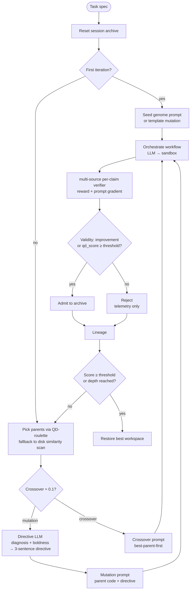
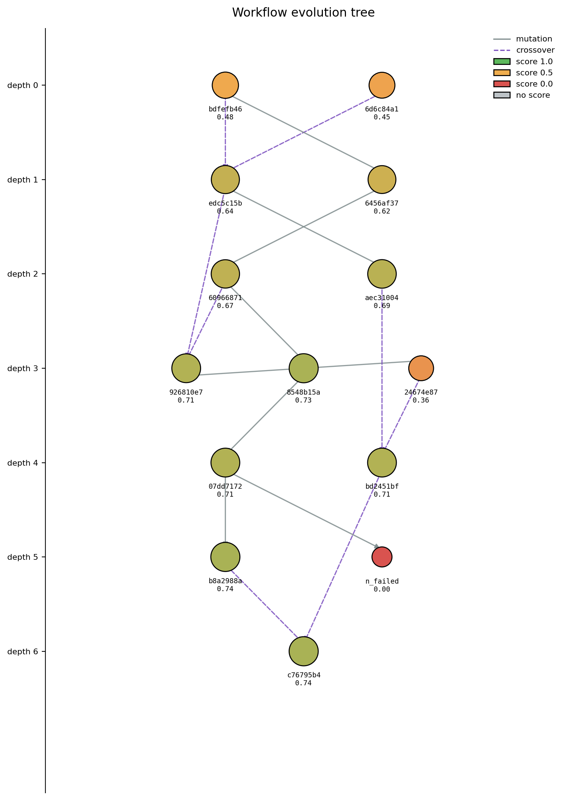

# Evolution engine

Mimosa-AI is a **self-evolving multi-agent system**. Rather than forcing
every task through a fixed pipeline, the engine composes a custom workflow
per task and refines it over generations. This page walks through what
actually happens inside the loop.

## Big picture

The [`EvolutionEngine`](https://github.com/HolobiomicsLab/Mimosa-AI/blob/main/sources/core/evolution_engine.py)
runs a **depth-first recursion** seeded from a Quality-Diversity (QD) archive:

A more detailed view lives in the source diagram
[`docs/diagrams/evolution_loop.mermaid`](https://github.com/HolobiomicsLab/Mimosa-AI/blob/main/docs/diagrams/evolution_loop.mermaid).

## Each recursive step

1. **Reset** the workspace to the initial state.
2. **Orchestrate** a workflow run (LLM writes Python → sandbox runs it).
3. **Snapshot** the workspace.
4. **Evaluate** — get `overall_score` and `reward_uncapped` (i.e.
   `overall_score_uncapped` in the persisted JSON) plus an
   `abstracted_prompt_gradient`.
5. **`validate_survivor()`** — admit to the archive when the candidate
   improves over baseline or clears `qd_score > admit_threshold`;
   capacity is curated by lowest-`qd_score` eviction.
6. **Select** next parent(s) and choose mutation vs. crossover.
7. **Recurse** until the score threshold is hit or `max_depth` is reached.

Termination:

- `overall_score >= learned_score_threshold` (default `0.9`) in `--learn` mode, *or*
- `max_depth` reached — `1` in single-shot mode, `max_learning_evolve_iterations`
  (default `20`) in `--learn` mode.

## Selection: Quality-Diversity (QD)

[`SelectionPressure`](https://github.com/HolobiomicsLab/Mimosa-AI/blob/main/sources/core/selection.py)
implements four strategies — `greedy`, `tournament`, `novelty`, and `qd`
(default). In QD mode:

- A **session archive** holds up to `population_size = 50` members.
- Each member has `qd_score = (1−w)·quality_norm + w·novelty_norm`, with
  `w = novelty_weight = 0.25`. Quality and novelty are **additive** — never
  multiplied — so high quality cannot rescue a redundant profile and high
  novelty cannot drag a broken run above peers.
- Quality is sourced from `reward_uncapped` so the hard-fail cap doesn't
  flatten rank ordering.
- Novelty is k-NN distance (`k = 15`) in **failure-fingerprint** space.
  The descriptor is the centered per-source pass-rate vector produced by
  [`failure_fingerprint.py`](https://github.com/HolobiomicsLab/Mimosa-AI/blob/main/sources/core/failure_fingerprint.py)
  from the verifier's per-claim verdicts (see below).
- Admission gate: candidate is admitted when it either improves over
  baseline by `min_improvement_threshold` or clears
  `qd_score > admit_threshold`. When the archive reaches capacity, the
  lowest-`qd_score` member is evicted.
- Parent draw applies an inverse-child-count penalty
  `÷ (1 + n_children_already)`, and parents are hard-capped at
  `MAX_CHILDREN_PER_PARENT = 2` before that penalty kicks in, so the
  offspring stream stays spread across the archive.

When the archive is empty (cold start), [`WorkflowSelector`](https://github.com/HolobiomicsLab/Mimosa-AI/blob/main/sources/core/workflow_selection.py)
falls back to a **similarity-filtered disk scan** (`cosine ≥ 0.8` on MiniLM
embeddings of `original_task`, `score ≥ 0.1`) — this lets useful workflows
transfer across tasks.

### Behaviour descriptor: failure fingerprint

The novelty signal compares candidates in **failure-fingerprint** space.
Per source A–F (literature, user goal, agent narration, math invariants,
computational reproducibility, statistical fingerprint), the verifier
records a pass rate. Sources with zero claims get the neutral value
`0.5` and a presence-mask entry of `0`. The vector is then **centered**:
the mean pass rate across present sources is subtracted from every entry.

The centering is the *quality firewall*. Without it, an all-pass run sits
at `[1,1,1,1,1,1]` and an all-fail run at `[0,0,0,0,0,0]` — Euclidean
distance between them is large, and quality silently leaks into novelty.
After centering, **both** runs collapse to the zero profile and novelty
encodes only the *shape* of which sources fail relative to the others.
Two workflows that fail in the same way are redundant regardless of how
different their DAGs look; two that fail in different ways explore
different basins and both deserve a seat in the archive.

The fingerprint is computed at the end of `VerifierEvaluator.evaluate()`
and persisted in `state_result.json` under
`evaluation.verifier.failure_fingerprint.vector`. The full audit trail —
which variable comes from where, the failure modes the descriptor must
survive, and the centering invariant asserted by the tests — lives in
[`docs/info-flow/failure_fingerprint.md`](../info-flow/failure_fingerprint.md).

When a run has no usable fingerprint (verifier short-circuit on a fully
failed workflow), `SelectionPressure._extract_behaviour_descriptor`
returns a neutral zero vector so distance lookups stay well-defined and
the cold path doesn't artificially win or lose on novelty.

The legacy structural descriptor (`[n_agents, n_edges, n_branches,
prompt_chars]`) shipped by
[`code_features.py`](https://github.com/HolobiomicsLab/Mimosa-AI/blob/main/sources/core/code_features.py)
is retained for ablations and offline analysis but is **no longer used**
for QD novelty — empirical work showed it barely co-varies with outcomes.

## Variation: evidence-driven mutation scope (Rechenberg 1/5 rule)

[`VariationEngine`](https://github.com/HolobiomicsLab/Mimosa-AI/blob/main/sources/core/variation_engine.py)
assembles mutation and crossover prompts. There is no fixed phase
schedule by iteration progress; mutation boldness is a continuous
function of two evidence signals — how long the lineage has been
failing to improve, *and* how often recent offspring actually beat the
best-so-far.

**Plateau signal.** `_iters_since_improvement()` counts the run of
trailing scored offspring (failures and unscored entries skipped) that
did not strictly beat the best-so-far at the moment they were
produced. It is normalised to `plateau = min(1, iters / _PLATEAU_PATIENCE)`
with `_PLATEAU_PATIENCE = 6`.

**Success-rate signal.** `_compute_success_rate(window=5)` counts the
fraction of the last 5 scored offspring whose `overall_score` strictly
beat the running best at the moment they were produced. The classical
Rechenberg 1/5 success rule (1973) is the threshold: below `0.20`
the search is "stuck" and step size must grow; above it, real progress
is happening and step size should be damped.

**Effective boldness.** Combining the two signals:

- **Cold start** (fewer than two comparable scored offspring) —
  `effective = 0.3 · plateau`. A capped cold-start ramp avoids jumping
  straight into RE-SPECIATION before any feedback has accumulated.
- **Below 1/5** (`success_rate < 0.20`) — average the deficit and the
  plateau: `effective = 0.5 · deficit + 0.5 · plateau`, where
  `deficit = (0.20 − success_rate) / 0.20`. A run of no-improvements
  and a stalling success rate both push scope up.
- **Above 1/5** — damp boldness in proportion to how far above
  threshold we are: `effective = plateau · (1 − progress)`, where
  `progress = min(1, (success_rate − 0.20) / (0.80 − 0.20))`. At
  `success_rate ≥ 0.80` boldness collapses regardless of plateau.
- **Near-finish floor** — only in the last 5 % of the score range,
  `effective` is multiplied by `(1 − 0.5 · near_finish)` where
  `near_finish = max(0, (parent_score − 0.95) / 0.05)`. This is the
  *only* point where the parent's absolute score re-enters the boldness
  calculation, so a 0.96 parent isn't gambled away one generation
  before early-stop.
- **RE-SPECIATION gate.** The top band is hysteresis-gated: unless
  `iters_since_improvement ≥ _RESPECIATION_PATIENCE` (default `8`) *and*
  `success_rate ∈ {None, 0.0}`, `effective` is clamped to
  `_RESPECIATION_CLAMP = 0.89` — just below the EXPLORATION/RE-SPECIATION
  boundary at `0.90`.

Notably, `parent_score` no longer multiplies the whole signal — that
older behaviour locked high-score lineages into "tiny tweak" mode even
when offspring kept failing identically.

**Agent budget.** The current agent count grows toward
`max_possible_agents = 7` proportionally to `effective`, then a
Beta-Binomial draw samples the actual count inside that window
(biased upward by `effective`). The seed generation samples agents
from `[1, 4]` with a `0.5` boldness prior.

**Scope band.** A single advisory line is added to the mutation prompt,
chosen by `effective`:

| Effective boldness  | Mutation scope                                                              |
| ------------------- | --------------------------------------------------------------------------- |
| < 0.35              | `EXPLOITATION` — point mutation: minor phrasing / prompt-adjective tweaks   |
| < 0.50              | `ALIGNMENT` — interface optimization: refine handoff prompts, IO contracts  |
| < 0.65              | `ADAPTATION` — component overhaul: rewrite lagging agent prompts, swap tools |
| < 0.90              | `EXPLORATION` — macro structural mutation: add/merge agents, change routing |
| ≥ 0.90              | `RE-SPECIATION` — clean-slate redesign of the multi-agent architecture      |

The bands are advisory text steered to the LLM, not hard gates: the
LLM can still pick any topology. The hard control is the agent-count
budget passed in the same prompt block.

### Mutation directive: offloading reasoning from the orchestrator

The orchestrator LLM has one job: write the next workflow's Python
code. Earlier revisions dumped the raw diagnosis, the per-agent
answers, *and* the boldness/scope band into the orchestrator prompt and
asked it to figure out the right intervention while also coding it.
That mixed two very different kinds of reasoning into one call —
diagnosis ("what went wrong, and what kind of change does that imply?")
and synthesis ("emit valid LangGraph + agent code") — and the
orchestrator routinely either over-edited (rewriting unrelated agents
because it re-litigated the diagnosis) or under-edited (touching only
phrasing while the diagnosis pointed at a missing agent).

`VariationEngine.llm_think_mutation_directive()` splits these two
reasoning steps. Before the orchestrator is invoked, a dedicated LLM
call reads:

- the parent's per-agent answers (`<agents_answers>`),
- the rubric-blind textual gradient from the verifier
  (`<diagnosis>` — trusted as ground truth),
- the boldness/scope block produced by `_get_prompt_step_size`
  (`<boldness>` — caps how big a change is allowed),
- and the goal,

and emits a **≤ 3-sentence directive** that names exactly one issue,
the kind of mutation it implies (prompt tweak, persona change, agent
add/remove, topology change), and the rationale. The system prompt is
explicit about trust ranks — the verifier diagnosis is trusted; agent
self-reports may mislead — and about action limits — add or remove at
most one agent per step, do not exceed the boldness band, and prefer
small incremental changes unless the diagnosis says the approach is
fundamentally flawed.

The orchestrator then receives only the parent code and that single
directive, wrapped in `<directive>...</directive>` with hard
instructions:

- **follow the directive exactly** as the only change-guideline,
- **do not add or remove more than 1 agent at a time** and never beyond
  the budget,
- **do not change topology** unless the directive says so,
- **do not edit prompt instructions outside the directive's scope**,
- **keep ≥ 90 % of the previous workflow code and prompts unchanged**.

The pre-digested directive is grounded — every claim it makes is
sourced from the boldness signals and the verifier diagnosis, never
from the orchestrator's own re-reading of the rubric — and precise —
the orchestrator is no longer asked to weigh evidence, only to
implement one named change. This consistently reduces drift between
generations and prevents the boldness budget from leaking into
unintended structural rewrites.

## Crossover

With probability `crossover_rate` per generation (default `0.1`, and only
once at least `initial_population = 2` runs have happened), two parents
are combined instead of one being mutated. The crossover prompt is
**best-parent-first**: the strongest parent's code structure leads,
weaker parents contribute specific improvements rather than competing
for the skeleton, and the offspring is hard-capped at the highest
parent agent count to prevent runaway complexity.

## Lineage & reproducibility

After each generation, [`lineage.py`](https://github.com/HolobiomicsLab/Mimosa-AI/blob/main/sources/core/lineage.py)
writes a sidecar record `sources/workflows/<uuid>/lineage_<uuid>.json`
with the parents and the operator used (`seed | mutation | crossover`).
Combined with `evolution_prompt_<uuid>.md` (the exact LLM prompt used),
runs are fully reproducible — same prompt, same code path, same seed
yields the same code.

## Watching evolution happen

The Rechenberg schedule, the directive-LLM, the QD archive, the
crossover roll — none of it is visible inside a single generation.
The shape of the search only emerges when you step back across a
whole run, and that's what the lineage tree in
`sources/workflows/<best_uuid>/evolution_tree.png` is for: it lays
every workflow the engine produced on the same canvas, with the
operator that linked each pair drawn explicitly. It's the most
direct way to confirm that the mechanics on this page are doing
something on your task.

{ width="60%" }

Generation depth runs down the y-axis, each node is a workflow
coloured by its `overall_score` (red → green), solid edges are
mutation parents and dashed edges are crossover parents. Failed runs
stay in the picture as labelled red nodes off the main trunk so you
can see *where* a branch died, not just that it did. Read top-down
to follow the ratchet — a 0.48 seed branching into 0.64 and 0.62
children, those crossing over into the 0.67/0.69 generation, then a
0.73 mutation finally bridging into a 0.74 leaf — and watch for the
dashed edges that span the tree horizontally: those are the
recombinations that pulled in a structural idea the local mutation
chain wouldn't have reached on its own. Long mutation runs at the
same colour are the plateau signal feeding back into the boldness
schedule; the colour jump that follows them is what an unstuck
EXPLORATION-band mutation actually looks like.

## Run metrics artifacts

Each iteration also writes structured metrics for post-hoc analysis:

- `sources/workflows/<uuid>/run_metrics.json` — one file per workflow.
  Captures `iteration`, `evolution_kind`, `parent_uuids`,
  `iteration_wall_time_s`, `iteration_cost_usd`, `cumulative_cost_usd`,
  `overall_score{,_uncapped}`, `qd_descriptor`, `qd_score`,
  `novelty_score`, the `selection_log`, and the
  `variation_state` (`iters_since_improvement`, `plateau`,
  `success_rate`, `effective_boldness`, `parent_score`,
  `respeciation_gate_open`, , `agent_budget`) that produced
  this offspring.
- `sources/workflows/qd_archive.jsonl` — append-only, one line per
  `validate_survivor` call. Records the candidate's descriptor,
  `qd_score`, `novelty_score`, admission verdict, and the `evicted_uuid`
  (if the archive was at capacity).
- `sources/workflows/variation_log.jsonl` — append-only, one line per
  mutation/crossover/seed prompt assembled. Lets you retrace the
  Rechenberg 1/5 step-size schedule without rerunning the engine.

All three are best-effort and fail-soft: an I/O error logs a warning
but never aborts a run.

## See also

- [Evaluation pipeline](evaluation-pipeline.md) — what the verifier actually returns.
- [Iterative learning](../usage/learning.md) — running the engine end-to-end.
- [Developer guide](../DEVELOPER_GUIDE.md) — code paths and class wiring.
