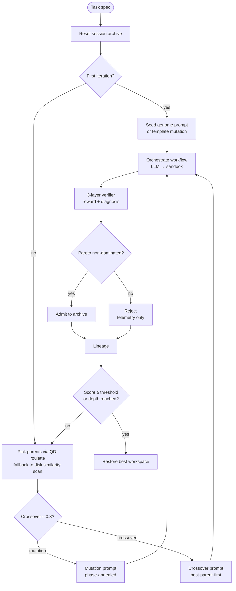
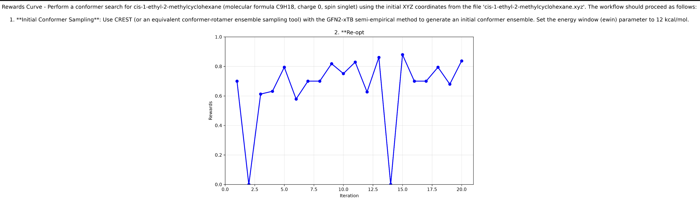

# Evolution engine

Mimosa-AI is a **self-evolving multi-agent system**. Rather than forcing
every task through a fixed pipeline, the engine composes a custom workflow
per task and refines it over generations. This page walks through what
actually happens inside the loop.

## Big picture

The [`EvolutionEngine`](https://github.com/HolobiomicsLab/Mimosa-AI/blob/main/sources/core/evolution_engine.py)
runs a **depth-first recursion** seeded from a Quality-Diversity (QD) archive:

A more detailed view lives in the source diagram
[`docs/diagrams/evolution_loop.mermaid`](https://github.com/HolobiomicsLab/Mimosa-AI/blob/main/docs/diagrams/evolution_loop.mermaid).

## Each recursive step

1. **Reset** the workspace to the initial state.
2. **Orchestrate** a workflow run (LLM writes Python → sandbox runs it).
3. **Snapshot** the workspace.
4. **Evaluate** — get `overall_score` and `reward_uncapped` plus an
   abstracted diagnosis.
5. **`validate_survivor()`** — admit to the archive if non-dominated on
   `(reward_uncapped, novelty)`.
6. **Select** next parent(s) and choose mutation vs. crossover.
7. **Recurse** until the score threshold is hit or `max_depth` is reached.

Termination:

- `overall_score > learned_score_threshold` (default `0.95`) in `--learn` mode, *or*
- `max_depth` reached (default `25`).

## Selection: Quality-Diversity (QD)

[`SelectionPressure`](https://github.com/HolobiomicsLab/Mimosa-AI/blob/main/sources/core/selection.py)
implements four strategies — `greedy`, `tournament`, `novelty`, and `qd`
(default). In QD mode:

- A **session archive** holds up to `population_size = 50` members.
- Each member has `qd_score = (1−w)·quality_norm + w·novelty_norm`, with
  `w = novelty_weight = 0.4`.
- Quality is sourced from `reward_uncapped` so the hard-fail cap doesn't
  flatten rank ordering.
- Novelty is k-NN distance (`k = 25`) in behaviour-descriptor space, where
  the descriptor is `[n_agents, n_edges, n_branches, prompt_chars]`
  extracted by [`code_features.py`](https://github.com/HolobiomicsLab/Mimosa-AI/blob/main/sources/core/code_features.py).
- Admission is gated by **Pareto non-domination** on
  `(reward_uncapped, novelty)` with ε-bands.
- Parent draw applies an inverse-child-count penalty
  `÷ (1 + n_children_already)` to spread offspring across the archive.

When the archive is empty (cold start), [`WorkflowSelector`](https://github.com/HolobiomicsLab/Mimosa-AI/blob/main/sources/core/workflow_selection.py)
falls back to a **similarity-filtered disk scan** (`cosine ≥ 0.5` on MiniLM
embeddings of `original_task`, `score ≥ 0.05`) — this lets useful workflows
transfer across tasks.

## Variation: phase-aware annealing

[`VariationEngine`](https://github.com/HolobiomicsLab/Mimosa-AI/blob/main/sources/core/variation_engine.py)
assembles mutation and crossover prompts. A phase-aware annealing schedule
gates topology complexity by iteration progress:

| Phase     | Progress | Agent count | Permitted mutations                  |
| --------- | -------- | ----------- | ------------------------------------ |
| SEED      | < 0.25   | 1–2         | prompt only                          |
| ANCHOR    | < 0.50   | 1–3         | prompt (primary), topology, tools    |
| DECOMPOSE | < 0.65   | 2–5         | topology, prompt, handoff            |
| ENGAGE    | < 0.85   | 2–6         | prompt, handoff, restricted topology |
| POLISH    | ≥ 0.85   | frozen      | prompt only                          |

Progress is computed as `(iter / (max_iter − 1)) ** (1 − α·score)` with
`α = 0.5` — high scorers progress slower (stay exploratory longer).

A small random bias on `agent_count` softens hard transitions between
phases.

## Crossover

With probability ~0.3 per generation, two parents are combined instead of
one being mutated. The crossover prompt is **best-parent-first**: the
strongest parent's code structure leads, and weaker parents contribute
specific improvements rather than competing for the skeleton.

## Lineage & reproducibility

After each generation, [`lineage.py`](https://github.com/HolobiomicsLab/Mimosa-AI/blob/main/sources/core/lineage.py)
writes a sidecar record `sources/workflows/<uuid>/lineage_<uuid>.json`
with the parents and the operator used (`seed | mutation | crossover`).
Combined with `evolution_prompt_<uuid>.md` (the exact LLM prompt used),
runs are fully reproducible — same prompt, same code path, same seed
yields the same code.

## Visualisations

When the loop finishes, Mimosa emits two artifacts in
`sources/workflows/<uuid>/`:

- `reward_progress.png` — reward over iterations.
- `evolution_tree.png` — rendered lineage tree.

{ width="80%" }

## See also

- [Evaluation pipeline](evaluation-pipeline.md) — what the verifier actually returns.
- [Iterative learning](../usage/learning.md) — running the engine end-to-end.
- [Developer guide](../DEVELOPER_GUIDE.md) — code paths and class wiring.
