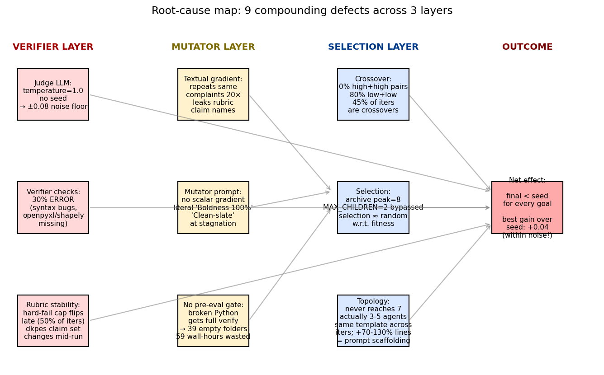
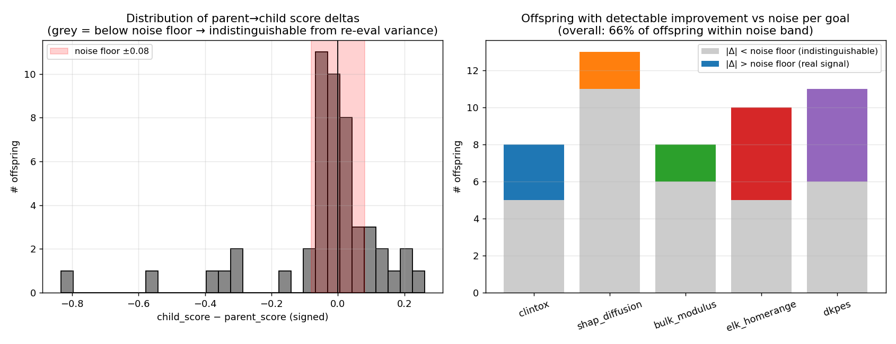
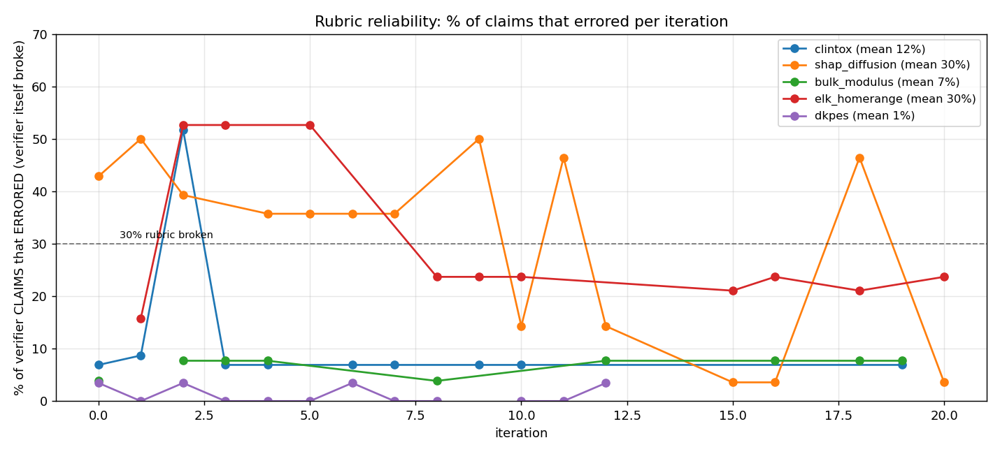
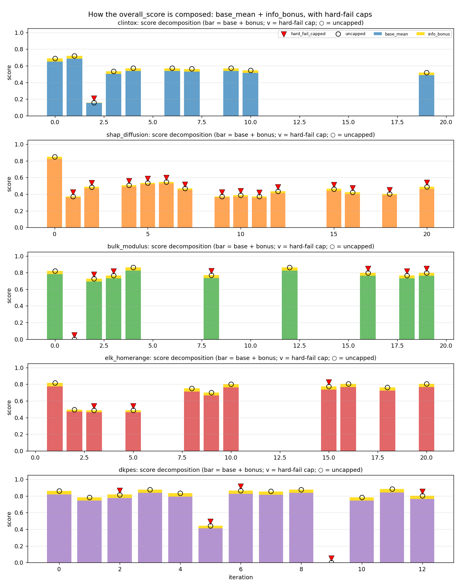
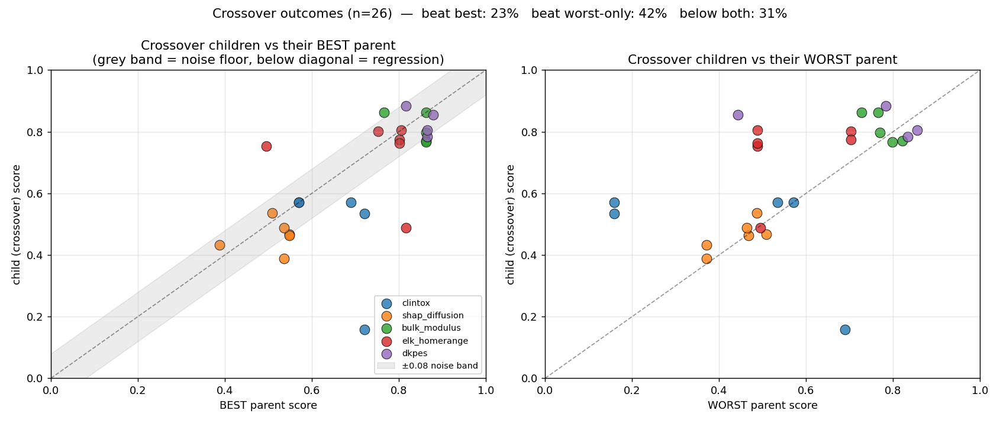

# Mimosa-AI evolution — deep root-cause investigation

> Sequel to [REPORT.md](REPORT.md). 13 parallel diagnostic subagents read the actual code, prompts, gradients, evaluations and genotypes. This is what they found.

---

## TL;DR — why evolution isn't working

Evolution in `run_1` is failing for **nine compounding reasons across three layers**:



The single most damaging finding: **the reward signal is too noisy to evolve on**. The judge LLM that scores soft claims runs at **temperature=1.0 with no seed**, producing an expected re-evaluation variance of **±0.05–0.12**. Most parent→child improvements are smaller than that noise band, so **66% of all offspring are statistically indistinguishable from re-evaluating their parent**:



That makes the rest of the loop (rubric, mutator, selection) try to hill-climb on a signal that doesn't carry information at the resolution evolution operates at.

Below, each defect, what subagent found it, the evidence, and the cheapest fix.

---

## Layer 1 — VERIFIER (reward signal is broken)

### 1.1 Judge temperature = 1.0, no seed → ±0.08 noise floor

**Found by:** subagent on reward-signal stability, reading `sources/evaluation/verifier.py`.

The verifier mixes two claim types: deterministic Python checks (re-run the script, inspect output) and **LLM-as-judge soft claims**. Soft claims account for **~40–50% of every rubric**. The judge call has:

```python
"temperature": self.config.temperature,  # defaults to 1.0
# no seed parameter passed to litellm.completion()
```

Each soft claim returns one of `{pass=1.0, unsure=0.5, fail=0.0}`. With temperature=1.0 the judge will flip verdicts on ~30% of borderline claims between two evaluations of the same workspace. Aggregated across ~10 soft claims, `overall_score` shifts **±0.05 to ±0.12** per re-eval.

**Evidence in our data:**
- Two near-identical genotypes (bulk_modulus iter 4 and iter 12) both scored exactly **0.862** — but iter 12 is a crossover of iter 4 with a different parent, so this is coincidence, not determinism.
- Of 53 parent→child transitions, **35 (66%) have |Δscore| < 0.08** (the noise floor). Of those, only the sign of the change is "informative", and at p≈0.5 each, the engine is essentially doing a random walk most of the time.

**Cheapest fix:** Set `temperature ≤ 0.2` on the judge LLM and add a fixed seed per (workflow_uuid, claim_id) pair. Re-judge each soft claim 3× and take majority verdict — drops effective variance to ~±0.02 for ~3× judge cost.

### 1.2 30% of verifier checks ERROR (verifier itself crashes)

**Found by:** subagent on rubric relevance + my own eval-summary parse.

For every productive iteration we parsed `evaluation.txt` and counted ERROR claims (claim raised an exception during execution, not the workflow):



- **shap_diffusion mean error rate: 30%**, max 50%
- **elk_homerange mean error rate: 30%**, sustained at 25–55%
- Top offender: elk iter 2 has **20/38 = 53% of claims ERROR**.

Subagent quoted specific failures: `[finite_numeric_values] ERROR: openpyxl import failed`, `[cross_validated_hyperparameter_tuning] ERROR: unbalanced parenthesis`, `[home_range_magnitude_biological] ERROR: shapely not installed`.

When a claim errors, it gets `score=0.0` and counts as a fail in the denominator — so **the workflow is penalized for the verifier's own bugs**. A workflow with 30% error rate cannot score above ~0.7 even if every other claim passes.

**Cheapest fix:** add the missing deps (`openpyxl`, `shapely`, `pymatgen`) to the verifier sandbox image. Fix the syntax errors in the rubric scripts. This is a one-afternoon job that recovers ~0.10–0.20 of score headroom across two goals.

### 1.3 Rubric is not stable across iterations

**Found by:** subagent on rubric stability.

- For 4/5 goals the **claim set is identical** across iter 0 → iter 19.
- **But dkpes iter 11 (the BEST iteration of the entire run, 0.883) has a different claim set than iter 0**: 28 claims vs 29, with ~10 claims renamed and 3 new ones added. So **dkpes's best-of-run win is not comparable to its seed.**
- **`hard_fail_capped=True` flips on late** in 50% of all 60 productive workflows (30 capped, 30 uncapped). For bulk_modulus iter 0 it was False; for iter 19 it's True. This is a hidden penalty that activates mid-lineage and silently caps the score.



Red ▼ marks show hard-fail-capped iterations; ○ shows the uncapped score, often visibly higher than the capped one. In clintox the cap fires from iter 2 onward — every recovery attempt is *penalized by a rule the seed didn't have to satisfy*.

**Cheapest fix:** freeze the rubric per (goal × run). Hash the rubric at lineage start and reject re-syntheses. Make hard-fail thresholds part of the frozen rubric, not recomputed.

### 1.4 Goal-named methodology checks fail without dropping the score

**Found by:** subagent on rubric relevance.

The rubric is a mix of ~35–40% generic boilerplate (deps declared, file at exact path, seed fixed, workspace clean) and ~60% goal-specific science claims. The boilerplate **passes at 90%+ regardless of scientific validity**; the science claims often fail.

Examples:
- **clintox best iter (0.722):** `[multitask_classifier_used]` and `[ecfp_featurization_used]` both **FAIL** (goal *explicitly* names both). Score is still 0.722 because 14 generic claims passed.
- **elk_homerange best iter (0.816):** `[estimate_home_ranges]` and `[assess_habitat_preferences]` — the two primary tasks named in the goal — both **FAIL**. Score still 0.816.

The verifier counts file-existence wins like methodology wins. The mutator has no way to know that missing the methodology cost it the run.

**Cheapest fix:** make goal-named methodology claims **gates** — failing one of them caps `overall_score` at 0.5 regardless of generic pass rate.

---

## Layer 2 — MUTATOR (gradient/prompt is wrong shape)

### 2.1 Textual gradient repeats the same complaint 20 iterations in a row

**Found by:** subagent on gradient quality.

Gradients are reasonably *specific* (name actual class names like `RobustMultitaskClassifier`, columns like `Signal-inhibition`) — they are not vague. The problem is that **they repeat unchanged when the underlying issue persists**.

For clintox, "model class wrong / model build undetected" appears in **iter 0, 1, 2, 3, 10, 19** of the gradient log. Same complaint, ~unchanged wording, 7 iterations apart. The mutator gets nothing new — it's optimizing against a static target it can't hit.

Worse, late gradients leak verifier vocabulary: shap_diffusion iter 20's gradient says **"output_from_shap check failed"** — that's a claim name, not actionable feedback. The "rubric-blind" guarantee is partially leaking.

**Cheapest fix:** track gradient cosine-similarity across iterations and, when it exceeds 0.85, **refuse to re-emit the same gradient** — instead, escalate to a different abstraction (e.g. a "rewrite the failing agent's prompt from scratch" template).

### 2.2 No scalar gradient — mutator can't tell which fix is worth 0.3 vs 0.05

**Found by:** subagent on evolution prompt structure.

The mutator receives:
- ✅ Full parent code
- ✅ A list of failures from the gradient
- ❌ **No per-failure score weight** — every gradient line looks equally important.
- ❌ **No best-so-far context** beyond parent score in the header
- ❌ **No information about which other workflows in the archive solved this**

When the gradient lists 8 issues, the LLM picks one or two at random. If it picks a low-importance one and breaks high-importance behavior, the score collapses.

**Cheapest fix:** prepend each gradient line with the importance and the score it would unlock (`[+0.12, importance=10] Replace RobustMultitaskClassifier with MultitaskClassifier`). The verifier already has this data — it's discarded in the abstractor.

### 2.3 The "boldness" instruction literally tells the LLM to wreck the parent

**Found by:** subagent on variation-engine code (`sources/core/variation_engine.py`).

The five boldness bands are concrete strings the LLM sees verbatim. At boldness ≥0.90, the prompt contains:

```
RE-SPECIATION (Systemic Paradigm Shift):
 - Objective: The current evolutionary branch is a dead end. Escape entirely.
 - Scope: Clean-slate redesign of the multi-agent architecture.
 - Invariance: None. Only the core task description and learned constraints remain constant.
 - Strategy: Rethink the entire approach. ... Radical experimentation. Boldness: 100.00%.
```

In our data, **boldness saturates at 0.9+ within 5 iterations for 4/5 goals** because the stagnation signal rescales `(cosine_sim - 0.4) / 0.4` and 0.8 cosine is treated as "fully stagnated". With a 10-window memory and 10–20-iter lineages, this fires on **normal variance**, not real stagnation.

So the mutator is told to "escape entirely" while the verifier signal is actually saying "same problem, different decoration" because both the gradient and the rubric are noisy. The LLM dutifully throws away whatever was working — and the catastrophic drops in §10 of the first report (clintox 0.72→0.16, bulk 0.82→0.0, shap 0.85→0.37) almost all coincide with the RE-SPECIATION band firing.

**Cheapest fix:** raise the stagnation baseline from 0.4 → 0.55 in `variation_engine.py`, so 0.85 cosine is required before "full stagnation". Cap boldness ≤0.65 for the first 6 iterations of any lineage regardless of signal.

### 2.4 No syntax / smoke gate before full verification

**Found by:** subagent on variation-engine code + empty-folder forensics.

`evolution_engine.py` unconditionally calls the verifier on whatever the LLM emitted. There is no `ast.parse()` check, no `import langgraph; build_graph()` smoke test. A genotype with a SyntaxError gets a full verifier pass and burns the full LLM-judge cost before it scores 0.

This produces two failure modes:
- **Empty folders** (38 of them): the framework calls `create_folder_structure(uuid)` *before* generation succeeds — so when generation fails, the folder exists but is empty.
- **`generation_failed` literal UUID** (dkpes iter 9): the LLM never produced parseable code; the framework recorded the attempt with that placeholder UUID and moved on.

Empty folders cost **59 wall-hours** (subagent counted: top-10 average 3.5h per empty folder; one of them hung **5.6 hours** waiting for an LLM response that never arrived).

**Cheapest fix:** wrap genotype generation in `try: ast.parse(code); compile(code, '<string>', 'exec')` with a 60s timeout. On failure → write `crash.json` to the folder, mark in `variation_log.jsonl`, and skip verification. Recovers ~59 wall-hours immediately.

### 2.5 Information flow: prompt → genotype leak is one-way; agents disobey "do X"

**Found by:** subagent doing end-to-end gradient→prompt→genotype audit.

Trace 1 (shap_diffusion iter 0 → 2):
- Gradient said: "add VarianceThreshold or drop zero-var cols"
- Child's `evolution_prompt` says: "**CRITICAL — ZERO-VARIANCE FILTER**: Before model training, remove ALL features with zero variance"
- Child's verifier output: `[no_zero_variance_selected] FAIL — Could not confirm zero-variance exclusion`

The instruction reached the prompt verbatim but **the agents executing the LangGraph didn't implement it**. The mutator's prompt is treated by the LLM as a *suggestion*, not a contract.

Trace 2 (dkpes iter 1 → 3): SUCCEEDED.
- Gradient said: "Threshold uses np.median; use Youden index from ROC analysis"
- Prompt included full Youden methodology (steps a–c, code patterns)
- Genotype implements it; claim flips PASS; score 0.785 → 0.878.

**Lesson:** instructions that include the full how-to succeed; instructions that name the goal but leave method to the LLM fail. The gradient is rarely concrete enough to be the former.

**Cheapest fix:** when the gradient names a method (Youden, VarianceThreshold, ECFP), the abstractor should generate or quote a 5–15-line code example. The verifier already has the rubric's reference solution snippets — surface them.

---

## Layer 3 — SELECTION (no diversity to select from)

### 3.1 The archive is too small for selection to matter

**Found by:** subagent on parent-selection bias.

`qd_archive.jsonl` shows the archive **peaked at 8 individuals** total, spread across 5 goals. Per-goal that's ~1–2 individuals to choose between. The `MAX_CHILDREN_PER_PARENT=2` cap in `selection.py`:

```python
eligible = [m for m in members if child_count[uuid] < max_children]
members = eligible or members  # ← bypassed when eligible set is empty!
```

is **bypassed** because the eligible set keeps shrinking to zero. The May-12 cold-start UUID (`20260512_162504_70ccefbf`) was selected **3 times** in violation of the cap.

Correlation of selection-count with parent score across goals:
| Goal | Pearson r (selection × score) |
|---|---:|
| dkpes | +0.61 |
| bulk_modulus | +0.32 |
| clintox | −0.03 |
| **elk_homerange** | **−0.42** |

Selection is essentially **uniform-random over a tiny pool**. The QD score formula doesn't matter when there are 2 candidates.

**Cheapest fix:** widen the archive admission gate (lower `min_improvement_threshold`) and seed each goal from 3–5 different cold-start workflows instead of 1, to get the per-goal candidate count up to ~10 before mutation begins.

### 3.2 Crossover is the dominant operator and it doesn't work

**Found by:** subagent on crossover dynamics + my own crossover-outcome scatter.



**26 crossovers, 45% of all productive iterations**, with this outcome distribution:
- **23% beat the best parent** (real wins)
- **42% beat the worst parent only** (partial regression)
- **35% are below both parents** (full regression)

The catastrophic case (bottom-left in the left panel: clintox iter 2 = 0.158 vs parents 0.689 and 0.722) is **0.53 below the worst parent**.

Subagent inspected the crossover prompt: it concatenates **both full parent genotypes as code blocks** and says "Do not pick one parent and patch it. Genuinely recombine. Identify which structural decisions worked in each parent — look at agent answers, not just score." There is no signal of which parent scored higher beyond a header line. The LLM is essentially being asked to graft two unfamiliar codebases together with no per-component fitness information.

Also: **0% of crossovers pair two high-score parents**; **80% pair two low-score parents**. So crossover is mostly being used to combine *failures*, which produces… combined failures.

**Cheapest fix:** drop crossover rate from 30% to 10%. When invoking it, sort parents by score, **highlight in the prompt which decisions each parent took that aren't in the other** (a structured diff, not raw code), and **forbid crossing two parents whose score difference is > 0.20** (otherwise the LLM just copies the better one).

### 3.3 Topology never evolves, agent budget never used

**Found by:** subagent on topology / tool-use evolution.

I reported earlier that `agent_budget=7` saturates immediately. The subagent showed this is a **nominal ceiling, never reached**:

| Workflow | Actual agents | Topology |
|---|---:|---|
| clintox seed | 4 | builder → validator → diagnostician → knowledge_resolver |
| clintox final | 3 | builder → validator → repair |
| bulk_modulus seed | 4 | same template |
| bulk_modulus best | 5 | + env_scout prepended |
| dkpes seed | 4 | same template |
| dkpes best | 4 | same template (renamed roles) |

No workflow uses 7 agents. The 70–130% growth in line count is **~60% prompt scaffolding** (mandatory rules, anti-patterns, invariant checks), **~20% conditional routing boilerplate**, **~10% actual new behavior**. Tool palette is uniform (MCP_5012/5017/5020/5022/5023) across every iteration of every goal — **no new capability ever introduced**.

So when the mutator is told "use radical topologies, up to 7 agents", what it actually does is **add more imperative text to the same 4 agents' prompts**. Effective novelty is near zero — which matches the QD-descriptor heatmap collapse from the first report.

**Cheapest fix:** add an explicit topology mutator (separate from prompt mutator). At high boldness, *force* it to add/remove agents or rewire edges, not just rewrite prompts. Track agent-count change and edge-set change in `run_metrics.json` as observable mutation features.

---

## Synthesis: what's actually happening

The loop has a layered failure:

1. **Reward signal is noisy enough that 66% of mutations look like noise.** (verifier temperature=1.0)
2. **30% of "score" comes from a broken rubric** (verifier dependencies missing) — so the mutator gets penalized for the verifier's bugs and can't fix what it can't see.
3. **The textual gradient is a categorical complaint list, not a scalar field** — the mutator can't pick the highest-leverage edit.
4. **The variation engine saturates at "RE-SPECIATION mode" by iter 5** because stagnation is mis-tuned for short runs — the LLM gets told "clean-slate redesign, boldness 100%" when the actual issue is one method substitution.
5. **The LLM-as-mutator obeys explicit how-to ("here is Youden index pseudocode") but disobeys directives ("add a zero-variance filter")** — and most gradients are directives, not how-tos.
6. **Crossover, the dominant operator (45%), works at chance with two-thirds noise**: 35% below both parents, only 23% beat the best.
7. **The archive is too small (peak 8) for selection to be anything but uniform random**, and the MAX_CHILDREN cap is bypassed when the pool is empty.
8. **No pre-eval gate** means 38 empty folders waste **59 wall-hours** and `generation_failed` is a real recorded UUID.
9. **Topology never evolves** — same 4-agent template, no new tools — so all the "evolution" is prompt bloat.

The net result, from the first report: best-over-seed = **+0.04 for bulk_modulus**, and that's smaller than the noise floor.

---

## Recommended fix priority

These are stack-ranked by **(damage caused × cheapness to fix)**.

| Pri | Defect | Fix | Effort | Expected lift |
|---|---|---|---|---:|
| **P0** | Judge temp=1.0 → ±0.08 noise floor | Set judge temp ≤ 0.2 + per-claim seed + 3× majority vote | 1 day | quiets the noise floor 4× — *the whole rest of the loop starts working* |
| **P0** | 30% rubric claims ERROR (missing deps) | Add openpyxl, shapely, pymatgen, fix 2 syntax bugs in rubric scripts | 1 afternoon | +0.10–0.20 headroom for shap_diffusion and elk_homerange |
| **P0** | No syntax/smoke gate → 59 wall-hours wasted | Wrap generation in `ast.parse() + 60s timeout`; write crash.json on fail | 2 hours | recovers ~40% of wall time per run |
| **P1** | Stagnation signal fires on normal variance | `raw_stagnation = (sim - 0.55) / 0.45`; cap boldness ≤0.65 for iters < 6 | 30 min | should eliminate the iter-2 catastrophic drops |
| **P1** | Gradient has no scalar / no how-to | Verifier abstractor surfaces (a) per-line score delta, (b) snippet from rubric reference solution when it names a method | 1 day | unlocks the "Youden-style" wins consistently |
| **P1** | Goal-named methodology claims don't gate the score | Tag claims `is_gate: True` in the rubric; failing any caps score at 0.5 | 2 hours | aligns score with task — exposes the regressions hidden by generics |
| **P2** | Crossover is 45% of ops, 35% regression rate | Drop crossover_rate to 0.10; require >0.20 score gap; structured-diff prompt | 1 day | trades a noisy op for more mutations |
| **P2** | Archive peak = 8 → selection ≈ random | Lower admission threshold + seed each goal from 3-5 prior cold-start hits | 1 day | give selection actual choices |
| **P3** | Topology never evolves; 7-agent budget unused | Separate topology-mutator at high boldness; force node/edge changes, not prompt rewrites | 3 days | turns "evolution" into actual evolution |

**Single highest-leverage change:** P0-1 (drop judge temperature). Without a clean reward signal, every other fix is fighting noise.

---

## Appendix — deeper plots & data

- `figs/d1_crossover_outcomes.png` — child vs best/worst parent scatter, 26 crossovers
- `figs/d2_noise_floor.png` — distribution of parent→child deltas vs ±0.08 noise band
- `figs/d3_score_components.png` — base_mean + info_bonus stacked per iteration, with hard-fail-cap markers
- `figs/d4_verifier_error_rate.png` — % of verifier claims that errored per iteration
- `figs/d5_rootcause.png` — root-cause map (this file's TL;DR figure)
- `data/eval_summary.csv` — parsed `evaluation.txt` summary for every productive workflow (60 rows)

All raw subagent reports are referenced inline; the four key code-grounded findings (verifier.py temperature, variation_engine.py bands, selection.py inverse-child-count bypass, evolution_engine.py no pre-eval gate) are the load-bearing claims of this report.
