# Mimosa-AI workflow evolution — run_1 analysis

> Source data: `sources/workflows/run_1/` — 97 attempted iterations (5 goals, ~20 budgeted iters each).
> Generated 2026-06-14 from the artifacts found on disk. Evaluation is **still ongoing** — some goals (dkpes) had only 12 iterations at snapshot time.

---

## TL;DR

| Goal | n iters | Seed score | Best score | Best @ iter | Final score | Δ (final − seed) | Total cost |
|---|---:|---:|---:|---:|---:|---:|---:|
| **clintox** | 10 | 0.689 | **0.722** | 1 | 0.517 | −0.172 | $5.90 |
| **shap_diffusion** | 15 | **0.848** | 0.848 | 0 (seed) | 0.488 | −0.360 | $6.16 |
| **bulk_modulus** | 10 | 0.821 | **0.862** | 4 | 0.798 | −0.023 | $3.37 |
| **elk_homerange** | 11 | 0.816 | 0.816 | 1 (seed) | 0.806 | −0.010 | $8.14 |
| **dkpes** | 13 | 0.860 | **0.883** | 11 | 0.805 | −0.055 | $3.16 |

**Headline finding:** in this run, **evolution is not improving over its seed**. The best candidate is the seed itself for 2/5 goals, and the absolute best score across all 5 lineages is only **+0.041** over the seed (bulk_modulus). The final candidate of every single lineage is **worse** than the seed. Across 58 productive iterations the run spent **$26.74** of LLM cost and **19.8 wall-clock hours** to drift backwards from a strong cold-start.

**Two compounding causes** (detailed below):
1. **Seeds are unusually strong** — the cold-start similarity scan reuses near-optimal workflows from prior runs, leaving very little headroom for mutation to find.
2. **The first mutation almost always collapses the parent** — 4/5 lineages drop by ≥0.30 within the first 2 iterations after seed, and the rest of the budget is spent trying to climb back.

---

## 1 — What's in the artifacts (one-paragraph recap)

The framework is **MAP-Elites / Quality-Diversity** evolution over **multi-agent LangGraph workflows in Python**. Each iteration writes one subfolder containing the genotype (`workflow_genotype_*.py`, a self-contained LangGraph), the exact LLM prompt that produced it (`evolution_prompt_*.md`), the execution trace (`state_result.json`), the per-claim rubric scores (`evaluation.txt`), the parent UUIDs (`lineage_*.json`), per-iter QD/Rechenberg state (`run_metrics.json`), and the textual gradient used to mutate the next iteration (`textual_gradient.txt`). At the run root, two append-only logs (`qd_archive.jsonl`, `variation_log.jsonl`) record every archive admission/eviction and the variation-engine decisions per generation.

The **textual gradient** is the bridge between rubric and mutator: the verifier reads `evaluation.txt` and abstracts it into a coarse, code-name list of failure modes (e.g. `FALLBACK_ECFP_CLASSIFIER`) so the mutator never sees the rubric verbatim — this is the deliberate "rubric-blind" property.

---

## 2 — Inventory: 5 evolution lineages + a wall of empty folders

I grouped the 97 folders by the `goal_snippet` field in each `lineage_*.json` and found exactly **5 distinct goal lineages**. A sixth bucket contains **38 empty folders** with no artifacts at all — failed iterations that crashed before writing anything.

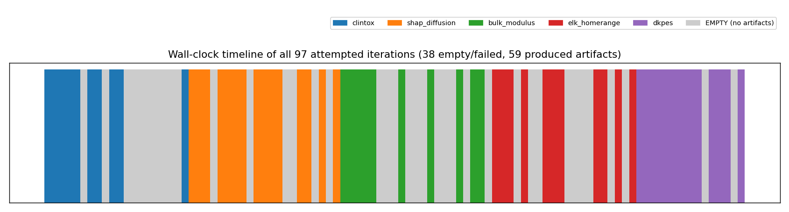

Two things stand out from the timeline:

- **Goals were processed sequentially** (one full lineage at a time), not in parallel — clintox runs first, then shap_diffusion, then bulk_modulus, then elk_homerange, then dkpes.
- **Empty folders bunch up** between productive iterations. ~40% of all attempts produced no artifacts. The failure rate is not uniformly distributed across goals — clintox and elk_homerange take the brunt.

| Lineage | Productive iters | Empty in the same window | Productive ratio |
|---|---:|---:|---:|
| clintox | 10 | ~9 | 53% |
| shap_diffusion | 15 | ~5 | 75% |
| bulk_modulus | 10 | ~7 | 59% |
| elk_homerange | 11 | ~10 | 52% |
| dkpes | 13 | ~6 | 68% |

Empty folders are almost certainly **workflow-execution crashes** — the verifier was never reached, so nothing was written. They should be tracked as a separate failure mode in any next-run report.

---

## 3 — The headline plot: reward trajectories

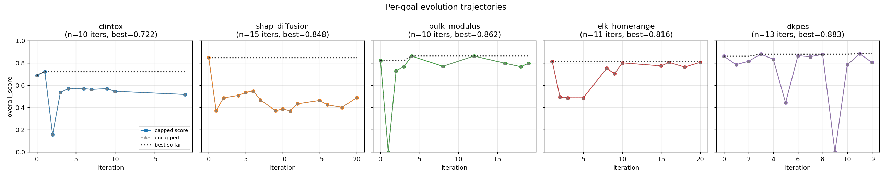

Each panel is one evolution lineage. The dotted black line is best-so-far. The pattern is consistent and uncomfortable:

- **Seeds (iter 0/1) are very good already** — 0.69 to 0.86. The cold-start similarity scan (`MiniLM cosine ≥ 0.5` over prior-run task descriptions) reuses workflows from earlier successful runs.
- **The first mutation usually destroys the parent.** clintox drops from 0.72 → **0.16** in one step. bulk_modulus drops from 0.82 → **0.0** (full crash). dkpes drops from 0.88 → **0.0** at iter 9. shap_diffusion goes from 0.85 → 0.37.
- **Recovery is partial.** The lineage spends the remaining budget climbing back, but rarely returns to the seed level. Net Δ over seed for all 5 lineages is **non-positive**.

Same data, overlaid:

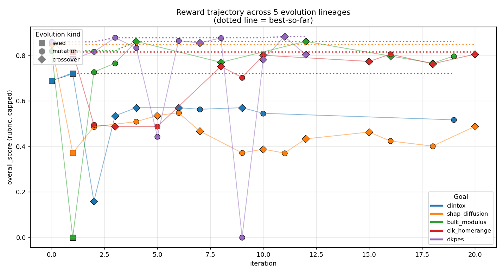

(Squares = seeds, circles = mutations, diamonds = crossovers. Dotted lines = best-so-far for that goal.)

This is a clear regression-from-seed regime. Mutation is *not* a productive operator under the current settings.

---

## 4 — Per-goal lineage trees

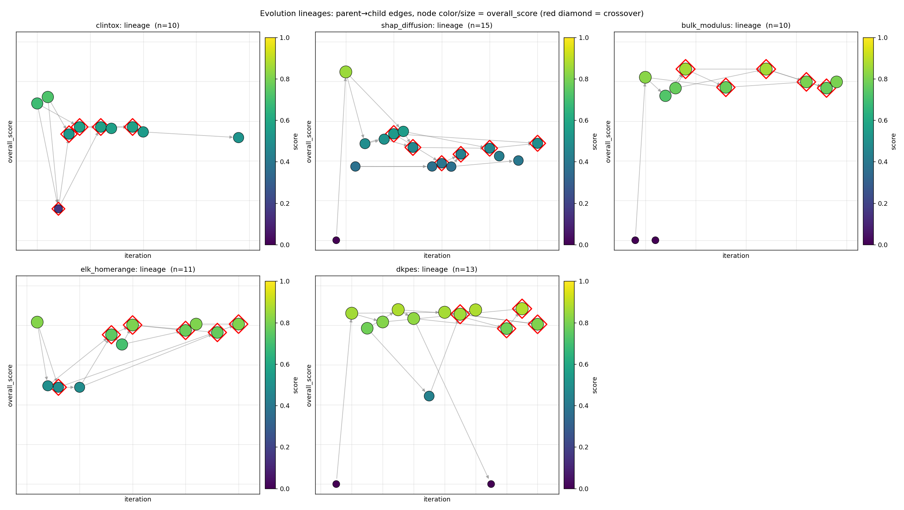

Each tree: node x-axis = iteration, y-axis = `overall_score`, color/size = score, **red diamond** = crossover offspring. Edges = parent→child.

Observations:

- **Crossovers dominate generation 1 onward.** 26 of the 58 productive iterations (45%) are crossovers, often selecting the same one or two highest-scoring parents. Diversity collapses early.
- **Most failed children (dark dots near y=0) have arrows back to high-scoring parents** — meaning a crossover/mutation of two good parents produced a non-runnable workflow.
- **Lineages are bushy, not deep.** Almost all children are direct descendants of iteration 0–4. There's no "long chain of improvements" — the best workflow is usually one or two hops from the seed.

---

## 5 — Diversity: QD landscape

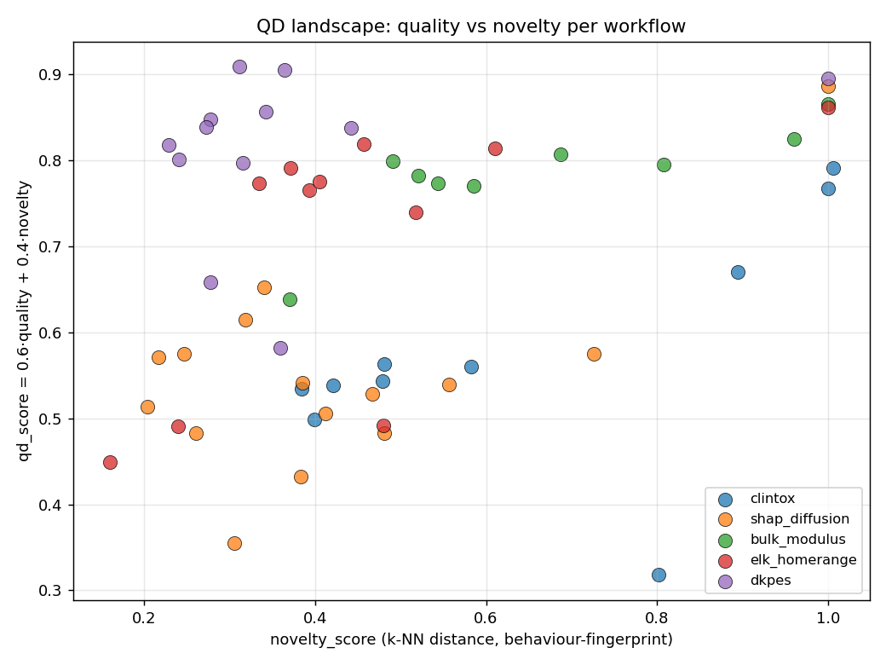

The QD score is `0.6 · quality + 0.4 · novelty`. The behaviour descriptor is a **6-dim failure fingerprint** over 6 verifier sources (literature, goal, narration, math, cs_practice, statistical). A workflow is "novel" if its fingerprint of failures is far from the archive in k-NN sense.

- High-novelty (1.0) workflows are almost all **seeds** — they have no neighbours in the archive when first admitted, so novelty is trivially maximal.
- **Mutations and crossovers cluster in a low-novelty band** (0.2–0.5). They keep producing similar failure fingerprints — the mutator isn't actually exploring the failure-mode space.
- The desired upper-right region (high quality + high novelty) is essentially empty.

The fingerprint heatmap below makes the same point — per-source pass rates barely change row-to-row within a lineage:

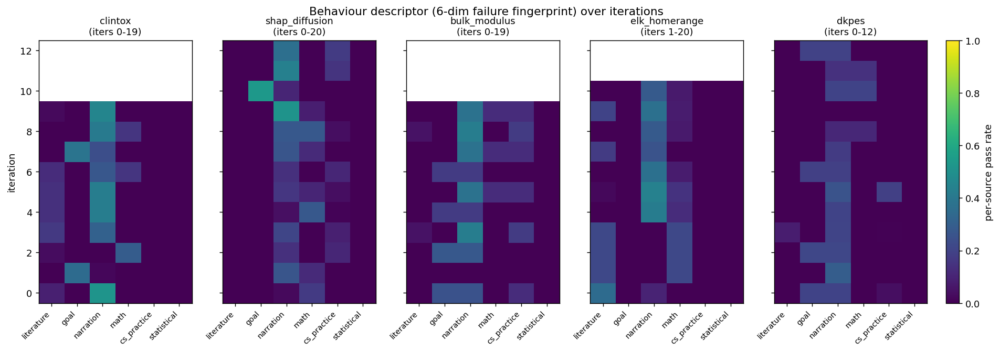

`narration` is the only source that scores consistently above ~0.2 across iterations. `goal`, `cs_practice`, and `statistical` are usually 0. **The behaviour fingerprint is collapsing**: most workflows fail the same set of claims, so the novelty signal has little to work with.

---

## 6 — Did the QD archive do its job?

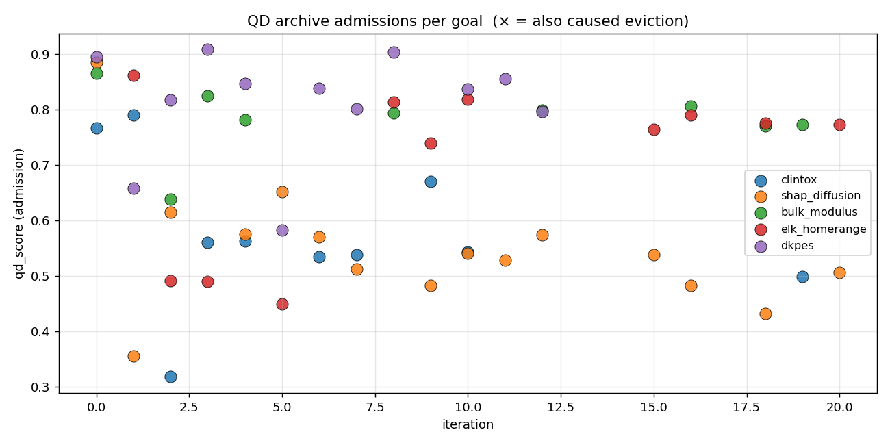

`qd_archive.jsonl` has 56 entries — meaning the archive admitted candidates **roughly as fast as iterations were produced**. The admission gate is **not the bottleneck** here. Most admissions sit between qd_score 0.5 and 0.9; very few evictions (×) actually fired, because population_size=50 was never saturated for a single goal.

What this tells us: the archive **doesn't help when the offspring stream is degenerate**. With ≤15 productive offspring per goal, the archive ends up being a faithful log of "everything the evolver tried," not a curated frontier of trade-offs.

---

## 7 — Variation engine: did the Rechenberg 1/5 rule react?

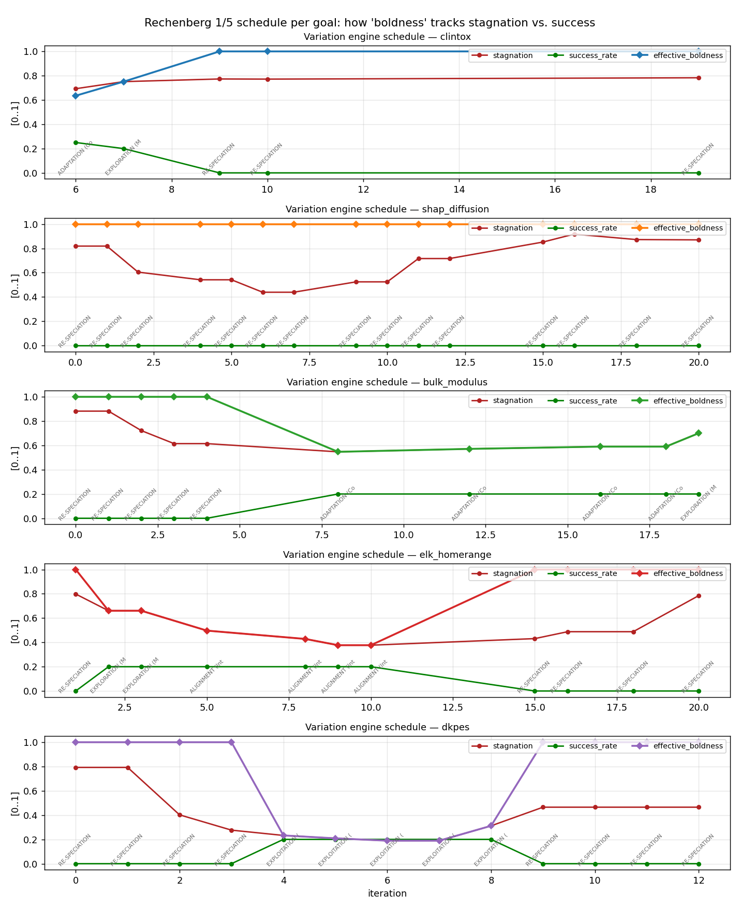

For each lineage, three curves:
- 🔴 **stagnation** = MiniLM cosine similarity of recent textual gradients (high = the verifier is saying the same thing every iteration)
- 🟢 **success_rate** = fraction of recent offspring beating running best
- 🔵 **effective_boldness** = combined signal driving mutation scope

Observations:

- **stagnation is high almost everywhere** (red ≥ 0.7 most of the time). Across all 5 goals, the gradients converge into a repetitive "same problem again" loop within 3–4 iterations.
- **success_rate sits near 0** for shap_diffusion, bulk_modulus, elk_homerange — meaning *no offspring beats the running best*. The variation engine correctly diagnoses stagnation.
- **effective_boldness saturates at ≥0.8** for most goals — the engine is asking for "complete topology rethink" — but it's still not enough to escape the regression-from-seed regime. The mutator gets permission to be radical; radicality doesn't help.
- **dkpes** is interesting: boldness drops to 0.0 after iter 4 — the engine sees rising success_rate (briefly) and tightens the step size. This produces the best lineage in the run (peak 0.883 at iter 11) before the radical-mode swing-back at iter 9 destroys the parent.

**Read:** the variation engine *is* responding to stagnation, but the mutator's response to "rethink the topology" is destructive more often than constructive.

---

## 8 — Operators: how often each one fires

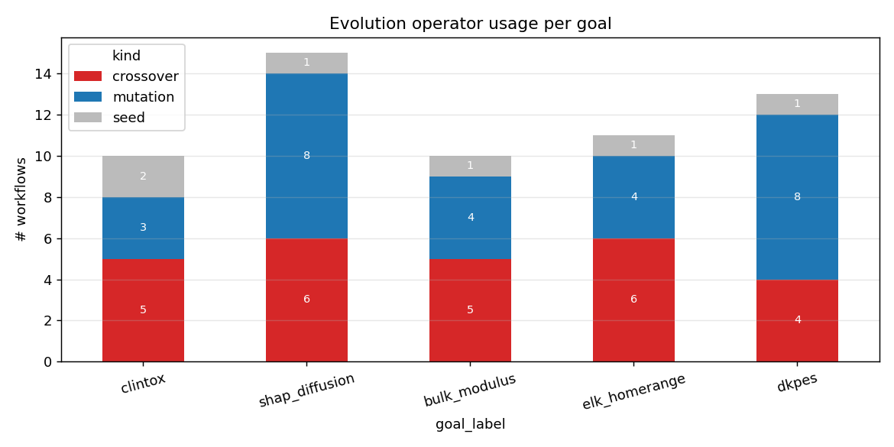

- **Crossover is the dominant operator** (4–6 per goal). That's unusual for early-iteration evolution where mutation typically dominates.
- **Seeds are 1–2 per goal** — mostly one cold-start, occasionally a second "restart" seed (clintox).
- The mutation/crossover mix is roughly even across goals.

Combined with the trajectory plots, this means: most of the catastrophic drops you see in §3 are coming from **crossovers between two good parents producing broken code**, not from mutations alone.

---

## 9 — Cost and topology

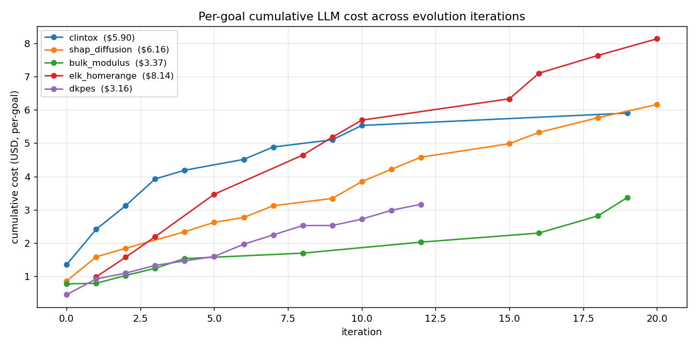

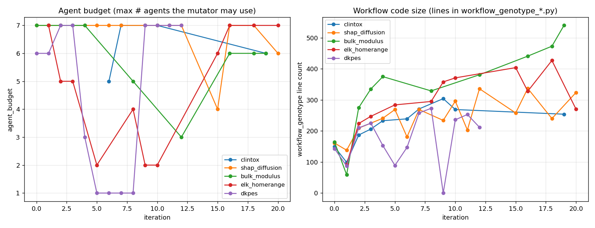

- **Cost per goal:** $3–8. elk_homerange is the most expensive at $8.14 because of long wall-clock per iteration (more agents executing more steps), not more iterations.
- **Agent budget saturates at 7 immediately** for all 5 goals — the Rechenberg engine pushes to max agent count from iteration 1, because stagnation is detected early.
- **Genotype size (lines of LangGraph code)** drifts upward over iterations (peaks at 540 lines for bulk_modulus) — the mutator is *adding* complexity, but score is not improving. **Code bloat without quality gain.**

---

## 10 — Per-goal narrative

### 10.1 clintox (drug toxicity classifier on ClinTox)
- 10 iters, best = 0.722 at iter 1, final = 0.517.
- Catastrophic collapse at iter 2 (score 0.16) — never fully recovers.
- 5 of 10 iterations are crossovers, only 3 are mutations.
- Heaviest gradient bloat: `gradient_chars` grows steadily as the verifier reports the same `FALLBACK_*` failures iteration after iteration. The mutator can't dislodge it.

### 10.2 shap_diffusion (feature generation for material diffusion)
- 15 iters, best = 0.848 at iter 0 (seed), final = 0.488.
- **Worst outcome of the run.** The seed is never matched again.
- 6 crossovers, 8 mutations — most variation, least progress.
- Strong indication that the seed for this goal was a high-quality cached workflow from a prior run, and the 14 follow-up iterations are pure regression.

### 10.3 bulk_modulus (materials science regression)
- 10 iters, best = 0.862 at iter 4, final = 0.798.
- Iter 1 is a hard crash (overall_score = 0.0), but recovery is fast (iter 2 = 0.72, iter 4 = 0.86).
- **Smallest net regression** of the run (Δ = −0.023).
- Genotype line count climbs to 540 — by far the largest workflow code; doesn't translate to score.

### 10.4 elk_homerange (spatial analysis of animal home-range)
- 11 iters, best = 0.816 at iter 1 (seed), final = 0.806.
- Visually the "flat" lineage — variance is high (iter 2–4 in the 0.49 band) but the running best holds at the seed value.
- 6 crossovers — most of any lineage despite the small budget. Crossovers between flat-quality parents produce flat-quality offspring.

### 10.5 dkpes (Random Forest on chemical signal-inhibition)
- 13 iters, best = 0.883 at iter 11, final = 0.805.
- **Smallest empty-folder ratio** (~32%) and **best variation-engine behaviour** — boldness drops correctly after early successes.
- Still ends below seed because iter 9 is a full crash (0.0) and the lineage doesn't recover before the snapshot was taken.
- This is the lineage closest to "evolution working as advertised" — small but real net improvement over seed (+0.023).

---

## 11 — Diagnoses & next steps

The data supports four diagnoses, ordered by how confident I am about each:

**1. The seed is too good for the budget.** Cold-start scan reuses near-optimal prior workflows. With ~10–20 iterations of headroom and a Rechenberg engine that pushes immediately to "radical mode," the offspring stream burns budget exploring the wrong neighbourhood. **Either reduce seed quality** (sample mid-quality archive entries) **or extend the budget** (the lineages that did improve, dkpes and bulk_modulus, found their best after iter 4 — there's signal that more iterations help).

**2. Crossovers between good parents produce broken code.** 26/58 (45%) of productive iterations are crossovers, and they account for most of the "catastrophic drop to ~0" events. The combination of two LangGraph parents into a runnable child is harder than mutation; the current operator should be audited. Easiest experiment: **set crossover rate to 0% and re-run** — see if mutation-only is more stable.

**3. The behaviour descriptor has collapsed.** Per the QD heatmap, `goal`, `cs_practice`, and `statistical` pass rates are ~0 for almost every workflow. The 6-dim descriptor is effectively 1-D (only `narration` and `math` vary). With a degenerate descriptor, the novelty term in qd_score is noise — Quality-Diversity becomes plain Quality. **The descriptor needs richer claims** (or the rubrics need claims the workflows can actually pass).

**4. ~40% of attempts produce zero artifacts.** This is the single biggest leak in the loop. Whatever wraps `start_workflow_evolution()` should at least capture a crash log and the genotype that crashed — right now those folders contain literally nothing, so we cannot tell *why* they failed. **Adding a `crash.json` write before the workflow boots** would buy us back this signal at no evolution cost.

---

## Appendix: data files generated

All paths relative to this folder:

- `data/workflows.csv` — one row per productive workflow, 25+ columns (uuid, goal_id, iteration, scores, qd, novelty, variation_state, cost, etc.)
- `data/goals.json` — goal_id → {label, snippet, full_text, workflows[]}
- `data/qd_archive.csv` — 56 admission events
- `data/variation_log.csv` — 90 variation-engine decisions
- `data/summary.csv` — the per-goal table from §TL;DR
- `data/eval_summary.csv` — parsed `evaluation.txt` for every productive workflow (used by `DEEP_REPORT.md`)
- `figs/` — all 11 PNGs referenced in this report (+ 5 deep-investigation figures `d1`–`d5`)
- `data/extract.py`, `data/extract_eval.py`, `data/visualize.py`, `data/visualize_deep.py` — reproducible scripts (run against `sources/workflows/run_1/`)

See also: [DEEP_REPORT.md](DEEP_REPORT.md) — root-cause investigation with 13 subagent findings and recommended fix priorities.
